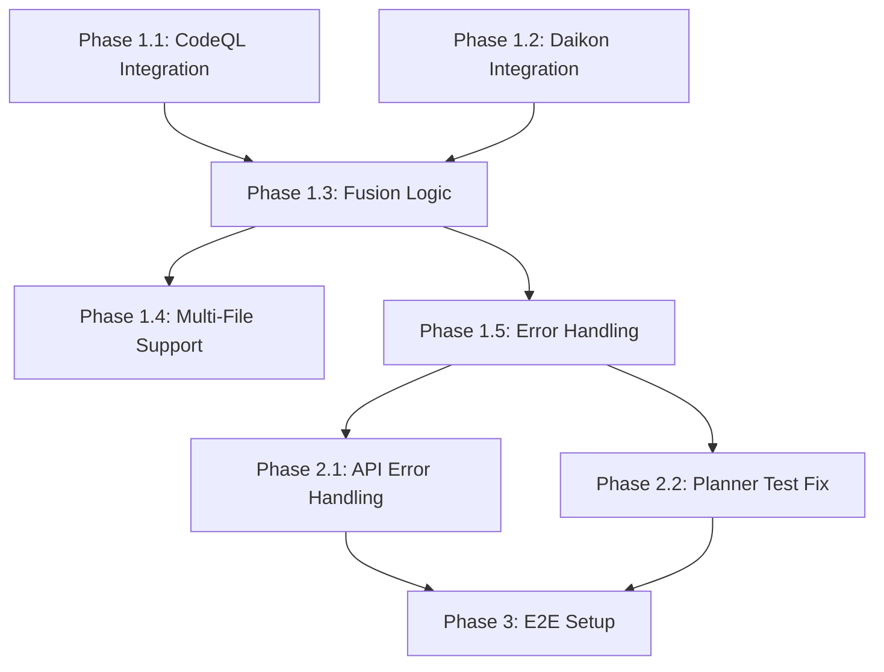

# lift-sys Development Plan
## Implementation Roadmap for Remaining Features

**Current Status:** 119/130 tests passing (91.5%)
**Goal:** 130/130 tests passing (100%)

---

## Phase 1: Reverse Mode Core Implementation (Priority: HIGH)
**Status:** 🔴 In Progress
**Estimated Effort:** 3-5 days
**Tests to Fix:** 9 integration tests

### 1.1 CodeQL Analyzer Integration
**File:** `lift_sys/reverse_mode/analyzers.py`

#### Tasks:
- [ ] Implement actual `subprocess` calls to CodeQL CLI
- [ ] Parse SARIF output format from CodeQL
- [ ] Extract security findings and convert to `Finding` objects
- [ ] Add error handling for missing CodeQL installation
- [ ] Add configuration for CodeQL database path
- [ ] Support multiple query types (security, performance, correctness)

#### Implementation Details:
```python
def run(self, repo_path: str, queries: Iterable[str]) -> List[Finding]:
    # 1. Check if CodeQL database exists or create it
    # 2. Run: codeql database analyze --format=sarif-latest
    # 3. Parse SARIF JSON output
    # 4. Convert to Finding objects
    # 5. Handle errors gracefully
```

#### Acceptance Criteria:
- ✅ `test_lift_with_mocked_codeql` passes
- ✅ Real CodeQL output can be parsed (integration test)
- ✅ Multiple query types supported
- ✅ Error handling for missing/invalid database

---

### 1.2 Daikon Analyzer Integration
**File:** `lift_sys/reverse_mode/analyzers.py`

#### Tasks:
- [ ] Implement `subprocess` calls to Daikon
- [ ] Parse Daikon invariant output
- [ ] Extract predicates and convert to `Finding` objects
- [ ] Add instrumentation support for target functions
- [ ] Add trace file generation and processing
- [ ] Handle edge cases (no invariants, parse errors)

#### Implementation Details:
```python
def run(self, repo_path: str, entrypoint: str) -> List[Finding]:
    # 1. Instrument Python code for Daikon tracing
    # 2. Execute instrumented code to generate .dtrace files
    # 3. Run: java daikon.Daikon <trace-file>
    # 4. Parse invariant output
    # 5. Convert to Finding objects with predicate metadata
```

#### Acceptance Criteria:
- ✅ `test_lift_with_mocked_daikon` passes
- ✅ Daikon invariants properly extracted
- ✅ Predicates mapped to IR assertions
- ✅ Error handling for missing Daikon

---

### 1.3 Specification Fusion & TypedHole Generation
**File:** `lift_sys/reverse_mode/lifter.py`

#### Tasks:
- [ ] Implement intelligent fusion of CodeQL + Daikon results
- [ ] Detect conflicts between static and dynamic analysis
- [ ] Generate TypedHoles for ambiguous/conflicting findings
- [ ] Preserve function signatures from source code
- [ ] Extract actual parameters from AST parsing
- [ ] Create meaningful intent summaries
- [ ] Add metadata tracking (analysis sources, confidence)

#### Implementation Details:
```python
def lift(self, target_module: str) -> IntermediateRepresentation:
    # 1. Run both analyzers
    # 2. Parse target module AST for signature extraction
    # 3. Fuse findings:
    #    - CodeQL → security assertions
    #    - Daikon → functional invariants
    # 4. Detect conflicts → create TypedHoles
    # 5. Build IR with proper metadata
```

#### Acceptance Criteria:
- ✅ `test_lift_generates_typed_holes_for_ambiguity` passes
- ✅ `test_lift_preserves_function_signatures` passes
- ✅ `test_lift_creates_metadata` passes
- ✅ `test_lift_with_conflicting_analyses` passes
- ✅ TypedHoles include context and resolution suggestions

---

### 1.4 Multi-File & Repository Support
**File:** `lift_sys/reverse_mode/lifter.py`

#### Tasks:
- [ ] Support lifting multiple files in single operation
- [ ] Handle cross-file dependencies
- [ ] Repository-wide analysis coordination
- [ ] Batch processing optimization
- [ ] Progress tracking for large codebases

#### Implementation Details:
```python
def lift_multiple(self, target_modules: List[str]) -> List[IntermediateRepresentation]:
    # 1. Batch analyze with CodeQL (single database run)
    # 2. Parallel Daikon runs per module
    # 3. Return list of IRs with cross-references
```

#### Acceptance Criteria:
- ✅ `test_lift_multiple_files` passes
- ✅ `test_lift_repository_loading` passes
- ✅ Efficient batch processing
- ✅ Progress callbacks for UI integration

---

### 1.5 Error Handling & Robustness
**File:** `lift_sys/reverse_mode/lifter.py`, `analyzers.py`

#### Tasks:
- [ ] Graceful degradation when tools unavailable
- [ ] Fallback to available analyzer if one fails
- [ ] Comprehensive error messages
- [ ] Logging for debugging
- [ ] Retry logic for transient failures

#### Acceptance Criteria:
- ✅ `test_lift_handles_analysis_failure` passes
- ✅ Informative error messages
- ✅ Partial results returned when possible
- ✅ Logging tracks analysis progress

---

## Phase 2: API & Infrastructure Improvements (Priority: MEDIUM)
**Status:** 🟡 Not Started
**Estimated Effort:** 1-2 days
**Tests to Fix:** 2 tests

### 2.1 Repository Endpoint Error Handling
**File:** `lift_sys/api/server.py`

#### Tasks:
- [ ] Add try-catch around `Repo(path)` initialization
- [ ] Return HTTP 400 for invalid paths
- [ ] Return HTTP 404 for non-existent paths
- [ ] Return HTTP 422 for non-git directories
- [ ] Validate permissions before opening

#### Implementation:
```python
@app.post("/repos/open")
async def open_repository(request: RepoRequest) -> RepoResponse:
    try:
        if not Path(request.path).exists():
            raise HTTPException(status_code=404, detail="Path not found")
        repo = Repo(request.path)
        if repo.bare:
            raise HTTPException(status_code=422, detail="Repository is bare")
        # ... rest of logic
    except (GitCommandError, InvalidGitRepositoryError) as e:
        raise HTTPException(status_code=400, detail=str(e))
```

#### Acceptance Criteria:
- ✅ `test_repos_open_invalid_path` passes
- ✅ Clear error messages for common failure modes

---

### 2.2 Planner Integration Test Fix
**File:** `tests/planner/test_planner.py`

#### Tasks:
- [ ] Investigate `test_planner_learns_from_conflicts` failure
- [ ] Review planner conflict learning logic
- [ ] Update test or implementation as needed
- [ ] Document expected behavior

#### Acceptance Criteria:
- ✅ Test passes or is properly skipped with rationale
- ✅ Conflict learning behavior documented

---

## Phase 3: E2E Test Infrastructure (Priority: LOW)
**Status:** ⚪ Blocked
**Estimated Effort:** 2-3 days
**Tests to Enable:** 2 skipped tests

### 3.1 Playwright Setup
**File:** Frontend testing infrastructure

#### Tasks:
- [ ] Install Playwright: `playwright install`
- [ ] Add to dev dependencies in `pyproject.toml`
- [ ] Configure Playwright for local testing
- [ ] Enable `test_code_to_ir_to_human_input_workflow`

---

### 3.2 Textual Testing Setup
**File:** TUI testing infrastructure

#### Tasks:
- [ ] Add `textual[dev]` to dev dependencies
- [ ] Enable `test_tui_ir_to_code_generation`
- [ ] Add TUI test documentation

---

## Implementation Order & Dependencies



---

## Testing Strategy

### Unit Tests
- Mock `subprocess.run` for analyzer tests
- Test individual components in isolation
- Fast feedback loop

### Integration Tests
- Use temporary repositories
- Mock external tool outputs (SARIF, invariants)
- Test component interactions

### E2E Tests
- Require real tools (CodeQL, Daikon) OR
- Use comprehensive mocking with real data fixtures

---

## Success Metrics

| Phase | Target | Current | Remaining |
|-------|--------|---------|-----------|
| Phase 1 | 9 tests | 0 passing | 9 failing |
| Phase 2 | 2 tests | 0 passing | 2 failing |
| Phase 3 | 2 tests | 0 skipped | 2 skipped |
| **Total** | **13 tests** | **119/130** | **11 remaining** |

---

## Risk Assessment

### High Risk
- **CodeQL/Daikon availability:** May not be installed in all environments
  - **Mitigation:** Graceful degradation, clear documentation, optional dependencies

- **SARIF parsing complexity:** CodeQL output format may vary
  - **Mitigation:** Comprehensive test fixtures, version detection

### Medium Risk
- **Subprocess reliability:** External tools may hang or crash
  - **Mitigation:** Timeouts, retry logic, error recovery

- **Large repository performance:** Whole-repo analysis slow
  - **Mitigation:** Incremental analysis, caching, parallel execution

### Low Risk
- **Test flakiness:** Temporary files, subprocess mocking
  - **Mitigation:** Proper cleanup, deterministic mocks

---

## Development Workflow

### For Each Feature:
1. **Write/Update Tests First** (TDD)
   - Ensure test fails for right reason
   - Add fixtures if needed

2. **Implement Minimum Viable Solution**
   - Focus on making test pass
   - Keep it simple

3. **Refactor & Optimize**
   - Clean up code
   - Add error handling
   - Performance improvements

4. **Document**
   - Update docstrings
   - Add examples
   - Update this plan

5. **Commit & Push**
   - Atomic commits per feature
   - Clear commit messages
   - Run full test suite before push

---

## Quick Start Checklist

### To Implement Reverse Mode (Phase 1):
- [ ] Start with `CodeQLAnalyzer.run()` - make it call subprocess
- [ ] Add SARIF parsing logic
- [ ] Update `test_lift_with_mocked_codeql` to mock subprocess properly
- [ ] Repeat for `DaikonAnalyzer`
- [ ] Implement `SpecificationLifter.lift()` fusion logic
- [ ] Run tests frequently: `uv run pytest tests/integration/test_reverse_mode.py -v`

### To Fix API Issues (Phase 2):
- [ ] Add error handling to `/repos/open` endpoint
- [ ] Test with: `uv run pytest tests/integration/test_api_endpoints.py::TestAPIEndpoints::test_repos_open_invalid_path -v`
- [ ] Investigate planner test failure in isolation

---

## Estimated Timeline

- **Phase 1:** 1 week (full-time) or 2-3 weeks (part-time)
- **Phase 2:** 2-3 days
- **Phase 3:** 2-3 days (optional, for complete E2E)

**Total:** ~2-4 weeks to 100% test coverage

---

## Notes

- Focus on **Phase 1** first - it unlocks the most value
- **Phase 2** is quick wins for robustness
- **Phase 3** can be deferred - E2E tests are valuable but not critical for core functionality

**Next Action:** Begin with `1.1 CodeQL Analyzer Integration`
