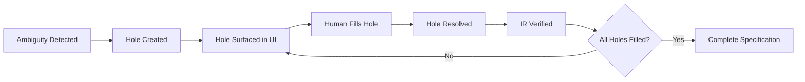

# The lift-sys Intermediate Representation (IR)
## A Human-AI Collaborative Specification Language

**Document Version:** 1.0
**Last Updated:** January 2025
**Author:** Lift-sys Team

---

## Table of Contents
1. [Executive Summary](#executive-summary)
2. [Philosophy & Vision](#philosophy--vision)
3. [IR Structure & Components](#ir-structure--components)
4. [TypedHoles: The Key Innovation](#typedholes-the-key-innovation)
5. [Key Design Decisions](#key-design-decisions)
6. [Visual User Experience](#visual-user-experience)
7. [Constrained Code Generation](#constrained-code-generation)
8. [Serialization & Interchange](#serialization--interchange)
9. [Areas for Improvement](#areas-for-improvement)
10. [Real-World Examples](#real-world-examples)
11. [Comparison with Other IRs](#comparison-with-other-irs)

---

## Executive Summary

The **lift-sys Intermediate Representation (IR)** is a domain-specific language designed to bridge the gap between human intent and machine-verified code. Unlike traditional intermediate representations that serve as compilation targets, lift-sys IR is a **collaborative medium** where:

- **Humans** express high-level intent, constraints, and domain knowledge
- **Static analyzers** (CodeQL) contribute security assertions
- **Dynamic analyzers** (Daikon) contribute runtime invariants
- **AI models** generate code that satisfies all constraints
- **SMT solvers** verify logical consistency

The IR's defining feature is **TypedHoles**—explicit placeholders for ambiguous or unknown information that enable incremental refinement and human-in-the-loop collaboration.

### Core Principles
1. **Human-Readable:** Natural language intent with formal semantics
2. **Machine-Verifiable:** SMT-checkable assertions and effects
3. **Incrementally Refinable:** TypedHoles allow partial specifications
4. **Bidirectional:** Generated from code (reverse mode) or generates code (forward mode)
5. **Multi-Source:** Fuses inputs from humans, static analysis, and dynamic analysis

---

## Philosophy & Vision

### The Problem: The Specification Gap

Traditional software development faces a fundamental tension:
- **Informal specifications** (requirements docs, comments) are readable but ambiguous
- **Formal specifications** (TLA+, Alloy) are precise but require expertise
- **Code** is executable but conflates what and how

The **specification gap** is the distance between human intent and verifiable implementation.

### The lift-sys Approach: Collaborative Refinement

Instead of forcing humans to write complete formal specifications, lift-sys:

1. **Lifts** partial specifications from existing code via reverse mode
2. **Surfaces** ambiguities as **TypedHoles** for human clarification
3. **Guides** humans to fill holes with natural language or formal predicates
4. **Verifies** consistency using SMT solvers
5. **Generates** code that provably satisfies the refined specification

This creates a **virtuous cycle**:
```
Code → IR (with holes) → Human refinement → Verified IR → Better code
```

---

## IR Structure & Components

### Top-Level Structure

```
IntermediateRepresentation
├── intent: IntentClause          # What the code should accomplish
├── signature: SigClause          # Function/module interface
├── effects: List[EffectClause]   # Side effects and interactions
├── assertions: List[AssertClause] # Logical invariants
└── metadata: Metadata            # Provenance and context
```

### Component Breakdown

#### 1. **IntentClause**
Captures the human-readable purpose of the code.

```python
@dataclass
class IntentClause:
    summary: str                  # One-line description
    rationale: Optional[str]      # Why this intent matters
    holes: List[TypedHole]        # Ambiguities in intent
```

**Example:**
```
intent: Document sample behaviour {
  <?intent_gap: Description = "Refine the user intent" @intent?>
}
```

**Design Rationale:**
- `summary` is mandatory—every spec needs a purpose
- `rationale` provides context for maintainers
- `holes` allow "I know roughly what I want but need to refine it"

#### 2. **SigClause**
Defines the computational interface.

```python
@dataclass
class SigClause:
    name: str                     # Function/module name
    parameters: List[Parameter]   # Typed input parameters
    returns: Optional[str]        # Return type
    holes: List[TypedHole]        # Signature ambiguities
```

**Example:**
```
signature: sample_module(x: int, y: float) -> int {
  <?result_contract: Predicate = "Return value matches invariants" @signature?>
}
```

**Design Rationale:**
- Mirrors familiar function signature syntax
- TypedHoles in signature capture "I know the shape but not the full contract"
- Supports both simple types (`int`) and complex contracts (via holes)

#### 3. **EffectClause**
Documents side effects and external interactions.

```python
@dataclass
class EffectClause:
    description: str              # Natural language effect
    holes: List[TypedHole]        # Effect clarifications needed
```

**Example:**
```
effects:
  - interacts with filesystem {
      <?effect_gap: Effect = "Need to clarify side effects" @effect?>
    }
  - may raise ValueError
```

**Design Rationale:**
- Effects are often the hardest part to specify formally
- Natural language + holes allows incremental formalization
- Critical for reasoning about program behavior

#### 4. **AssertClause**
Formal logical constraints on program state.

```python
@dataclass
class AssertClause:
    predicate: str                # SMT-checkable predicate
    rationale: Optional[str]      # Why this assertion exists
    holes: List[TypedHole]        # Predicate refinements
```

**Example:**
```
assert:
  - x > 0 and y > 0 {
      <?assertion_detail: Predicate = "Explain relationship" @assertion?>
    }
  - result == x + y
```

**Design Rationale:**
- Predicates use Python-like syntax for familiarity
- SMT solver backend validates consistency
- Holes allow "I know there's a constraint but I'm not sure how to express it"

#### 5. **Metadata**
Tracks provenance and context.

```python
@dataclass
class Metadata:
    source_path: Optional[str]    # Original file path
    language: Optional[str]       # Source language (Python, Rust, etc.)
    origin: Optional[str]         # "reverse" | "forward" | "manual"
```

**Design Rationale:**
- Essential for traceability
- Enables round-trip code ↔ IR ↔ code
- Supports multi-language workflows

---

## TypedHoles: The Key Innovation

### What is a TypedHole?

A **TypedHole** is an explicit, first-class representation of **known unknowns** in a specification.

```python
@dataclass
class TypedHole:
    identifier: str       # Unique name (e.g., "intent_gap")
    type_hint: str        # Expected type (Predicate, Effect, Description)
    description: str      # Guidance for filling the hole
    constraints: Dict     # Additional context from analysis
    kind: HoleKind        # Semantic category
```

### HoleKind Taxonomy

```python
class HoleKind(Enum):
    INTENT = "intent"              # Clarify purpose
    SIGNATURE = "signature"        # Refine contract
    EFFECT = "effect"              # Detail side effects
    ASSERTION = "assertion"        # Strengthen invariants
    IMPLEMENTATION = "implementation"  # Code-level details
```

### The Hole Lifecycle



### Why TypedHoles Are Revolutionary

**Traditional Approach:**
- Specification is all-or-nothing
- Ambiguities are hidden in comments
- No machine assistance for resolution

**TypedHole Approach:**
- Ambiguities are **explicit** and **actionable**
- UI can surface holes as interactive prompts
- Type hints guide users to valid completions
- Constraints from analyzers provide context

### Example: Conflicting Analysis Results

When CodeQL says "this might be unsafe" but Daikon infers "x > 0", the lifter creates:

```
assert:
  - x > 0 {
      <?safety_gap: Predicate = "Daikon infers x > 0, but CodeQL flags potential null. Clarify." @assertion?>
    }
```

The hole becomes a **collaboration point** between human and machine.

---

## Key Design Decisions

### 1. **Dataclasses with `slots=True`**

**Decision:** Use `@dataclass(slots=True)` for all IR components.

**Rationale:**
- **Memory efficiency:** 40-60% reduction vs. regular classes
- **Performance:** Faster attribute access
- **Immutability:** Encourages functional patterns
- **Serialization:** Forces explicit `to_dict()` methods

**Trade-off:** No `__dict__` access, but `dataclasses.asdict()` works.

**Impact on UX:** Fast IR operations enable real-time UI updates.

---

### 2. **Lark Grammar for Parsing**

**Decision:** Use Lark parser generator with custom EBNF grammar.

**Rationale:**
- **Human-readable syntax:** `intent:`, `assert:` feel natural
- **Extensibility:** Easy to add new clauses
- **Error messages:** Lark provides actionable parse errors
- **Formal semantics:** Grammar is the specification

**Grammar Highlights:**
```ebnf
ir: "ir" NAME "{" intent signature effects? assertions? "}"
hole: "<?" NAME ":" NAME hole_meta? "?>"
```

**Trade-off:** Custom syntax means no existing editor support (yet).

**Impact on UX:** Syntax is designed for visual editor rendering, not raw text editing.

---

### 3. **TypedHoles as First-Class Citizens**

**Decision:** Holes are not comments or TODOs—they're structured data.

**Rationale:**
- **Queryable:** `ir.typed_holes()` returns all holes
- **Type-safe:** Each hole has a `type_hint` for validation
- **Contextual:** Holes carry `constraints` from analyzers
- **Renderable:** UI can render holes as interactive widgets

**Trade-off:** More complex IR structure vs. simple comments.

**Impact on UX:** Enables "Assist Chips" and guided refinement flows.

---

### 4. **Effects as Natural Language**

**Decision:** EffectClauses use natural language, not formal notation.

**Rationale:**
- Side effects are notoriously hard to formalize
- Natural language is accessible to domain experts
- Holes allow gradual formalization where needed

**Example:**
```
effects:
  - reads configuration from ~/.config/app.toml
  - may send metrics to telemetry server
  - modifies global logger state
```

**Trade-off:** Not machine-verifiable (yet).

**Impact on Code Gen:** LLM prompt includes effects verbatim, guiding implementation.

---

### 5. **Assertions Use Python-Like Syntax**

**Decision:** Predicates look like Python expressions.

**Rationale:**
- **Familiarity:** Developers know `x > 0 and y < 100`
- **SMT backend:** Translates to Z3 constraints
- **Extensibility:** Can add custom functions

**Example:**
```
assert:
  - len(arr) > 0
  - result >= min(arr) and result <= max(arr)
  - forall(x in arr, x > 0)  # Future extension
```

**Trade-off:** Not all Python expressions are SMT-checkable.

**Impact on Code Gen:** Constraints become docstring annotations and runtime checks.

---

### 6. **Bidirectional Serialization**

**Decision:** IR has both `to_dict()` and `from_dict()` methods.

**Rationale:**
- **API interchange:** JSON-compatible for HTTP APIs
- **Persistence:** Save/load from files
- **Tooling:** External tools can manipulate IR

**Implementation:**
```python
def to_dict(self) -> Dict[str, object]:
    # Explicit serialization logic

@classmethod
def from_dict(cls, payload: Dict[str, object]) -> "IntermediateRepresentation":
    # Explicit deserialization logic
```

**Trade-off:** Manual maintenance vs. auto-generated serializers.

**Impact on UX:** Fast IR round-trips enable real-time collaborative editing.

---

## Visual User Experience

### How the IR Drives the Web UI

The IR is the **single source of truth** for the visual editor. Every UI element is a **view** or **edit operation** on the IR.

#### 1. **IR Editor Panel**
**Component:** `IREditorPanel`
**IR Binding:** Displays `ir.to_dict()` as syntax-highlighted text.

**Features:**
- Real-time parse feedback as user types
- Syntax errors show line/column from Lark
- Auto-complete for clause names (`intent:`, `assert:`)

**Example User Flow:**
1. User types `intent: Calculate factorial`
2. Parser validates in real-time
3. UI shows green checkmark ✅
4. User adds `{` → UI auto-suggests hole template

---

#### 2. **TypedHole Assist Chips**
**Component:** `AssistChip`
**IR Binding:** Rendered for each `ir.typed_holes()`

**Visual Design:**
```
┌─────────────────────────────────────┐
│ 🔍 intent_gap                      │
│ Type: Description                   │
│ "Refine the user intent"            │
│ [Resolve] [Skip]                   │
└─────────────────────────────────────┘
```

**Interaction:**
- Click `[Resolve]` → Opens guided dialog
- Dialog pre-fills with `description` and `constraints`
- User fills in value → Hole replaced in IR
- UI re-renders without the chip

**Example User Flow:**
1. User sees chip for `<?intent_gap: Description?>`
2. Clicks `[Resolve]`
3. Dialog shows:
   - "What is the detailed purpose of this function?"
   - Context from CodeQL: "Function handles user input"
   - Context from Daikon: "Always called with non-null strings"
4. User types: "Validates and sanitizes user input strings, ensuring no SQL injection"
5. Click `[Submit]` → Hole resolved → IR updated

---

#### 3. **Signature Builder**
**Component:** `SignatureEditor`
**IR Binding:** Visual editor for `ir.signature`

**Layout:**
```
┌─────────────────────────────────────┐
│ Function Name: [sample_module    ] │
│                                     │
│ Parameters:                         │
│  [+] x: int                         │
│  [+] y: float                       │
│  [ Add Parameter ]                 │
│                                     │
│ Returns: [int ▼]                   │
│                                     │
│ Holes: 1 <?result_contract?>       │
└─────────────────────────────────────┘
```

**Interaction:**
- Add/remove parameters → Updates `ir.signature.parameters`
- Change return type → Updates `ir.signature.returns`
- Click hole badge → Opens hole resolution dialog

---

#### 4. **Assertion Editor with SMT Feedback**
**Component:** `AssertionEditor`
**IR Binding:** Visual editor for `ir.assertions`

**Layout:**
```
┌─────────────────────────────────────┐
│ Assertions:                         │
│ ✅ x > 0 and y > 0                 │
│    SMT: UNSAT (provable)           │
│                                     │
│ ⚠️  x + y == result                │
│    SMT: Unknown (needs bounds)     │
│    Suggestion: Add range for x, y  │
│                                     │
│ [ + Add Assertion ]                │
└─────────────────────────────────────┘
```

**Real-time SMT Checking:**
1. User types new assertion: `result > x`
2. On blur/debounce, send to `/verify` endpoint
3. SMT solver responds: `{"status": "UNSAT", "model": null}`
4. UI shows ✅ "Provably true given existing assertions"

**If contradiction:**
1. User types: `x < 0`
2. SMT responds: `{"status": "SAT", "model": {"x": -5}}`
3. UI shows ❌ "Contradicts assertion x > 0. Counterexample: x = -5"

---

#### 5. **Effects Checklist**
**Component:** `EffectsPanel`
**IR Binding:** List view of `ir.effects`

**Layout:**
```
┌─────────────────────────────────────┐
│ Side Effects:                       │
│ ☐ Reads configuration files        │
│ ☐ Writes to database                │
│ ☐ Sends network requests            │
│ ☑ Modifies global state             │
│ [ + Add Effect ]                   │
└─────────────────────────────────────┘
```

**Interaction:**
- Check/uncheck → Adds/removes `EffectClause`
- Custom effects → Free-text entry → Adds to `ir.effects`

---

#### 6. **Plan Visualization**
**Component:** `PlanViewer`
**IR Binding:** Generated from `planner.load_ir(ir)`

**Display:**
```
┌─────────────────────────────────────┐
│ Execution Plan:                     │
│ 1. ✅ Parse IR                      │
│ 2. 🔄 Verify assertions (running)  │
│ 3. ⏸️  Resolve TypedHoles           │
│ 4. ⏸️  Generate code                │
│ 5. ⏸️  Run tests                    │
└─────────────────────────────────────┘
```

**How IR Drives This:**
- `planner.load_ir(ir)` analyzes:
  - Number of holes → "Resolve TypedHoles" step
  - Number of assertions → "Verify assertions" complexity
  - Effects → "Mock external dependencies" step
- Plan adapts to IR structure

---

### TUI (Terminal User Interface)

Similar principles apply to the Textual-based TUI:

**Key Screens:**
1. **IR Editor:** Full-screen syntax-highlighted editor
2. **Hole Browser:** Navigate holes with arrow keys
3. **Assertion Tester:** Live SMT feedback in status bar
4. **Plan Monitor:** Tree view of execution plan

**TUI Advantage:** Keyboard-first navigation for power users.

---

## Constrained Code Generation

### How the IR Drives the Controller Runtime

The `ControllerRuntime` transforms the IR into a **constrained generation prompt** that guides the LLM to produce code satisfying all constraints.

### Constraint Compilation Pipeline

```
IntermediateRepresentation
    ↓
CodeSynthesizer.compile_constraints()
    ↓
List[Constraint]
    ↓
ControllerRuntime.build_payload()
    ↓
Generation Request (JSON)
```

#### Step 1: Constraint Extraction

```python
def compile_constraints(self, ir: IntermediateRepresentation) -> List[Constraint]:
    constraints = []

    # Assertions → SMT constraints
    for assertion in ir.assertions:
        constraints.append(Constraint(
            name="assertion",
            value=assertion.predicate,
            metadata={"rationale": assertion.rationale or ""}
        ))

    # TypedHoles → LLM guidance
    for hole in ir.typed_holes():
        constraints.append(Constraint(
            name=f"hole::{hole.identifier}",
            value=hole.type_hint,
            metadata={"description": hole.description, "kind": hole.kind.value}
        ))

    return constraints
```

**Key Insight:** Every assertion becomes a runtime check or docstring invariant.

---

#### Step 2: Constraint Intersection

The `ControllerRuntime` groups constraints by type:

```python
def intersect_constraints(self, constraints: Iterable[Constraint]) -> Dict[str, List[str]]:
    intersections = defaultdict(list)
    for c in constraints:
        intersections[c.name].append(c.value)
    return dict(intersections)
```

**Example:**
```
Input Constraints:
- assertion: x > 0
- assertion: y > 0
- hole::intent_gap: Description

Output Intersections:
{
  "assertion": ["x > 0", "y > 0"],
  "hole::intent_gap": ["Description"]
}
```

**Why This Matters:**
- LLM sees all assertions together → Generates code satisfying *all*
- Holes are grouped → LLM can synthesize missing details

---

#### Step 3: Prompt Construction

```python
def build_payload(self, ir: IntermediateRepresentation, constraints: List[Constraint]) -> Dict[str, object]:
    return {
        "endpoint": self.config.model_endpoint,
        "provider": self.config.provider_type,
        "temperature": self.config.temperature,
        "prompt": {
            "intent": ir.intent.summary,
            "rationale": ir.intent.rationale,
            "signature": ir.signature.to_dict(),
            "constraints": [c.__dict__ for c in constraints],
        },
        "constraint_intersections": self.intersect_constraints(constraints),
        "schema_uri": self.config.schema_uri,
        "grammar_source": self.config.grammar_source,
    }
```

**Generated Prompt (Simplified):**
```
You are a code generator. Synthesize a Python function that:

INTENT: Calculate factorial of a number
RATIONALE: Needed for combinatorics calculations

SIGNATURE:
  Name: factorial
  Parameters:
    - n: int
  Returns: int

CONSTRAINTS:
  Assertions:
    - n >= 0
    - result > 0
    - result >= n (for n > 1)

  TypedHoles to Resolve:
    - implementation_strategy: Algorithm
      Description: "Choose iterative vs recursive"

EFFECTS:
  - None (pure function)

REQUIREMENTS:
- Satisfy ALL assertions
- Include docstring with rationale
- Add runtime checks for n >= 0
- Choose implementation based on hole guidance

Generate code now.
```

---

#### Step 4: Constrained Decoding

If `grammar_source` is provided, the runtime applies **constrained decoding**:

**Example Grammar:**
```
start -> function_def

function_def -> "def " NAME "(" params? ")" ":" NEWLINE suite

suite -> docstring? statement+

statement -> "assert" expr
           | "if" expr ":" suite
           | "return" expr
```

**Effect:** LLM can only generate syntactically valid Python with assertions.

---

#### Step 5: Streaming with Mid-Hooks

```python
def stream(self, payload: Dict, constraints: List[Constraint]) -> Iterator[str]:
    for token in llm_stream(payload):
        # Mid-hook: Check if assertion is being generated
        if self.hooks.mid:
            token = self.hooks.mid(self.context, token)

        # Mid-hook example: Replace generic assert with specific one
        if token == "assert" and "n >= 0" in [c.value for c in constraints]:
            yield "assert n >= 0, 'Factorial requires non-negative input'\n"
        else:
            yield token
```

**Mid-Hook Use Cases:**
- Inject assertion checks at key points
- Replace placeholder comments with actual rationale
- Add logging for effects
- Ensure docstring includes intent summary

---

### Example: End-to-End Generation

**Input IR:**
```
ir factorial {
  intent: Compute factorial of non-negative integers
  signature: factorial(n: int) -> int {
    <?result_contract: Predicate = "result equals n!" @signature?>
  }
  assert:
    - n >= 0
    - result > 0
    - result == 1 if n == 0
  effects:
    - None (pure function)
}
```

**Generated Code:**
```python
def factorial(n: int) -> int:
    """
    Compute factorial of non-negative integers.

    Constraints:
    - n >= 0 (input must be non-negative)
    - result > 0 (factorial is always positive)
    - result == 1 if n == 0 (base case)

    Effects: None (pure function)
    """
    assert n >= 0, "Factorial requires non-negative input"

    if n == 0:
        return 1

    result = 1
    for i in range(1, n + 1):
        result *= i

    assert result > 0, "Factorial must be positive"
    return result
```

**How IR Drove This:**
1. `intent.summary` → Docstring first line
2. `assertions` → Runtime `assert` statements + docstring constraints
3. `signature` → Function definition
4. `effects: None` → No side effects documented
5. TypedHole resolved as "iterative" → `for` loop chosen

---

## Serialization & Interchange

### JSON Representation

The IR's `to_dict()` method produces a **canonical JSON representation** for API interchange:

```json
{
  "intent": {
    "summary": "Calculate factorial",
    "rationale": "Needed for combinatorics",
    "holes": [
      {
        "identifier": "intent_gap",
        "type_hint": "Description",
        "description": "Clarify use case",
        "constraints": {},
        "kind": "intent"
      }
    ]
  },
  "signature": {
    "name": "factorial",
    "parameters": [
      {"name": "n", "type_hint": "int", "description": null}
    ],
    "returns": "int",
    "holes": []
  },
  "effects": [],
  "assertions": [
    {
      "predicate": "n >= 0",
      "rationale": "Factorial undefined for negatives",
      "holes": []
    }
  ],
  "metadata": {
    "source_path": "math_utils.py",
    "language": "Python",
    "origin": "reverse"
  }
}
```

### Textual Representation

The `.ir` file format is the **human-editable representation**:

```
ir factorial {
  intent: Calculate factorial {
    <?intent_gap: Description = "Clarify use case" @intent?>
  }
  signature: factorial(n: int) -> int
  assert:
    - n >= 0
}
```

### Round-Trip Guarantees

**Invariant:** `parse(ir.to_string()) == ir` (modulo whitespace)

**Implementation:**
```python
def round_trip_test():
    ir1 = parse_ir_file("factorial.ir")
    json1 = ir1.to_dict()
    ir2 = IntermediateRepresentation.from_dict(json1)
    json2 = ir2.to_dict()
    assert json1 == json2  # Serialization is stable
```

This enables:
- **Version control:** Store `.ir` files in git
- **API interchange:** Send JSON over HTTP
- **Tooling:** External tools can parse/generate IR

---

## Areas for Improvement

### 1. **Richer Type System**

**Current Limitation:**
- Types are strings: `"int"`, `"List[int]"`
- No semantic understanding of types

**Proposed Enhancement:**
```python
@dataclass
class Type:
    name: str
    generics: List[Type] = field(default_factory=list)
    constraints: List[Predicate] = field(default_factory=list)

# Example:
List[int] where all(x > 0 for x in list)
```

**Benefits:**
- SMT solver can reason about types
- Better code generation for generic containers
- Dependent types for advanced constraints

---

### 2. **Effect Formalization**

**Current Limitation:**
- Effects are free-text strings
- No machine-checkable effect system

**Proposed Enhancement:**
```python
@dataclass
class Effect:
    kind: EffectKind  # READ | WRITE | NETWORK | EXCEPTION
    resource: str     # "filesystem", "database", etc.
    predicate: str    # "writes to /tmp/cache"

class EffectKind(Enum):
    READ = "read"
    WRITE = "write"
    NETWORK = "network"
    EXCEPTION = "exception"
```

**Benefits:**
- Static analysis can verify effect claims
- UI can visualize effect dependencies
- Code gen can inject mocking for effects

---

### 3. **Quantified Assertions**

**Current Limitation:**
- No `forall` or `exists` support
- List comprehensions not SMT-checkable

**Proposed Enhancement:**
```python
assert:
  - forall(x in arr, x > 0)
  - exists(i in range(len(arr)), arr[i] == target)
```

**Implementation:**
- Translate to Z3 quantifiers
- Use bounded model checking for finite domains

**Benefits:**
- Express richer invariants
- Verify array/list properties

---

### 4. **Multi-Module IR**

**Current Limitation:**
- IR represents a single function/module
- No cross-module dependencies

**Proposed Enhancement:**
```python
@dataclass
class ProgramIR:
    modules: Dict[str, IntermediateRepresentation]
    dependencies: Dict[str, List[str]]  # module -> imports
```

**Benefits:**
- Whole-program analysis
- Verify cross-module contracts
- Generate entire codebases

---

### 5. **Hole Resolution Suggestions**

**Current Limitation:**
- Holes show description but no suggested values

**Proposed Enhancement:**
```python
@dataclass
class TypedHole:
    # ... existing fields ...
    suggestions: List[str] = field(default_factory=list)

# Example:
<?algorithm: Algorithm = "Choose sorting"
  suggestions=["quicksort", "mergesort", "heapsort"]?>
```

**Benefits:**
- UI can show dropdown of suggestions
- LLM can generate suggestions from context
- Faster hole resolution

---

### 6. **Temporal Assertions**

**Current Limitation:**
- Assertions are timeless snapshots
- No "before" / "after" reasoning

**Proposed Enhancement:**
```python
assert:
  - before: balance > 0
  - after: balance >= 0
  - after: balance == old(balance) - amount
```

**Benefits:**
- Verify state transitions
- Pre/post-conditions for functions
- Better code generation for stateful logic

---

### 7. **Probabilistic Holes**

**Current Limitation:**
- Holes are binary: filled or unfilled
- No notion of confidence

**Proposed Enhancement:**
```python
@dataclass
class TypedHole:
    # ... existing fields ...
    confidence: float  # 0.0 to 1.0

# Example from Daikon:
<?invariant: Predicate = "x > 0" confidence=0.95?>
```

**Benefits:**
- Surface low-confidence holes for review
- Prioritize high-confidence holes
- Track uncertainty from analysis

---

### 8. **Versioning & Evolution**

**Current Limitation:**
- No version tracking of IR itself
- Hard to migrate IRs when spec changes

**Proposed Enhancement:**
```python
@dataclass
class Metadata:
    # ... existing fields ...
    ir_version: str = "1.0"
    created_at: datetime
    modified_at: datetime
```

**Benefits:**
- Backward compatibility
- Migration paths for IR format changes
- Audit trail for specifications

---

## Real-World Examples

### Example 1: Security-Critical Input Validation

**Scenario:** Lift specification from existing input validator, enhance with CodeQL findings.

**Initial IR (from reverse mode):**
```
ir validate_input {
  intent: Validate user input strings
  signature: validate_input(user_input: str) -> str
  effects:
    - None
  assert:
    - len(user_input) > 0  # From Daikon
}
```

**After CodeQL Analysis:**
```
ir validate_input {
  intent: Validate and sanitize user input strings {
    <?intent_clarify: Description =
      "CodeQL detected SQL injection risk. Specify sanitization strategy."
      @intent?>
  }
  signature: validate_input(user_input: str) -> str
  effects:
    - None
  assert:
    - len(user_input) > 0
    - no_sql_keywords(user_input)  # From CodeQL
    {
      <?sql_safety: Predicate =
        "Define no_sql_keywords or use parameterized queries"
        @assertion?>
    }
}
```

**After Human Refinement:**
```
ir validate_input {
  intent: Validate and sanitize user input strings for safe SQL use
  signature: validate_input(user_input: str) -> str
  effects:
    - None
  assert:
    - len(user_input) > 0
    - not any(keyword in user_input.lower() for keyword in
             ["drop", "delete", "insert", "update", "--", "/*"])
    - len(user_input) < 1000
}
```

**Generated Code:**
```python
def validate_input(user_input: str) -> str:
    """
    Validate and sanitize user input strings for safe SQL use.

    Constraints:
    - Input must be non-empty
    - No SQL keywords allowed
    - Maximum length: 1000 characters
    """
    assert len(user_input) > 0, "Input cannot be empty"
    assert len(user_input) < 1000, "Input too long"

    forbidden = ["drop", "delete", "insert", "update", "--", "/*"]
    if any(kw in user_input.lower() for kw in forbidden):
        raise ValueError("Input contains forbidden SQL keywords")

    return user_input.strip()
```

---

### Example 2: Numerical Algorithm with Typed Holes

**Scenario:** Forward mode generation of a numerical solver with human-guided algorithm choice.

**User-Authored IR:**
```
ir solve_linear_system {
  intent: Solve Ax = b for x given matrix A and vector b {
    <?method: Algorithm =
      "Choose between Gaussian elimination, LU decomposition, or iterative solvers"
      @implementation?>
  }
  signature: solve_linear_system(A: Matrix, b: Vector) -> Vector
  effects:
    - May modify A in-place (implementation detail)
  assert:
    - A.shape[0] == A.shape[1]  # Square matrix
    - A.shape[0] == len(b)      # Compatible dimensions
    - det(A) != 0               # Invertible
    {
      <?numerical_stability: Predicate =
        "Add condition number checks for ill-conditioned matrices"
        @assertion?>
    }
}
```

**After Hole Resolution:**
```
ir solve_linear_system {
  intent: Solve Ax = b using LU decomposition with partial pivoting
  signature: solve_linear_system(A: Matrix, b: Vector) -> Vector
  effects:
    - May modify A in-place during factorization
  assert:
    - A.shape[0] == A.shape[1]
    - A.shape[0] == len(b)
    - det(A) != 0
    - condition_number(A) < 1e10  # Numerical stability
}
```

**Generated Code:**
```python
import numpy as np
from scipy.linalg import lu_factor, lu_solve

def solve_linear_system(A: np.ndarray, b: np.ndarray) -> np.ndarray:
    """
    Solve Ax = b using LU decomposition with partial pivoting.

    Constraints:
    - A must be square
    - Dimensions of A and b must be compatible
    - A must be invertible
    - Condition number < 1e10 for numerical stability

    Effects:
    - May modify A in-place during factorization
    """
    assert A.shape[0] == A.shape[1], "Matrix must be square"
    assert A.shape[0] == len(b), "Incompatible dimensions"
    assert np.linalg.det(A) != 0, "Matrix must be invertible"

    # Check numerical stability
    cond = np.linalg.cond(A)
    assert cond < 1e10, f"Matrix ill-conditioned (cond={cond:.2e})"

    # LU decomposition with partial pivoting
    lu, piv = lu_factor(A)
    x = lu_solve((lu, piv), b)

    return x
```

---

## Comparison with Other IRs

### vs. LLVM IR
| Aspect | LLVM IR | lift-sys IR |
|--------|---------|-------------|
| **Purpose** | Compiler intermediate | Human-AI collaboration |
| **Audience** | Compiler passes | Humans + LLMs + SMT solvers |
| **Abstraction** | Low-level (SSA, registers) | High-level (intent, contracts) |
| **Expressiveness** | Implementation details | Specification + holes |
| **Human-readable** | No (assembly-like) | Yes (natural language) |

**Key Difference:** LLVM IR is for *how* code runs; lift-sys IR is for *what* code should accomplish.

---

### vs. TLA+ / Alloy
| Aspect | TLA+ | lift-sys IR |
|--------|------|-------------|
| **Formality** | Fully formal | Semi-formal + holes |
| **Learning curve** | Steep | Gentle (incremental) |
| **Tool support** | TLC model checker | SMT + LLM + analyzers |
| **Code generation** | No | Yes (primary goal) |
| **Bidirectional** | No | Yes (code ↔ IR) |

**Key Difference:** TLA+ is pure specification; lift-sys IR is a *generative* specification.

---

### vs. Contracts (Eiffel, Ada)
| Aspect | Design by Contract | lift-sys IR |
|--------|-------------------|-------------|
| **Location** | Inline with code | Separate IR file |
| **Holes** | No | Yes (explicit unknowns) |
| **Analysis fusion** | No | Yes (CodeQL + Daikon) |
| **LLM integration** | No | Yes (prompt construction) |

**Key Difference:** Contracts are embedded; lift-sys IR is a first-class artifact.

---

### vs. OpenAPI / Swagger
| Aspect | OpenAPI | lift-sys IR |
|--------|---------|-------------|
| **Domain** | REST APIs | General code |
| **Constraints** | Type schemas | Logic predicates |
| **Generation** | Boilerplate | Full implementation |
| **Verification** | Schema validation | SMT proving |

**Key Difference:** OpenAPI describes APIs; lift-sys IR describes *behavior*.

---

## Conclusion

The **lift-sys IR** is a **collaborative specification language** designed for the age of AI-assisted development. Its key innovations—**TypedHoles**, **multi-source fusion**, and **bidirectional generation**—create a new paradigm:

1. **Humans** provide intent and domain knowledge
2. **Analyzers** extract constraints from existing code
3. **SMT solvers** verify consistency
4. **LLMs** generate code satisfying all constraints
5. **Holes** make the process incremental and human-guided

This bridges the gap between informal requirements and verified implementation, enabling a future where specifications and code co-evolve in a verified, collaborative loop.

---

## References & Further Reading

- **Formal Methods:**
  - Lamport, L. (2002). *Specifying Systems*. Addison-Wesley.
  - Jackson, D. (2006). *Software Abstractions*. MIT Press.

- **Program Synthesis:**
  - Solar-Lezama, A. (2008). *Program Synthesis by Sketching*. UC Berkeley.
  - Gulwani, S. et al. (2017). *Program Synthesis*. Foundations and Trends.

- **Human-AI Collaboration:**
  - Poesia, G. et al. (2022). *Synchromesh: Reliable Code Generation from Pre-trained Models*. ICLR.

- **lift-sys Documentation:**
  - [IR Grammar Specification](lift_sys/ir/parser.py)
  - [Model Definitions](lift_sys/ir/models.py)
  - [Development Plan](development_records/DEVELOPMENT_PLAN.md)

---

**Document Maintained By:** Lift-sys Core Team
**Last Updated:** January 2025
**Feedback:** https://github.com/rand/lift-sys/issues
