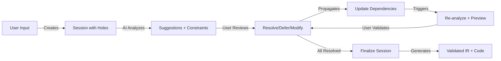
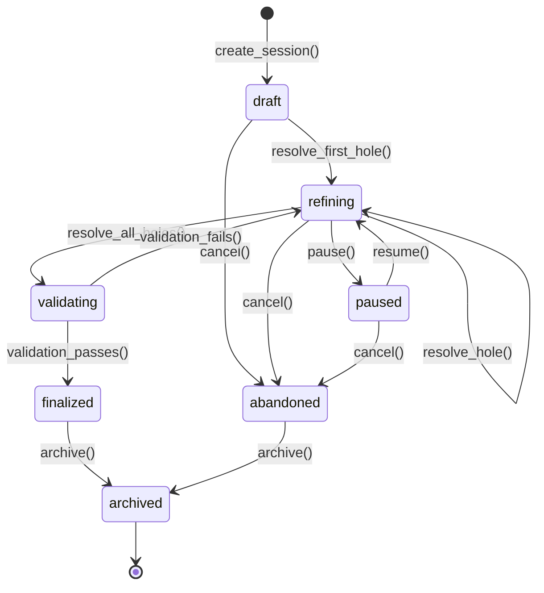

# Product Requirements Document: Interactive Refinement (Human-AI Collaboration)

**Version**: 1.0
**Date**: 2025-10-21
**Status**: Active
**Owner**: Codelift Team

---

## Document Overview

**Purpose**: Define the vision, requirements, and implementation strategy for Interactive Refinement - a real-time, session-based workflow that enables humans and AI to collaboratively refine specifications through typed holes, constraint propagation, and live preview.

**Audience**: Product team, engineering team, designers, researchers

**Related Documents**:
- [PRD: lift](PRD_LIFT.md) - Top-level product vision
- [PRD: Typed Holes](PRD_TYPED_HOLES.md) - Hole system fundamentals
- [PRD: Forward Mode](PRD_FORWARD_MODE.md) - NL → IR → Code workflows
- [PRD: Reverse Mode](PRD_REVERSE_MODE.md) - Code → IR workflows
- [IR Specification](../lift-sys/docs/IR_SPECIFICATION.md) - Technical IR details
- [Session State](../lift-sys/docs/planning/SESSION_STATE.md) - Implementation status

---

## Table of Contents

1. [Executive Summary](#1-executive-summary)
2. [Vision for Human-AI Collaboration](#2-vision-for-human-ai-collaboration)
3. [Session-Based Workflows](#3-session-based-workflows)
4. [Real-Time Refinement Experience](#4-real-time-refinement-experience)
5. [Functional Requirements](#5-functional-requirements)
6. [User Experience Design](#6-user-experience-design)
7. [Success Metrics](#7-success-metrics)

---

## 1. Executive Summary

### The Collaborative Refinement Problem

Current AI coding tools operate in a **fire-and-forget** paradigm:
1. User provides prompt
2. AI generates complete code
3. User discovers issues (wrong assumptions, missing edge cases, unclear behavior)
4. User must start over or manually fix

This wastes time and creates frustration when:
- **Ambiguities** in the prompt lead to wrong implementations
- **Edge cases** aren't discovered until code runs
- **Constraints** aren't validated until deployment
- **User intent** gets lost across multiple regeneration attempts

### The Interactive Refinement Solution

**Shift from fire-and-forget to iterative collaboration:**

```
Traditional:                  Interactive Refinement:
─────────────                 ───────────────────────
Prompt → Code                 Prompt → IR with Holes
  ↓                             ↓
Run → Find Issues             Refine Holes Iteratively
  ↓                             ↓ (constraint propagation)
New Prompt → Rework           Live Preview with Partial Eval
  ↓                             ↓
Repeat until right            Finalize → Validated IR → Code
```

**Key Capabilities**:

1. **Session Continuity**: Work persists across interruptions (resume, branch, merge)
2. **Real-Time Feedback**: See IR updates and constraint violations as you type
3. **AI Assistance**: Context-aware suggestions ranked by confidence and constraints
4. **Transparency**: Full provenance - why does this hole exist? What depends on it?
5. **Partial Progress**: Evaluate around holes to see behavior before full resolution
6. **Collaborative History**: Track all refinements with undo/redo and revision branching

### Integration with lift Ecosystem

Interactive Refinement is the **human-in-the-loop layer** connecting all modes:

**Forward Mode** (Prompt → Code):
- Creates session from natural language
- Detects ambiguities as typed holes
- User refines iteratively before code generation

**Reverse Mode** (Code → Understanding):
- Creates session from existing code
- Surfaces implicit assumptions as holes
- User documents intent iteratively

**Typed Holes**:
- Interactive refinement is the primary UX for working with holes
- Real-time constraint propagation shows hole dependencies
- AI suggestions guide resolution

### Current Status (2025-10-21)

**Production** (IR 0.8):
- ✅ Session management (create, resume, finalize)
- ✅ Supabase persistence for session state
- ✅ Basic hole resolution workflow
- ✅ Python SDK and CLI support

**In Progress** (IR 0.9, Phase 2-3):
- 🔄 Phase 2 Complete: H2 StatePersistence resolved (Supabase working)
- ⏳ Phase 3 (Q3 2025): Hole closures, partial evaluation, live preview
- ⏳ Real-time WebSocket updates
- ⏳ Advanced constraint propagation
- ⏳ AI-powered suggestions

**Planned** (IR 1.0, Q4 2025):
- ⏳ Multi-user collaboration
- ⏳ Branch/merge workflows
- ⏳ Visual dependency graph
- ⏳ LSP integration for IDE support

---

## 2. Vision for Human-AI Collaboration

### Principles of Effective Collaboration

**1. Transparency Over Magic**
- Users see **what the AI knows** and **what it's guessing**
- Holes make ambiguities explicit rather than hidden
- Provenance explains every decision: "This hole exists because X was ambiguous"

**2. Agency Over Automation**
- Users control the pace: resolve holes now, defer for later, or accept AI suggestions
- No forced decisions: partial evaluation shows consequences before commitment
- Easy backtracking: undo/redo with full revision history

**3. Guidance Over Guessing**
- AI provides **ranked suggestions with confidence scores**, not single answers
- Constraints narrow solution space rather than expanding it
- Context-aware: suggestions consider dependencies, usage patterns, and domain knowledge

**4. Continuity Over Fragmentation**
- Sessions persist across interruptions (save/resume)
- Work can branch (explore alternatives) and merge (reconcile choices)
- Full history: see how spec evolved from prompt to validated IR

**5. Feedback Over Delay**
- Real-time updates: see constraint violations immediately
- Live preview: partial evaluation shows value flows through holes
- Incremental validation: SMT checks run as holes resolve

### The Collaborative Loop



**Collaborative Dynamics**:

| Phase | User Role | AI Role |
|-------|-----------|---------|
| **Initiation** | Provides prompt/code | Detects ambiguities as holes |
| **Analysis** | Reviews holes and context | Generates ranked suggestions |
| **Refinement** | Chooses resolution | Propagates constraints, updates dependents |
| **Validation** | Reviews conflicts | Provides SMT counterexamples |
| **Preview** | Inspects partial results | Shows value flows through holes |
| **Finalization** | Confirms completeness | Generates validated IR and code |

### User Mental Model

**"I'm refining a specification with an AI partner who:"**
- **Identifies** what's unclear (holes)
- **Suggests** possible resolutions (ranked by confidence)
- **Validates** my choices (constraint checking)
- **Shows** the impact (dependency propagation)
- **Previews** the behavior (partial evaluation)
- **Remembers** the journey (session history)

**Not:**
- A black box that generates code I don't understand
- A magic oracle that always knows the right answer
- A tool that forces me to decide everything upfront
- A system that forgets context between attempts

---

## 3. Session-Based Workflows

### 3.1 Session Lifecycle

**Session States**:
```
draft → refining → validating → finalized
  ↓         ↓           ↓            ↓
abandoned  paused     failed      archived
```

**State Transitions**:

| From | To | Trigger | Validation |
|------|----|---------| -----------|
| - | draft | `create_session()` | Prompt or IR provided |
| draft | refining | First hole resolution | N/A |
| refining | refining | Resolve/defer hole | Constraint checks pass |
| refining | validating | Resolve all holes | All constraints satisfied |
| validating | finalized | SMT validation passes | No conflicts, complete |
| validating | refining | Validation fails | User reviews conflicts |
| * | paused | User pause | Save state to Supabase |
| paused | refining | User resume | Load state from Supabase |
| * | abandoned | User cancel | Optional save for recovery |

### 3.2 Create Session

**Entry Points**:

1. **From Natural Language Prompt** (Forward Mode)
   ```python
   session = client.create_session(
       prompt="Create a notification system with retry logic",
       metadata={"project": "alerts", "language": "python"}
   )
   ```

   **AI Processing**:
   - Parse prompt into IntentSpec
   - Generate skeletal FuncSpec
   - Detect ambiguities as typed holes
   - Return session with holes

2. **From Existing Code** (Reverse Mode)
   ```python
   session = client.create_session(
       code=Path("notifications.py").read_text(),
       source="code",
       metadata={"language": "python"}
   )
   ```

   **AI Processing**:
   - Lift code to IR
   - Identify implicit assumptions as holes
   - Extract intent from docstrings/comments
   - Return session with holes

3. **From Partial IR** (Resume/Branch)
   ```python
   session = client.create_session(
       ir=existing_ir,
       source="ir",
       metadata={"branch_from": "session-abc123"}
   )
   ```

   **AI Processing**:
   - Validate IR structure
   - Re-detect holes
   - Restore provenance
   - Return session ready for refinement

**Session Response**:
```json
{
  "session_id": "550e8400-e29b-41d4-a716-446655440000",
  "status": "draft",
  "source": "prompt",
  "created_at": "2025-10-21T10:30:00Z",
  "ambiguities": ["?notification_channel", "?retry_strategy", "?max_retries"],
  "current_draft": {
    "version": 1,
    "ir": { ... },
    "validation_status": "pending",
    "holes": [
      {
        "id": "?notification_channel",
        "kind": "term",
        "type": "Set[Channel]",
        "constraints": ["at_least_one"],
        "provenance": "Derived from 'notification system' - channel unspecified",
        "suggestions": [
          {"value": "{Email, Push}", "confidence": 0.9},
          {"value": "{Email}", "confidence": 0.7}
        ]
      }
    ]
  }
}
```

### 3.3 Resume Session

**Use Cases**:
- User paused work and wants to continue
- Session interrupted (network issue, browser refresh)
- User switches devices
- Long-running refinement across multiple days

**Implementation**:
```python
# Resume by session ID
session = client.resume_session("550e8400-e29b-41d4-a716-446655440000")

# Session restored from Supabase with:
# - All holes (resolved and unresolved)
# - Full revision history
# - Constraint state
# - AI suggestion cache
```

**Supabase Schema** (from H2 StatePersistence):
```sql
CREATE TABLE graph_states (
  execution_id UUID PRIMARY KEY,
  state_snapshot JSONB NOT NULL,
  state_type TEXT NOT NULL,
  provenance JSONB DEFAULT '[]',
  metadata JSONB DEFAULT '{}',
  user_id TEXT,
  created_at TIMESTAMPTZ DEFAULT NOW(),
  updated_at TIMESTAMPTZ DEFAULT NOW()
);
```

**Resume Behavior**:
- Loads latest draft (version N)
- Reconstructs hole dependency graph
- Re-validates constraints (constraints may have evolved)
- Re-ranks AI suggestions (model may have improved)
- Shows "Resumed from [timestamp]" notification

### 3.4 Branch Session

**Use Case**: Explore alternative resolutions without losing original work

**Workflow**:
```python
# Branch from existing session at specific revision
new_session = client.branch_session(
    source_session_id="550e8400-...",
    branch_point={"version": 3},  # Branch from draft v3
    metadata={"branch_reason": "Try HTTP instead of email"}
)

# Make different choices in the branch
client.resolve_hole(
    session_id=new_session.session_id,
    hole_id="?notification_channel",
    resolution_text="{HTTP}",  # Different from main branch
)
```

**Branch Tracking**:
```json
{
  "session_id": "new-branch-uuid",
  "parent_session_id": "550e8400-...",
  "branch_point": {"version": 3},
  "divergence": [
    {
      "hole_id": "?notification_channel",
      "parent_resolution": "{Email, Push}",
      "branch_resolution": "{HTTP}"
    }
  ]
}
```

**Branch Visualization** (UI):
```
Main Branch:
  v1: [Create] → 5 holes
  v2: [Resolve ?notification_channel = {Email, Push}] → 4 holes
  v3: [Resolve ?retry_strategy = exponential] → 3 holes
  v4: [Resolve ?max_retries = 3] → 2 holes
       ↓
       ├─── v5: [Resolve ?timeout = 30s] → 1 hole
       │
       └─── Branch 1: [Try HTTP alternative]
            v3b: [Resolve ?notification_channel = {HTTP}] → 3 holes (different constraints!)
            v4b: [Resolve ?webhook_url = "..."] → 2 holes
```

### 3.5 Merge Sessions

**Use Case**: Reconcile choices from branched exploration

**Scenario**: User tried two approaches (Email vs HTTP), wants to combine best parts

**Merge Request**:
```python
merge_result = client.merge_sessions(
    base_session_id="550e8400-...",  # Main branch
    branch_session_id="branch-uuid",  # Alternative
    conflict_resolution="manual"  # or "auto", "prefer_base", "prefer_branch"
)
```

**Merge Conflict Detection**:
```json
{
  "conflicts": [
    {
      "hole_id": "?notification_channel",
      "base_resolution": "{Email, Push}",
      "branch_resolution": "{HTTP}",
      "conflict_type": "different_value",
      "resolution_required": true
    },
    {
      "hole_id": "?retry_strategy",
      "base_resolution": "exponential",
      "branch_resolution": "exponential",
      "conflict_type": "no_conflict",
      "resolution_required": false
    }
  ],
  "auto_mergeable": false
}
```

**Manual Conflict Resolution**:
```python
# User chooses how to resolve each conflict
client.resolve_merge_conflict(
    merge_id="merge-xyz",
    hole_id="?notification_channel",
    resolution="union",  # Combine both: {Email, Push, HTTP}
    # or: "base", "branch", "custom:<value>"
)
```

**Merge Result**:
- New session with merged resolutions
- Provenance tracks merge origin
- Re-runs constraint validation (merged constraints may conflict!)
- Shows diff of what changed from each branch

### 3.6 Session History and Revision Tracking

**Revision Structure**:
```python
class Revision:
    version: int
    timestamp: datetime
    action: RevisionAction  # fill_hole, split_hole, revert, merge
    hole_id: str | None
    before: Any
    after: Any
    propagated_changes: list[HoleUpdate]
    user_id: str
```

**Accessing History**:
```python
# Get full history
history = client.get_session_history(session_id)

# Timeline view:
# v1: [2025-10-21 10:30] Create session from prompt
# v2: [2025-10-21 10:32] Resolve ?notification_channel = {Email, Push}
#     → Propagated: ?rate_limit updated, ?retry_strategy narrowed
# v3: [2025-10-21 10:35] Resolve ?retry_strategy = exponential
#     → Propagated: ?backoff_base updated
# v4: [2025-10-21 10:40] Revert to v2 (retry decision wrong)
# v5: [2025-10-21 10:42] Resolve ?retry_strategy = linear
```

**Undo/Redo**:
```python
# Undo last change (creates new revision)
client.undo(session_id)  # Reverts v5 → v4

# Redo
client.redo(session_id)  # Re-applies v5

# Jump to specific revision
client.checkout_revision(session_id, version=2)
```

**Constraint Propagation in History**:
- Each revision tracks **propagated changes** to dependent holes
- Undo reverses propagation (hole constraints restored)
- Redo re-applies propagation (holes re-narrowed)

---

## 4. Real-Time Refinement Experience

### 4.1 Live IR Updates

**User Experience**:
- User types in prompt refinement or hole resolution
- IR updates **immediately** (debounced 300ms)
- Constraint violations shown **inline**
- Dependency graph updates **in real-time**

**Implementation**: WebSocket connection

```javascript
// Client establishes WebSocket
const ws = new WebSocket('ws://api.lift-sys.dev/sessions/550e8400.../stream');

// User types: "?max_retries = 5"
ws.send({
  type: "resolve_hole",
  hole_id: "?max_retries",
  resolution_text: "5"
});

// Receive real-time updates
ws.onmessage = (event) => {
  const update = JSON.parse(event.data);

  switch (update.type) {
    case "hole_resolved":
      // Update UI: mark hole as resolved
      break;
    case "constraints_propagated":
      // Update dependent holes
      update.affected_holes.forEach(hole => updateHoleUI(hole));
      break;
    case "validation_result":
      // Show constraint check result
      if (update.status === "violated") {
        showInlineError(update.message);
      }
      break;
  }
};
```

**Update Flow**:
```
User types → WebSocket send → Server processes → Constraint propagation
                                                         ↓
UI updates ← WebSocket receive ← Server broadcasts ← SMT validation
```

**Optimistic UI Updates**:
- Client immediately shows resolution (optimistic)
- Server validates and may reject
- If rejected, client reverts with error message

**Example**:
```
User: "?max_retries = -5"
  → UI shows: "?max_retries = -5" (optimistic)
  → Server: Constraint violation (must be positive)
  → UI reverts: "?max_retries = ???" + error "Value must be > 0"
```

### 4.2 AI Suggestion Generation

**Trigger Points**:
1. **On Hole Creation**: When hole first detected
2. **On Context Change**: When dependent hole resolves (suggestions re-rank)
3. **On User Request**: User clicks "Get Suggestions"
4. **On Validation Failure**: User tries invalid value, AI suggests valid alternatives

**Suggestion Pipeline** (from PRD_TYPED_HOLES.md §7.1):

```python
def generate_suggestions(hole: TypedHole, context: Context) -> list[Suggestion]:
    # 1. Solver-based: SMT models satisfying constraints
    solver_suggestions = generate_smt_models(hole.constraints, limit=5)

    # 2. Valid fits: In-scope terms matching type (GHC-style)
    valid_fits = find_valid_fits(hole.type, context.scope)

    # 3. Pattern matching: Similar holes in codebase
    pattern_suggestions = search_similar_resolutions(hole, context.codebase)

    # 4. LLM generation: Context-aware AI suggestions
    llm_suggestions = query_llm(hole, context)

    # 5. Rank and calibrate
    all_suggestions = [
        *solver_suggestions,
        *valid_fits,
        *pattern_suggestions,
        *llm_suggestions
    ]

    ranked = rank_suggestions(all_suggestions, hole, context)
    calibrated = calibrate_confidence(ranked)

    return calibrated[:10]  # Top 10
```

**Suggestion Display**:
```
Suggestions for ?notification_channel (Set[Channel]):

 1. ✓ {Email, Push}                         (90% confidence)
    └─ Based on: 80% of notification systems use these two
    └─ Constraints: ✓ at_least_one, ✓ all_valid_channels
    └─ Impact: Narrows ?retry_strategy to 1 option

 2.   {Email}                               (70% confidence)
    └─ Based on: Email-only is common for simpler systems
    └─ Constraints: ✓ at_least_one, ✓ all_valid_channels
    └─ Impact: No constraint propagation

 3.   {SMS, Email, Push}                    (60% confidence)
    └─ Based on: Full multi-channel systems
    └─ Constraints: ✓ at_least_one, ✓ all_valid_channels
    └─ Warning: Increases ?rate_limit complexity

[Custom] Enter your own value
```

**Suggestion Ranking Factors** (from PRD_TYPED_HOLES.md §7.5):
- Type compatibility: 30%
- Constraint satisfaction: 25%
- Scope proximity: 15%
- Usage priors: 15%
- LLM confidence: 10%
- Name similarity: 5%

**Confidence Calibration** (FR3.12):
- Score 0.9 → 90% historical acceptance rate
- Measured continuously via feedback loop
- Updated via isotonic regression

### 4.3 Constraint Propagation Visualization

**User View**: Dependency graph showing hole relationships

**Example**:
```
Session: Notification System (5 holes)

Dependency Graph:

[?notification_channel] ──blocks──> [?retry_strategy]
         │                               │
         │                               └──blocks──> [?max_retries]
         │
         └──blocks──> [?rate_limit]
                           │
                           └──blocks──> [?timeout]

Critical Path: ?notification_channel → ?retry_strategy → ?max_retries (3 steps)
```

**When Hole Resolves**:
```
User resolves: ?notification_channel = {Email, Push}

Propagation:
  ✓ ?retry_strategy: Narrowed from 5 options to 1 (email_retry)
  ✓ ?rate_limit: Updated to {email: 100/min, push: 50/min}
  ✓ ?timeout: No change (not directly dependent)

Dependency Graph (updated):

[✓ ?notification_channel = {Email, Push}] ──narrowed──> [?retry_strategy] (1 option)
         │
         └──updated──> [?rate_limit] (new constraints)
                           │
                           └──blocks──> [?timeout]
```

**Visual Indicators**:
- ✓ Green: Resolved
- ⚠️ Yellow: Constraint narrowed (fewer valid options)
- 🔴 Red: Conflict detected (no valid options)
- 🔒 Gray: Blocked by dependencies

**Interactive Graph**:
- Click hole → show details panel
- Hover edge → show constraint propagation rule
- Filter: Show only critical path, show only conflicts

### 4.4 Partial Evaluation Preview

**Goal**: Show behavior of incomplete code with holes

**Mechanism** (from Hazel, PRD_TYPED_HOLES.md §2.2):
- **Hole closures**: Runtime representation `⟨Γ, ?h⟩`
- **Indeterminate progress**: Evaluation continues around holes
- **Trace collection**: Record value flows through holes

**Example Code with Holes**:
```python
def process_orders(orders: List[Order]) -> Report:
    validated = [?validate_order(o) for o in orders]  # HOLE
    return summarize(validated)
```

**Partial Evaluation**:
```python
# Run with sample data
preview_result = client.preview_with_holes(
    session_id,
    test_data={"orders": [Order(id=1, amount=100), Order(id=2, amount=50)]}
)
```

**Preview Result**:
```json
{
  "partial_output": {
    "validated": [
      "⟨?validate_order, Order(id=1, amount=100)⟩",
      "⟨?validate_order, Order(id=2, amount=50)⟩"
    ],
    "summarize_input": "List of 2 hole closures"
  },
  "hole_traces": [
    {
      "hole_id": "?validate_order",
      "inputs_seen": [
        "Order(id=1, amount=100)",
        "Order(id=2, amount=50)"
      ],
      "operations_attempted": ["summarize(...)"],
      "discovered_constraints": [
        "Must return something summarize() accepts",
        "Called 2 times (same as len(orders))"
      ]
    }
  ],
  "suggestions_updated": [
    {
      "hole_id": "?validate_order",
      "new_top_suggestion": "def validate_order(o: Order) -> ValidatedOrder",
      "rationale": "Trace shows it receives Order, must return something for summarize"
    }
  ]
}
```

**UI Display**:
```
Preview: process_orders([Order(1, $100), Order(2, $50)])

Execution Flow:
  1. orders = [Order(1, $100), Order(2, $50)]  ✓ Completed
  2. validated = [?validate_order(o) for o in orders]  ⚠️ Hole encountered
     └─ Trace: ?validate_order called twice
     └─ Inputs: Order(1, $100), Order(2, $50)
  3. summarize(validated)  ⏸️ Paused (validated contains holes)

Discovered:
  • ?validate_order must handle Order type
  • ?validate_order should return consistent type for summarize
  • Execution pattern: map over list (consider vectorization?)

[Update Suggestions] [Try Different Data] [Resume Preview]
```

**Benefits**:
- See **what values flow** through holes (concrete examples)
- Discover **constraints from usage** (type inference from traces)
- Test **different scenarios** before full implementation
- Validate **performance characteristics** (how many calls?)

### 4.5 Conflict Detection and Resolution

**Conflict Scenario**:
```python
# User resolves two holes
?min_timeout = 100  # seconds
?max_timeout = 50   # seconds

# Constraint: ?min_timeout < ?max_timeout
# SMT Solver: UNSAT (100 < 50 is false)
```

**Real-Time Conflict Notification**:
```
⚠️ Conflict Detected

Filling ?max_timeout with 50 violates:
  Constraint: ?min_timeout < ?max_timeout
  Current: 100 < 50 (false)

Suggestions:
  ✓ Change ?max_timeout to 200 (>= 100)
  • Or reduce ?min_timeout to 30
  • Or adjust constraint (allow ?min_timeout = ?max_timeout?)

[Auto-Fix: 200] [Edit Constraint] [Undo ?max_timeout]
```

**Conflict Types**:

| Type | Example | Resolution |
|------|---------|------------|
| **Value Inequality** | `?min > ?max` | Adjust one value |
| **Type Mismatch** | `?fn : Int -> Str`, used as `Int -> Int` | Fix type or usage |
| **Constraint Unsatisfiable** | `{x \| x>10 ∧ x<5}` | Relax constraints |
| **Circular Dependency** | `?A depends on ?B depends on ?A` | Introduce abstraction |

**Auto-Fix Suggestions**:
- SMT solver generates **alternative values** satisfying all constraints
- Ranked by minimal change from user's choice
- User can accept auto-fix or manually adjust

---

## 5. Functional Requirements

### FR4.1: Session Creation from Multiple Sources
**Priority**: P0

**Requirement**: Support session creation from prompt, code, or partial IR.

**Acceptance Criteria**:
- [x] Create session from natural language prompt
- [x] Create session from code file (Reverse Mode)
- [ ] Create session from partial IR (branch/resume)
- [ ] Validate source format before creating session
- [ ] Return session with detected holes and initial suggestions

**Current Status**: Basic session creation working (Supabase persistence ✅)

---

### FR4.2: Session State Persistence
**Priority**: P0

**Requirement**: All session state must persist to Supabase for resume/recovery.

**Acceptance Criteria**:
- [x] Save session state atomically (no partial writes)
- [x] Load session state with full fidelity (no data loss)
- [x] Session state includes: holes, resolutions, history, constraints
- [x] Support concurrent sessions for same user
- [ ] Auto-save on every change (debounced 5s)

**Current Status**: ✅ H2 StatePersistence resolved (Phase 2 complete)

---

### FR4.3: Real-Time Updates via WebSocket
**Priority**: P0

**Requirement**: Changes to session state must broadcast to all connected clients.

**Acceptance Criteria**:
- [ ] Establish WebSocket connection on session open
- [ ] Broadcast hole resolution to all clients
- [ ] Broadcast constraint propagation updates
- [ ] Broadcast validation results (SMT checks)
- [ ] Handle reconnection gracefully (restore missed updates)
- [ ] Latency <200ms from user action to UI update

**Current Status**: Planned for IR 0.9 Phase 3

---

### FR4.4: Optimistic UI Updates
**Priority**: P1

**Requirement**: UI must update immediately, then validate server-side.

**Acceptance Criteria**:
- [ ] Client shows resolution optimistically
- [ ] Server validates and responds within 500ms
- [ ] Client reverts if validation fails
- [ ] Error messages actionable (suggest fix)
- [ ] Visual indicator during validation (spinner/pending state)

**Current Status**: Planned for IR 0.9 Phase 3

---

### FR4.5: AI Suggestion Generation and Ranking
**Priority**: P0

**Requirement**: Generate context-aware suggestions for every hole.

**Acceptance Criteria**:
- [ ] Generate suggestions within 2s of hole creation
- [ ] Rank suggestions by confidence (calibrated)
- [ ] Show top 5-10 suggestions
- [ ] Update suggestions when context changes
- [ ] Include rationale for each suggestion
- [ ] Allow user to request more suggestions

**Current Status**: Planned for IR 0.9 Phase 3

**Dependencies**: H10 (OptimizationMetrics), H12 (ConfidenceCalibration)

---

### FR4.6: Constraint Propagation Engine
**Priority**: P0

**Requirement**: Resolving one hole must propagate constraints to dependents.

**Acceptance Criteria**:
- [ ] Identify dependent holes via dependency graph
- [ ] Update constraints for each dependent
- [ ] Trigger re-ranking of suggestions
- [ ] Detect conflicts (UNSAT constraints)
- [ ] Notify user of propagated changes
- [ ] Propagation latency <100ms

**Current Status**: Planned for IR 0.9 Phase 3

**Dependencies**: SMT solver integration (Phase 2)

---

### FR4.7: Partial Evaluation with Hole Closures
**Priority**: P1

**Requirement**: Execute code with holes to collect traces and preview behavior.

**Acceptance Criteria**:
- [ ] Hole closures `⟨Γ, ?h⟩` implemented in evaluator
- [ ] Partial evaluation runs without errors
- [ ] Traces collect input/output values
- [ ] Traces show operations attempted
- [ ] Discovered constraints update hole metadata
- [ ] User can provide test data for preview

**Current Status**: Planned for IR 0.9 Phase 3 (Q3 2025)

**Dependencies**: Hazel-style evaluator, hole closures

---

### FR4.8: Undo/Redo with Revision History
**Priority**: P1

**Requirement**: Users can undo/redo hole resolutions and view full history.

**Acceptance Criteria**:
- [x] Undo reverts last change (creates new revision)
- [x] Redo re-applies reverted change
- [x] Full history accessible (all revisions)
- [ ] Revision metadata includes: action, timestamp, user, propagated changes
- [ ] Jump to specific revision (checkout)
- [ ] Constraint propagation reversed on undo

**Current Status**: Basic undo/redo implemented (Supabase history)

---

### FR4.9: Branch and Merge Sessions
**Priority**: P2

**Requirement**: Users can explore alternative resolutions in branches, then merge.

**Acceptance Criteria**:
- [ ] Branch from any revision
- [ ] Track divergence between branches
- [ ] Detect merge conflicts
- [ ] Manual conflict resolution
- [ ] Auto-merge when no conflicts
- [ ] Merge provenance tracked

**Current Status**: Planned for IR 1.0 (Q4 2025)

---

### FR4.10: Dependency Graph Visualization
**Priority**: P1

**Requirement**: Show hole dependencies as interactive graph.

**Acceptance Criteria**:
- [ ] Graph shows all holes and edges
- [ ] Visual states: resolved, narrowed, blocked, conflict
- [ ] Click hole → details panel
- [ ] Hover edge → propagation rule
- [ ] Filter: critical path, conflicts only
- [ ] Auto-layout for readability

**Current Status**: Planned for IR 0.9 Phase 3

---

### FR4.11: Conflict Detection and Auto-Fix
**Priority**: P0

**Requirement**: Detect constraint conflicts and suggest fixes.

**Acceptance Criteria**:
- [ ] SMT solver detects UNSAT constraints
- [ ] Generate counterexample showing conflict
- [ ] Suggest alternative values (auto-fix)
- [ ] Rank auto-fix suggestions by minimal change
- [ ] User can accept, reject, or customize auto-fix
- [ ] Conflict detection latency <1s

**Current Status**: Planned for Phase 2 (SMT integration)

---

### FR4.12: Multi-User Collaboration
**Priority**: P2

**Requirement**: Multiple users can refine the same session.

**Acceptance Criteria**:
- [ ] Presence indicators (who's viewing/editing)
- [ ] Real-time cursors/selections
- [ ] Conflict resolution for concurrent edits
- [ ] Change attribution (who resolved which hole)
- [ ] User permissions (view-only, edit, admin)

**Current Status**: Planned for IR 1.0 (Q4 2025)

---

### FR4.13: Session Finalization and Validation
**Priority**: P0

**Requirement**: Finalize session to generate validated IR and code.

**Acceptance Criteria**:
- [x] Finalization blocked if holes remain
- [x] SMT validation runs on full IR
- [x] Code generation from validated IR
- [ ] Finalization report (summary of changes)
- [ ] Option to finalize with deferred holes (partial impl)
- [ ] Finalized sessions immutable (archive only)

**Current Status**: Basic finalization working

---

### FR4.14: Session Import/Export
**Priority**: P2

**Requirement**: Export session for sharing, import for resumption.

**Acceptance Criteria**:
- [ ] Export to JSON/YAML with full state
- [ ] Import validates format before creating session
- [ ] Export includes: IR, holes, history, metadata
- [ ] Version control friendly (deterministic serialization)
- [ ] Share sessions across teams

**Current Status**: Planned for IR 1.0

---

### FR4.15: LSP Integration for IDE Support
**Priority**: P2

**Requirement**: IDE support for hover, autocomplete, quick fixes.

**Acceptance Criteria**:
- [ ] LSP server exposes hole operations
- [ ] Hover shows hole details (type, constraints, suggestions)
- [ ] Autocomplete for hole fills
- [ ] Quick fixes for conflicts
- [ ] Inline diagnostics for validation errors
- [ ] VS Code extension (reference impl)

**Current Status**: Planned for IR 0.9 Phase 4 (Months 11-14)

---

## 6. User Experience Design

### 6.1 UI Layout: Three-Pane Studio

**Layout**:
```
┌─────────────────────────────────────────────────────────────────┐
│ lift-sys Interactive Refinement                     [Save] [?] │
├──────────────────┬─────────────────────┬────────────────────────┤
│                  │                     │                        │
│  Spec Editor     │  Dependency Graph   │  Hole Details Panel    │
│  (Left Pane)     │  (Center Pane)      │  (Right Pane)          │
│                  │                     │                        │
│  • Prompt        │  • Visual graph     │  • Selected hole info  │
│  • IR draft      │  • Critical path    │  • Type & constraints  │
│  • Holes inline  │  • Conflicts        │  • Suggestions         │
│  • Validation    │  • Click to select  │  • Preview traces      │
│                  │                     │  • Resolution history  │
│                  │                     │                        │
├──────────────────┴─────────────────────┴────────────────────────┤
│  Status Bar: 5 holes • 2 resolved • 1 conflict • Session abc123│
└─────────────────────────────────────────────────────────────────┘
```

### 6.2 Hole Interactions

**Visual Design**:
- Holes underlined with **yellow wavy line** (VSCode-style)
- Icon indicates kind: 🔲 term, 🔳 type, 📋 spec, 👤 entity, ⚙️ function, 📦 module
- Badge shows resolution status: ❓ unresolved, ⏳ refining, ✓ resolved, ⚠️ conflict
- Glow effect for critical path holes

**Hover Tooltip**:
```
┌─────────────────────────────────────────┐
│ ?notification_channel (term hole)       │
│ Type: Set[Channel]                      │
│ Constraint: At least one channel        │
│                                         │
│ Suggestions:                            │
│ ✓ {Email, Push} (90% confidence)       │
│   {Email} (70% confidence)             │
│   {SMS, Email, Push} (60% confidence)  │
│                                         │
│ Why: "send notifications" is ambiguous │
│ Blocks: ?retry_strategy, ?rate_limit  │
│                                         │
│ [Accept] [Custom] [Defer] [Details]    │
└─────────────────────────────────────────┘
```

**Actions**:
- **Accept**: Fill hole with top suggestion (one click)
- **Custom**: Open input for manual value
- **Defer**: Mark as "to do later"
- **Details**: Open right panel with full information

**Inline Validation**:
```python
def process(timeout: ?timeout):  # ← HOLE
    ^^^^^^^^^^^^^^^^^^^^^^^^^^^^^
    ⚠️ Conflict: ?timeout = -5 violates {x:Int | x>0}

    Suggestions:
      ✓ Change to 30 (common default)
      • Change to 60
      • Enter custom positive value
```

### 6.3 Dependency Graph Visualization

**Visual Elements**:
- **Nodes**: Rectangles with hole ID and status
- **Edges**: Directed arrows showing dependency direction
- **Colors**:
  - ✅ Green: Resolved
  - ⚠️ Yellow: Narrowed (constraints updated)
  - 🔴 Red: Conflict detected
  - 🔒 Gray: Blocked by dependencies
- **Highlights**: Critical path nodes have thicker borders

**Interactions**:
- Click node → show details in right panel
- Hover edge → show propagation rule tooltip
- Double-click node → jump to hole in spec editor
- Filter buttons: [All] [Critical Path] [Conflicts] [Resolved]

**Example Graph**:
```
     [✓ ?notification_channel]
              ↓  ↓
              ↓  └─────────────┐
    [⚠️ ?retry_strategy]    [⚠️ ?rate_limit]
              ↓                    ↓
      [?max_retries]          [?timeout]
```

### 6.4 Hole Details Panel

**Sections**:

1. **Header**
   ```
   ?notification_channel
   Term Hole • Set[Channel] • Status: Unresolved
   ```

2. **Context & Provenance**
   ```
   Why this exists:
   "notification system" in prompt doesn't specify channels

   Created: 2025-10-21 10:30:00
   Source: Spec line 12: "send notifications"
   ```

3. **Type & Constraints**
   ```
   Type: Set[Channel]
   Constraints:
     ✓ At least one channel
     ✓ All channels valid (Email, SMS, Push, HTTP)
     • Used in: ?retry_strategy, ?rate_limit
   ```

4. **Suggestions** (ranked)
   ```
   1. {Email, Push}                    (90%)
      Rationale: 80% of notification systems use these
      Impact: Narrows ?retry_strategy to 1 option
      [Accept] [Preview]

   2. {Email}                          (70%)
      Rationale: Email-only common for simple systems
      Impact: No constraint propagation
      [Accept] [Preview]

   [Custom Value] [Request More Suggestions]
   ```

5. **Preview (if partial eval available)**
   ```
   Trace from preview:
     Input: notification(message="Test", channel=?)
     Output: ⟨?notification_channel, message="Test"⟩

   Discovered:
     • channel must be serializable
     • channel used in HTTP request
   ```

6. **History**
   ```
   • v3: Narrowed by ?retry_strategy resolution
   • v2: Suggestions updated (context changed)
   • v1: Created from prompt
   ```

### 6.5 Conflict Resolution UI

**Conflict Alert**:
```
┌─────────────────────────────────────────────────────┐
│ ⚠️ Conflict Detected                                │
│                                                     │
│ Filling ?max_timeout with 50 violates:             │
│   Constraint: ?min_timeout < ?max_timeout          │
│   Current: 100 < 50 (false)                        │
│                                                     │
│ Auto-Fix Suggestions:                               │
│   1. Change ?max_timeout to 200 (>= 100)           │
│   2. Reduce ?min_timeout to 30                     │
│   3. Adjust constraint (allow equal values?)       │
│                                                     │
│ [Apply Auto-Fix 1] [Edit Manually] [Undo]         │
└─────────────────────────────────────────────────────┘
```

### 6.6 Session Status Bar

**Persistent Bottom Bar**:
```
Session: abc123 • Status: Refining • 5 holes (2 resolved, 1 conflict, 2 unresolved)
Critical Path: 50% complete • Last updated: 2 minutes ago • Auto-saved ✓

[Undo] [Redo] [History] [Preview] [Finalize]
```

**Status Indicators**:
- **Session ID**: Clickable → show session metadata
- **Status**: draft, refining, validating, finalized
- **Hole counts**: Color-coded badges
- **Critical path**: Progress bar
- **Auto-save**: ✓ saved, ⏳ saving, ⚠️ failed

### 6.7 Keyboard Shortcuts

| Shortcut | Action |
|----------|--------|
| `Cmd+Enter` | Accept top suggestion for focused hole |
| `Cmd+Shift+Enter` | Open custom input for focused hole |
| `Cmd+Z` | Undo last change |
| `Cmd+Shift+Z` | Redo |
| `Cmd+/` | Show keyboard shortcuts |
| `Cmd+P` | Preview with holes |
| `Cmd+F` | Finalize session (if ready) |
| `Tab` | Navigate to next hole |
| `Shift+Tab` | Navigate to previous hole |
| `Esc` | Close hole details panel |

---

## 7. Success Metrics

### 7.1 Session Engagement

**Metric**: Session completion rate

**Definition**: Percentage of sessions that reach "finalized" status

**Target**: ≥80%

**Measurement**:
```sql
SELECT
  COUNT(CASE WHEN status = 'finalized' THEN 1 END) * 100.0 / COUNT(*) AS completion_rate
FROM sessions
WHERE created_at >= NOW() - INTERVAL '30 days';
```

**Current Baseline**: Not measured (IR 0.8)

---

### 7.2 Time to Resolution

**Metric**: Median time from hole creation to resolution

**Target**: ≤10 minutes per hole

**Measurement**:
- Track timestamp when hole created
- Track timestamp when hole resolved
- Compute median across all holes

**Segmentation**:
- By hole kind (term, type, spec, etc.)
- By user experience level (new vs experienced)
- By prompt complexity (simple vs complex)

**Current Baseline**: Not measured

---

### 7.3 Suggestion Acceptance Rate

**Metric**: Percentage of holes filled with top-3 AI suggestions

**Target**: ≥70% acceptance for top suggestion, ≥85% for top-3

**Measurement**:
```python
acceptance_rate = {
    "top_1": holes_filled_with_rank_1 / total_holes,
    "top_3": holes_filled_with_rank_1_to_3 / total_holes,
    "custom": holes_filled_with_custom / total_holes
}
```

**Current Baseline**: No AI suggestions yet (IR 0.8)

**Improvement Plan**: Confidence calibration (FR3.12) improves ranking over time

---

### 7.4 Constraint Propagation Latency

**Metric**: Time from hole resolution to UI update with propagated changes

**Target**: P90 <100ms, P99 <500ms

**Measurement**:
- Timestamp: User clicks "Accept"
- Timestamp: WebSocket broadcasts propagation
- Timestamp: UI updates dependent holes
- Latency = UI update - User click

**Current Baseline**: Not measured (no real-time propagation yet)

---

### 7.5 Conflict Detection Accuracy

**Metric**: Percentage of actual conflicts detected by SMT solver

**Target**: ≥95% precision, ≥90% recall

**Measurement**:
- **True Positives**: SMT says UNSAT, human confirms conflict
- **False Positives**: SMT says UNSAT, human says no conflict
- **False Negatives**: SMT says SAT, but human finds conflict later
- Precision = TP / (TP + FP)
- Recall = TP / (TP + FN)

**Current Baseline**: Not measured (SMT integration pending)

---

### 7.6 Undo/Redo Usage

**Metric**: Percentage of sessions using undo at least once

**Target**: 20-40% (healthy exploration/backtracking)

**Measurement**:
```sql
SELECT
  COUNT(DISTINCT session_id) FILTER (WHERE action = 'undo') * 100.0
  / COUNT(DISTINCT session_id) AS undo_usage_rate
FROM revision_history
WHERE created_at >= NOW() - INTERVAL '30 days';
```

**Interpretation**:
- Too low (<10%): Users afraid to experiment
- Too high (>60%): Suggestions poor, users constantly backtracking

---

### 7.7 Partial Evaluation Adoption

**Metric**: Percentage of sessions using "Preview with Holes" feature

**Target**: ≥30%

**Measurement**:
- Track usage of `preview_with_holes()` API
- Count sessions with at least one preview
- Compute percentage of total sessions

**Current Baseline**: Not available (IR 0.9 feature)

---

### 7.8 Branch/Merge Usage

**Metric**: Percentage of sessions that branch at least once

**Target**: ≥15% (advanced feature)

**Measurement**:
- Count sessions with `branch_from` metadata
- Compute percentage of total sessions

**Current Baseline**: Not available (IR 1.0 feature)

---

### 7.9 User Satisfaction

**Metric**: Post-session NPS (Net Promoter Score)

**Target**: NPS ≥50 ("Excellent")

**Measurement**:
- Survey after session finalization
- Question: "How likely are you to recommend lift-sys to a colleague?" (0-10)
- NPS = % Promoters (9-10) - % Detractors (0-6)

**Current Baseline**: No user testing yet

**Survey Questions**:
1. How likely are you to recommend lift-sys? (0-10)
2. The interactive refinement process was: (1=frustrating, 10=delightful)
3. AI suggestions were helpful: (1=not at all, 10=very helpful)
4. I felt in control of the refinement: (1=strongly disagree, 10=strongly agree)
5. What did you like most? (open-ended)
6. What frustrated you? (open-ended)

---

### 7.10 Error Recovery Rate

**Metric**: Percentage of validation errors resolved without abandoning session

**Target**: ≥90%

**Measurement**:
- Track validation errors (constraint violations, type mismatches)
- Track whether user resolves error or abandons session
- Recovery rate = (errors_resolved) / (errors_encountered)

**Current Baseline**: Not measured

**Interpretation**:
- High rate: Good error messages, helpful suggestions
- Low rate: Errors confusing, no clear path to resolution

---

## Appendix A: WebSocket Protocol Specification

### Connection

**Endpoint**: `wss://api.lift-sys.dev/sessions/{session_id}/stream`

**Auth**: Bearer token in header or query param

```javascript
const ws = new WebSocket(
  `wss://api.lift-sys.dev/sessions/${sessionId}/stream?token=${authToken}`
);
```

### Message Types

#### Client → Server

**1. Resolve Hole**
```json
{
  "type": "resolve_hole",
  "hole_id": "?notification_channel",
  "resolution_text": "{Email, Push}",
  "resolution_type": "clarify_intent"
}
```

**2. Request Suggestions**
```json
{
  "type": "request_suggestions",
  "hole_id": "?retry_strategy",
  "limit": 10
}
```

**3. Preview with Holes**
```json
{
  "type": "preview",
  "test_data": {"orders": [...]}
}
```

#### Server → Client

**1. Hole Resolved**
```json
{
  "type": "hole_resolved",
  "hole_id": "?notification_channel",
  "resolution": "{Email, Push}",
  "timestamp": "2025-10-21T10:32:00Z"
}
```

**2. Constraints Propagated**
```json
{
  "type": "constraints_propagated",
  "source_hole_id": "?notification_channel",
  "affected_holes": [
    {
      "hole_id": "?retry_strategy",
      "change": "narrowed",
      "before_constraints": [...],
      "after_constraints": [...]
    }
  ]
}
```

**3. Validation Result**
```json
{
  "type": "validation_result",
  "hole_id": "?max_timeout",
  "status": "violated",
  "message": "Value -5 violates constraint {x:Int | x>0}",
  "auto_fix_suggestions": [
    {"value": 30, "confidence": 0.9}
  ]
}
```

**4. Suggestions Updated**
```json
{
  "type": "suggestions_updated",
  "hole_id": "?notification_channel",
  "suggestions": [
    {"value": "{Email, Push}", "confidence": 0.9},
    {"value": "{Email}", "confidence": 0.7}
  ]
}
```

**5. Preview Result**
```json
{
  "type": "preview_result",
  "partial_output": {...},
  "hole_traces": [...]
}
```

### Reconnection Protocol

**On Disconnect**:
1. Client detects disconnect
2. Client attempts reconnect with exponential backoff
3. Client sends `sync_request` with last known revision

**Sync Request**:
```json
{
  "type": "sync_request",
  "last_known_revision": 5
}
```

**Sync Response**:
```json
{
  "type": "sync_response",
  "current_revision": 8,
  "missed_updates": [
    {"revision": 6, "type": "hole_resolved", ...},
    {"revision": 7, "type": "constraints_propagated", ...},
    {"revision": 8, "type": "validation_result", ...}
  ]
}
```

---

## Appendix B: Session Lifecycle State Machine



**State Descriptions**:

| State | Description | Valid Transitions |
|-------|-------------|-------------------|
| **draft** | Session created, no holes resolved yet | refining, abandoned |
| **refining** | Actively resolving holes | refining, paused, validating, abandoned |
| **paused** | Work paused, state saved | refining, abandoned |
| **validating** | All holes resolved, SMT validation in progress | finalized, refining (if fails) |
| **finalized** | Validation passed, IR ready for code gen | archived |
| **abandoned** | User canceled session | archived |
| **archived** | Immutable historical record | (terminal) |

---

**Document Status**: Active
**Last Updated**: 2025-10-21
**Next Review**: After Phase 3 completion (Q3 2025)
**Maintained By**: Product & Engineering Leadership
**Version History**: v1.0 (2025-10-21) - Initial comprehensive PRD
