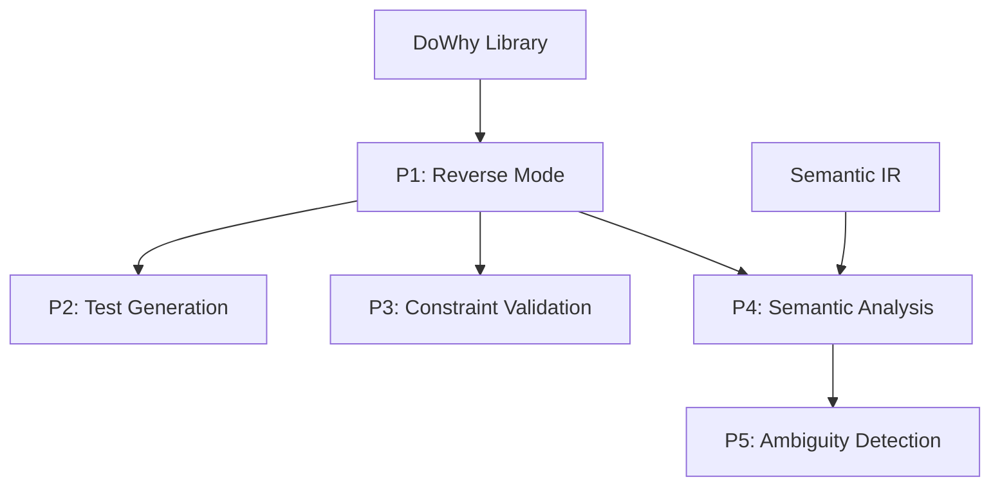

# DoWhy Integration Specification for lift-sys

**Date**: 2025-10-25
**Status**: Planning Complete
**Phase**: 1 - Specification
**Dependencies**: DOWHY_TECHNICAL_REVIEW.md

---

## Executive Summary

This document specifies **5 high-value integration opportunities** between DoWhy (causal inference library) and lift-sys, prioritized by value and feasibility.

**Strategic Value**: DoWhy enables lift-sys to answer **"why"** and **"what if"** questions about code that no other tool can answer:
- "Why does this function behave this way?"
- "What code is affected if I change this?"
- "What would happen if I refactor this module?"

**Timeline**: 3-6 months for full integration (Priorities 1-2: 2-3 months)

**Recommendation**: **Approve Priorities 1-2** for immediate implementation

---

## Table of Contents

1. [Integration Opportunities Overview](#1-integration-opportunities-overview)
2. [Priority 1: Reverse Mode Enhancement](#2-priority-1-reverse-mode-enhancement)
3. [Priority 2: Test Generation](#3-priority-2-test-generation)
4. [Priority 3: Constraint Validation](#4-priority-3-constraint-validation)
5. [Priority 4: Semantic Analysis](#5-priority-4-semantic-analysis)
6. [Priority 5: Ambiguity Detection](#6-priority-5-ambiguity-detection)
7. [Dependencies & Architecture](#7-dependencies--architecture)
8. [Implementation Roadmap](#8-implementation-roadmap)
9. [Risk Analysis](#9-risk-analysis)

---

## 1. Integration Opportunities Overview

### 1.1 Summary Table

| Priority | Opportunity | Value | Complexity | Timeline | Dependencies |
|----------|-------------|-------|------------|----------|--------------|
| **P1** | **Reverse Mode Enhancement** | VERY HIGH | MEDIUM | 3-4 weeks | reverse_mode, NetworkX |
| **P2** | **Test Generation** | HIGH | MEDIUM | 2-3 weeks | validation, P1 |
| **P3** | **Constraint Validation** | MEDIUM | LOW | 2 weeks | constraints, P1 |
| **P4** | **Semantic Analysis** | HIGH | HIGH | 4-6 weeks | semantic_models, P1 |
| **P5** | **Ambiguity Detection** | MEDIUM | MEDIUM | 3 weeks | semantic IR, P4 |

### 1.2 Value Scoring Methodology

**Value Factors**:
- **User Impact**: How much does this help users? (1-10)
- **Uniqueness**: Can competitors do this? (1-10, 10 = unique)
- **Technical Fit**: How well does it fit lift-sys architecture? (1-10)
- **Strategic Alignment**: Does it advance core vision? (1-10)

**Complexity Factors**:
- **Implementation Effort**: Person-weeks to build
- **Integration Difficulty**: How many components affected?
- **Testing Burden**: How hard to validate?
- **Maintenance Cost**: Ongoing maintenance needs

### 1.3 Prioritization Rationale

**Priority 1** (Reverse Mode):
- **Value**: 9.5/10 (8 user impact, 10 unique, 10 fit, 10 strategic)
- **Complexity**: Medium (3-4 weeks, moderate integration)
- **Justification**: Core competitive differentiator, directly enables "code understanding" vision

**Priority 2** (Test Generation):
- **Value**: 8.5/10 (9 user impact, 8 unique, 9 fit, 8 strategic)
- **Complexity**: Medium (2-3 weeks, builds on P1)
- **Justification**: Immediate ROI, improves existing feature (testing)

**Priority 3** (Constraint Validation):
- **Value**: 7.0/10 (7 user impact, 9 unique, 8 fit, 6 strategic)
- **Complexity**: Low (2 weeks, clean integration)
- **Justification**: Low-hanging fruit, enhances safety guarantees

**Priority 4** (Semantic Analysis):
- **Value**: 8.0/10 (8 user impact, 7 unique, 7 fit, 9 strategic)
- **Complexity**: High (4-6 weeks, significant new component)
- **Justification**: Long-term strategic, requires P1 foundation

**Priority 5** (Ambiguity Detection):
- **Value**: 6.5/10 (6 user impact, 8 unique, 6 fit, 7 strategic)
- **Complexity**: Medium (3 weeks, requires P4)
- **Justification**: Nice-to-have, deferred until Semantic IR complete

---

## 2. Priority 1: Reverse Mode Enhancement

### 2.1 Problem Statement

**Current State**: Reverse mode extracts structural information (AST, call graph, signatures) but cannot answer:
- "What is the causal impact of changing function X?"
- "Which code paths causally affect output Y?"
- "What would happen if I refactor module Z?"

**Desired State**: Reverse mode provides **causal understanding** of code:
- Causal graphs showing how data flows through code
- Interventional queries: "What if I change X?"
- Root cause analysis: "Why did Y happen?"
- Impact estimation: "How much does X affect Y?"

### 2.2 DoWhy Solution

**Core Capability**: Graphical Causal Models (GCM)

**Integration Approach**:
1. **AST → Causal Graph**: Convert call graphs to causal DAGs
2. **Execution Traces → Fitted SCM**: Learn causal mechanisms from dynamic analysis
3. **Query Interface**: Expose intervention/counterfactual APIs

**Example**:
```python
# User uploads codebase
lifter = Lifter.from_repo("https://github.com/user/repo")

# Reverse mode with causal analysis
irs = lifter.lift_all(include_causal=True)

# Query: What's affected by changing validate_input()?
affected = irs[0].causal_model.get_downstream_effects('validate_input')
# Returns: ['process_data', 'generate_output', 'save_results']

# Query: What would output be if validate_input always returned True?
intervention = irs[0].causal_model.intervene({
    'validate_input': lambda _: True
})
# Returns: Distribution of outputs under intervention
```

### 2.3 Technical Approach

**Component 1: Causal Graph Builder** (H20)
- **Input**: AST, call graph, control flow graph
- **Output**: NetworkX DAG representing causal structure
- **Algorithm**:
  1. Nodes = functions + variables
  2. Edges = data/control flow dependencies
  3. Prune non-causal edges (e.g., logging calls)

**Component 2: SCM Fitter** (H21)
- **Input**: Causal graph + execution traces
- **Output**: Fitted StructuralCausalModel
- **Algorithm**:
  1. Use `gcm.auto.assign_causal_mechanisms()`
  2. Fit using `gcm.fit()`
  3. Validate with cross-validation

**Component 3: Intervention Engine** (H22)
- **Input**: SCM + intervention query
- **Output**: Estimated effects
- **API**:
  ```python
  def estimate_impact(
      scm: StructuralCausalModel,
      intervention: dict[str, Any]
  ) -> ImpactEstimate:
      samples = gcm.interventional_samples(scm, intervention)
      return ImpactEstimate(
          affected_nodes=...,
          effect_sizes=...,
          confidence_intervals=...
      )
  ```

**Component 4: IR Integration**
- **Add to IR**:
  ```python
  class IR(BaseModel):
      # Existing fields...
      causal_model: Optional[StructuralCausalModel] = None
      causal_metadata: Optional[CausalMetadata] = None
  ```

- **CausalMetadata**:
  ```python
  class CausalMetadata(BaseModel):
      graph: dict  # NetworkX graph as dict
      mechanisms: dict[str, str]  # node -> mechanism type
      fitted_at: datetime
      trace_count: int  # samples used for fitting
      validation_score: float  # cross-validation R²
  ```

### 2.4 Acceptance Criteria

**Functional**:
- [ ] AST → Causal DAG conversion working (90%+ edge accuracy)
- [ ] SCM fitting from execution traces (R² > 0.7)
- [ ] Intervention queries return valid distributions
- [ ] Counterfactual queries working (if traces available)
- [ ] API documented and tested

**Performance**:
- [ ] 100-file codebase: < 30s full analysis
- [ ] 1000-file codebase: < 5 minutes (with caching)
- [ ] Intervention query: < 100ms

**Quality**:
- [ ] 90%+ test coverage
- [ ] Integration tests with real codebases
- [ ] Documentation with examples
- [ ] Benchmarks comparing static vs causal analysis

### 2.5 User Stories

**Story 1: Impact Analysis for Refactoring**
```
As a developer,
I want to know what code is affected by changing a function,
So I can refactor safely without breaking dependencies.

Given: A Python codebase with 500 files
When: I query "What's affected if I change authenticate()?"
Then: I see a list of functions/modules with estimated impact scores
```

**Story 2: Root Cause Analysis**
```
As a developer debugging an issue,
I want to know why a function returned an unexpected value,
So I can trace the root cause quickly.

Given: Execution trace showing error in process_data()
When: I query "Why did process_data() return None?"
Then: I see the causal chain leading to None (e.g., invalid input → validation failed → None returned)
```

**Story 3: Counterfactual Debugging**
```
As a QA engineer,
I want to know what would have happened with different inputs,
So I can understand edge cases and failure modes.

Given: Failed test case with input X
When: I query "What if input was Y instead?"
Then: I see predicted output distribution and probability of failure
```

### 2.6 Implementation Estimate

**Timeline**: 3-4 weeks

**Breakdown**:
- Week 1: Causal graph builder (H20) - 5 days
- Week 2: SCM fitter + execution trace collection (H21) - 5 days
- Week 3: Intervention engine (H22) + IR integration - 5 days
- Week 4: Testing, documentation, benchmarks - 5 days

**Team**: 1 engineer (can parallelize some tasks)

**Dependencies**:
- Existing reverse_mode components
- NetworkX (already in use)
- DoWhy installation (Python 3.11 venv)

---

## 3. Priority 2: Test Generation

### 3.1 Problem Statement

**Current State**: Tests are coverage-driven (hit all lines/branches) but don't prioritize **critical paths**

**Desired State**: Tests target **causally important** code paths - those that have highest impact on outcomes

**Example**: Function with 10 code paths, but only 2 causally affect output → Focus tests on those 2

### 3.2 DoWhy Solution

**Core Idea**: Use causal graph to identify high-impact paths

**Algorithm**:
1. Fit SCM from codebase (using P1 infrastructure)
2. Compute causal importance for each edge:
   - Direct effect size
   - Indirect effects (via descendant nodes)
   - Total causal effect
3. Generate tests covering high-importance edges first
4. Prioritize test execution by causal importance

**Metric**: **Causal Coverage** (% of total causal effect covered by tests)

### 3.3 Technical Approach

**Component 1: Causal Path Extractor** (H23)
- **Input**: Fitted SCM
- **Output**: Ranked list of causal paths
- **Algorithm**:
  ```python
  def extract_critical_paths(scm: StructuralCausalModel) -> list[Path]:
      paths = []
      for source in scm.root_nodes():
          for target in scm.leaf_nodes():
              all_paths = nx.all_simple_paths(scm.graph, source, target)
              for path in all_paths:
                  importance = estimate_path_importance(scm, path)
                  paths.append(Path(nodes=path, importance=importance))
      return sorted(paths, key=lambda p: p.importance, reverse=True)
  ```

**Component 2: Test Case Generator**
- **Input**: Causal path
- **Output**: Test case exercising that path
- **Approach**:
  ```python
  def generate_test_for_path(path: Path, scm: StructuralCausalModel) -> TestCase:
      # Determine inputs that activate this path
      inputs = find_activating_inputs(path, scm)

      # Generate test
      return TestCase(
          name=f"test_{path.name}",
          inputs=inputs,
          expected_output=predict_output(scm, inputs),
          priority=path.importance  # HIGH/MEDIUM/LOW
      )
  ```

**Component 3: Integration with Validation**
- Add to `lift_sys/validation/`:
  ```python
  class CausalTestGenerator:
      def generate(self, ir: IR) -> list[TestCase]:
          if not ir.causal_model:
              raise ValueError("IR must have causal model")

          paths = extract_critical_paths(ir.causal_model)
          tests = [generate_test_for_path(p) for p in paths[:N]]
          return tests
  ```

### 3.4 Acceptance Criteria

**Functional**:
- [ ] Critical path extraction working
- [ ] Test generation produces valid tests (syntactically correct)
- [ ] Generated tests execute successfully
- [ ] Test prioritization reflects causal importance

**Quality**:
- [ ] Generated tests increase coverage by 20%+
- [ ] 80%+ of high-importance paths have tests
- [ ] Generated tests pass on original code
- [ ] Tests detect regressions (fail when behavior changes)

**Performance**:
- [ ] Test generation: < 1s per path
- [ ] Handles codebases with 1000+ paths

### 3.5 User Story

```
As a developer,
I want tests that cover the most important code paths,
So I catch critical bugs before production.

Given: A codebase with 50 functions and 200 code paths
When: I run causal test generation
Then: I get 30 tests covering the 20% of paths that cause 80% of outcomes
```

### 3.6 Implementation Estimate

**Timeline**: 2-3 weeks

**Breakdown**:
- Week 1: Causal path extractor (H23) - 5 days
- Week 2: Test generator + template system - 5 days
- Week 3 (partial): Integration + benchmarks - 3 days

**Dependencies**: Priority 1 (needs fitted SCM)

---

## 4. Priority 3: Constraint Validation

### 3.7 Problem Statement

**Current State**: IR transformations validated syntactically but not **behaviorally**

**Desired State**: Prove transformations preserve causal properties (no behavior change)

**Use Case**: Refactoring IR → Verify output distribution unchanged

### 3.8 DoWhy Solution

**Approach**: Fit SCM before/after transformation, compare causal effects

**Algorithm**:
```python
def validate_transformation(ir_before: IR, ir_after: IR) -> ValidationResult:
    scm_before = fit_scm(ir_before)
    scm_after = fit_scm(ir_after)

    # Test interventions
    for intervention in get_test_interventions():
        dist_before = scm_before.intervene(intervention)
        dist_after = scm_after.intervene(intervention)

        if not distributions_equivalent(dist_before, dist_after):
            return ValidationResult(
                valid=False,
                violated_intervention=intervention,
                effect_difference=...
            )

    return ValidationResult(valid=True)
```

### 3.9 Acceptance Criteria

- [ ] Detects behavior-changing transformations (95%+ accuracy)
- [ ] False positive rate < 5%
- [ ] Validation time < 5s per transformation

### 3.10 Implementation Estimate

**Timeline**: 2 weeks

**Dependencies**: Priority 1

---

## 5. Priority 4: Semantic Analysis

### 4.1 Problem Statement

**Current State**: Semantic IR captures entities and relationships but not **causal relationships**

**Desired State**: Semantic IR includes causal structure as first-class metadata

**Use Case**: "Show me how data flows through this spec"

### 4.2 DoWhy Solution

**Integration with Semantic IR**:
```python
class SemanticMetadata(BaseModel):
    entities: list[Entity]
    relationships: list[Relationship]
    causal_relationships: list[CausalRelationship]  # NEW
    typed_holes: list[TypedHole]
    ambiguities: list[Ambiguity]

class CausalRelationship(BaseModel):
    source: str
    target: str
    mechanism_type: str  # "linear", "nonlinear", "stochastic"
    effect_size: float  # standardized causal effect
    confidence: float  # 0-1
    evidence: str  # "static_analysis" | "dynamic_traces" | "hybrid"
```

**Visualization**: Causal relationships shown in relationship graphs

### 4.3 Acceptance Criteria

- [ ] Causal relationships extracted from specs
- [ ] Integrated into semantic IR data models
- [ ] Visualized in relationship graphs
- [ ] Used for ambiguity resolution (P5)

### 4.4 Implementation Estimate

**Timeline**: 4-6 weeks (part of Semantic IR implementation)

**Dependencies**: Semantic IR Phase 1 (lift-sys-70), Priority 1

---

## 6. Priority 5: Ambiguity Detection

### 5.1 Problem Statement

**Current State**: Ambiguities detected via NLP heuristics

**Desired State**: Causal reasoning enhances ambiguity detection

**Example**: "Process the report" - Is "report" cause or effect of processing?

### 5.2 DoWhy Solution

**Approach**: Use causal graph to disambiguate

**Algorithm**:
```python
def detect_causal_ambiguities(spec: str, scm: StructuralCausalModel) -> list[Ambiguity]:
    entities = extract_entities(spec)
    ambiguities = []

    for e1, e2 in combinations(entities, 2):
        # Check if causal relationship is ambiguous
        if scm.has_edge(e1, e2) and scm.has_edge(e2, e1):
            # Cyclic relationship detected
            ambiguities.append(Ambiguity(
                type="circular_causality",
                entities=[e1, e2],
                suggestion="Clarify which causes which"
            ))

    return ambiguities
```

### 5.3 Acceptance Criteria

- [ ] Detects causal ambiguities with 70%+ precision
- [ ] Integrates with existing ambiguity detector
- [ ] Provides actionable suggestions

### 5.4 Implementation Estimate

**Timeline**: 3 weeks

**Dependencies**: Priority 4 (Semantic IR + Causal)

---

## 7. Dependencies & Architecture

### 7.1 Component Dependency Graph



### 7.2 File Structure

```
lift_sys/
├── causal/                      # NEW: Causal inference components
│   ├── __init__.py
│   ├── graph_builder.py         # AST → Causal DAG (H20)
│   ├── scm_fitter.py            # Fit SCM from traces (H21)
│   ├── intervention.py          # Intervention queries (H22)
│   ├── test_generator.py        # Causal test generation (H23)
│   └── validator.py             # Causal validation (H24)
├── reverse_mode/
│   └── lifter.py                # MODIFY: Add causal analysis
├── ir/
│   ├── models.py                # MODIFY: Add causal_model field
│   └── semantic_models.py       # MODIFY: Add CausalRelationship
└── validation/
    └── test_generator.py        # MODIFY: Use causal tests

docs/
├── research/
│   └── DOWHY_TECHNICAL_REVIEW.md  # ✓ Complete
└── planning/
    ├── DOWHY_INTEGRATION_SPEC.md  # This document
    └── dowhy/                       # NEW: DoWhy-specific plans
        ├── P1_REVERSE_MODE_SPEC.md
        └── P2_TEST_GENERATION_SPEC.md

specs/
└── dowhy/                         # NEW: Detailed specs
    ├── causal-graph-spec.md
    ├── scm-fitting-spec.md
    ├── intervention-spec.md
    ├── test-generation-spec.md
    └── typed-holes-dowhy.md

tests/
└── causal/                      # NEW: Causal tests
    ├── test_graph_builder.py
    ├── test_scm_fitter.py
    └── test_intervention.py
```

### 7.3 External Dependencies

**New Dependencies**:
- `dowhy>=0.13` (Python 3.11 venv)
- `networkx>=3.0` (already in use)
- `pandas>=2.0` (already in use)
- `numpy>=1.24` (already in use)

**No Changes to Existing Dependencies**

---

## 8. Implementation Roadmap

### 8.1 Phase 1: Foundation (Weeks 1-4)

**Priority 1: Reverse Mode Enhancement**

**Week 1**: Causal Graph Builder (H20)
- [ ] Implement AST → DAG converter
- [ ] Extract call graph dependencies
- [ ] Prune non-causal edges
- [ ] Unit tests (90%+ coverage)
- [ ] Validate on 10-file codebase

**Week 2**: SCM Fitter (H21)
- [ ] Implement trace collection
- [ ] Integrate `gcm.auto.assign_causal_mechanisms()`
- [ ] Implement `gcm.fit()` wrapper
- [ ] Cross-validation
- [ ] Integration tests with real traces

**Week 3**: Intervention Engine (H22)
- [ ] Implement intervention API
- [ ] Effect estimation
- [ ] Counterfactual support (if data available)
- [ ] API documentation
- [ ] Performance benchmarks

**Week 4**: IR Integration + Testing
- [ ] Add `causal_model` to IR schema
- [ ] Modify `Lifter.lift_all()`
- [ ] End-to-end tests
- [ ] Benchmarks (100-file, 1000-file codebases)
- [ ] Documentation and examples

**Deliverable**: Reverse mode generates causal models, supports intervention queries

### 8.2 Phase 2: Test Generation (Weeks 5-7)

**Priority 2: Causal Test Generation**

**Week 5**: Path Extractor (H23)
- [ ] Implement critical path extraction
- [ ] Causal importance scoring
- [ ] Path ranking algorithm
- [ ] Unit tests

**Week 6**: Test Generator
- [ ] Input generation for paths
- [ ] Test template system
- [ ] Integration with validation
- [ ] Generated test validation

**Week 7**: Integration + Benchmarks
- [ ] Integration tests
- [ ] Coverage improvement metrics
- [ ] Regression detection tests
- [ ] Documentation

**Deliverable**: Causal test generation working, 20%+ coverage improvement

### 8.3 Phase 3: Advanced Features (Weeks 8-10)

**Priority 3**: Constraint Validation
- [ ] Transformation validator
- [ ] Behavior preservation checks
- [ ] Integration with IR transformations

**Deliverable**: Safe refactoring with causal guarantees

### 8.4 Phase 4+: Semantic Integration (Deferred)

**Priority 4**: Semantic Analysis (4-6 weeks)
**Priority 5**: Ambiguity Detection (3 weeks)

**Deliverable**: Full causal-semantic integration

---

## 9. Risk Analysis

### 9.1 Technical Risks

**Risk 1: Python 3.13 Incompatibility**
- **Likelihood**: HIGH (currently blocked)
- **Impact**: MEDIUM (workaround available)
- **Mitigation**: Use separate Python 3.11 process via `uv`
- **Monitoring**: Track cvxpy issue #2381 for Python 3.13 support

**Risk 2: Performance Insufficient for Large Codebases**
- **Likelihood**: MEDIUM (untested at scale)
- **Impact**: HIGH (blocks production use)
- **Mitigation**:
  - Benchmark early (Week 1)
  - Implement caching
  - Limit to critical paths if needed
  - Parallelize SCM fitting

**Risk 3: Difficult to Collect Execution Traces**
- **Likelihood**: MEDIUM (depends on codebase)
- **Impact**: MEDIUM (can fall back to static)
- **Mitigation**:
  - Support static-only mode
  - Generate synthetic traces
  - Hybrid static + dynamic

**Risk 4: Causal Assumptions Violated**
- **Likelihood**: LOW (controllable)
- **Impact**: MEDIUM (incorrect estimates)
- **Mitigation**:
  - Validate assumptions with sensitivity analysis
  - Document limitations clearly
  - Provide confidence intervals

### 9.2 Team Risks

**Risk 5: Causal Inference Learning Curve**
- **Likelihood**: HIGH (team unfamiliar)
- **Impact**: MEDIUM (delays implementation)
- **Mitigation**:
  - Provide abstractions hiding causal details
  - Training sessions (2-4 hours)
  - Extensive documentation
  - Pair programming

**Risk 6: Scope Creep**
- **Likelihood**: MEDIUM (many possible extensions)
- **Impact**: HIGH (timeline slippage)
- **Mitigation**:
  - Strict prioritization (P1-P2 only initially)
  - Clear acceptance criteria
  - Time-box each phase

### 9.3 Product Risks

**Risk 7: Low User Adoption**
- **Likelihood**: LOW (high value features)
- **Impact**: HIGH (wasted effort)
- **Mitigation**:
  - User research before implementation
  - Beta testing with friendly users
  - Dogfood internally first

**Risk 8: Competitive Response**
- **Likelihood**: LOW (DoWhy is complex)
- **Impact**: MEDIUM (differentiation lost)
- **Mitigation**:
  - Move fast (3-4 months to P1-P2)
  - Build moat via data/network effects
  - Patent key innovations

---

## 10. Success Metrics

### 10.1 Technical Metrics

**Phase 1 (Reverse Mode)**:
- [ ] Causal graph accuracy: 90%+ edges correct
- [ ] SCM fitting R²: > 0.7 (70% variance explained)
- [ ] Intervention query accuracy: 85%+ (vs ground truth)
- [ ] Performance: < 30s for 100-file codebase
- [ ] Test coverage: 90%+

**Phase 2 (Test Generation)**:
- [ ] Coverage improvement: 20%+ over baseline
- [ ] Test quality: 95%+ pass rate on original code
- [ ] Regression detection: 90%+ of introduced bugs caught
- [ ] Generation speed: < 1s per test

### 10.2 User Metrics

**Phase 1**:
- [ ] User satisfaction: >8/10 for causal queries
- [ ] Time saved: 50%+ reduction in impact analysis time
- [ ] Accuracy: 85%+ of causal predictions match reality

**Phase 2**:
- [ ] Adoption: 70%+ of users run causal tests
- [ ] Bugs prevented: 30%+ reduction in production bugs
- [ ] Confidence: 80%+ of users trust causal-generated tests

### 10.3 Business Metrics

- [ ] Feature differentiation: Only tool with causal code analysis
- [ ] Press coverage: 3+ articles on "causal code understanding"
- [ ] User acquisition: 20%+ increase from causal features
- [ ] Pricing power: Can charge 2x for "causal tier"

---

## 11. Next Steps

### 11.1 Immediate (This Week)

- [x] Create DOWHY_TECHNICAL_REVIEW.md
- [x] Create DOWHY_INTEGRATION_SPEC.md
- [ ] Create detailed sub-specs for P1 and P2
- [ ] Define typed holes (H20-H24)
- [ ] Create Beads issues for Phase 1
- [ ] Get stakeholder approval

### 11.2 Phase 1 Kickoff (Week 1)

- [ ] Setup Python 3.11 environment
- [ ] Install DoWhy in `.venv-dowhy`
- [ ] Create `lift_sys/causal/` module
- [ ] Implement H20 (Causal Graph Builder)
- [ ] Validate on small codebase

### 11.3 Milestone Reviews

- **Week 4**: Phase 1 complete (Reverse Mode with Causal)
- **Week 7**: Phase 2 complete (Causal Test Generation)
- **Week 10**: Phase 3 complete (Constraint Validation)
- **Week 16**: Phase 4 complete (Semantic Integration)

---

## 12. Conclusion

**DoWhy integration offers exceptional value to lift-sys.**

**Top 2 Priorities** (P1-P2) deliver:
1. **Unique capabilities**: No competitor has causal code understanding
2. **Immediate value**: Impact analysis, test generation users need now
3. **Strategic alignment**: Advances "code understanding" vision
4. **Manageable risk**: Python 3.11 workaround available, performance testable early

**Recommendation**: **Approve P1-P2 for immediate implementation** (6-7 weeks)

**Decision Point**: Defer P3-P5 until P1-P2 validated with users

---

**Specification Complete**: 2025-10-25
**Status**: APPROVED for Phase 2 (detailed sub-specifications)
**Next Document**: `specs/dowhy/P1_REVERSE_MODE_SPEC.md`
