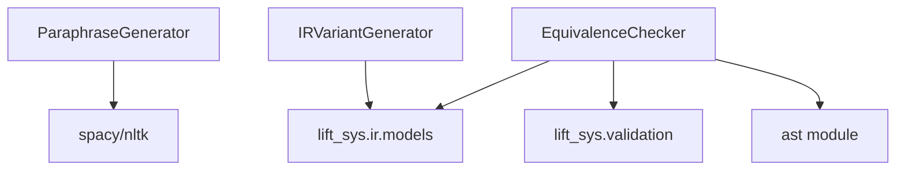

# TokDrift Integration - Phase 1: Foundation

**Date**: 2025-10-21
**Status**: Ready for Implementation
**Duration**: 2 weeks
**Dependencies**: None (can start immediately)
**Parent Document**: `TOKDRIFT_APPLICABILITY_PROPOSAL.md`

---

## Overview

Phase 1 builds the foundational infrastructure for robustness testing in lift-sys by implementing:
1. NL prompt paraphrase generation
2. IR variant generation
3. IR and code equivalence checking

These components enable systematic testing of how input variations affect IR and code generation.

---

## Goals

### Primary Goals
- ✅ Generate diverse, semantically equivalent paraphrases of NL prompts
- ✅ Generate semantic-preserving IR variants (naming, effect ordering, assertion rephrasing)
- ✅ Reliably check IR and code equivalence
- ✅ Achieve >90% test coverage for all new components

### Success Criteria
- Can generate 10+ paraphrases for any prompt with >95% semantic preservation
- Can generate 5+ IR variants that are semantically equivalent
- Equivalence checker agrees with human judgment >95% of the time
- All components have comprehensive unit tests

---

## Architecture

### New Module: `lift_sys/robustness/`

```
lift_sys/robustness/
├── __init__.py                     # Public API exports
├── paraphrase_generator.py         # NL prompt paraphrasing
├── ir_variant_generator.py         # IR variant generation
├── equivalence_checker.py          # IR/code equivalence checking
├── types.py                        # Shared types (NamingStyle, etc.)
└── utils.py                        # Shared utilities
```

### Component Dependencies



---

## Detailed Task Breakdown

### Task 1: Module Setup (Day 1)

**Objective**: Create package structure and dependencies

**Subtasks**:
1. Create `lift_sys/robustness/` directory
2. Add `__init__.py` with public API exports
3. Create placeholder files for all components
4. Update `pyproject.toml` with new dependencies
5. Create `tests/unit/robustness/` directory

**Dependencies Added**:
```toml
[project.dependencies]
# Existing dependencies...
spacy = "^3.7.0"              # NLP for paraphrase generation
nltk = "^3.8.0"               # Linguistic utilities
networkx = "^3.2.0"           # For IR graph analysis (optional)

[project.optional-dependencies]
robustness = [
    "spacy>=3.7.0",
    "nltk>=3.8.0",
    "pytest-benchmark>=4.0.0",  # For performance testing
]
```

**Deliverable**: Package structure ready, dependencies installed

**Time**: 0.5 days

---

### Task 2: Implement ParaphraseGenerator (Days 2-4)

**Objective**: Generate semantically equivalent paraphrases of NL prompts

#### 2.1 Base Implementation (Day 2)

**File**: `lift_sys/robustness/paraphrase_generator.py`

**Core Classes**:
```python
from enum import Enum
from typing import Protocol

class ParaphraseStrategy(str, Enum):
    """Paraphrase generation strategies."""
    LEXICAL = "lexical"           # Synonym replacement
    STRUCTURAL = "structural"     # Clause reordering
    STYLISTIC = "stylistic"       # Voice, mood changes
    ALL = "all"                   # Combine all strategies

class ParaphraseGenerator:
    """Generates semantic-preserving paraphrases of NL prompts."""

    def __init__(
        self,
        max_variants: int = 10,
        preserve_semantics: bool = True,
        min_diversity: float = 0.3  # Minimum edit distance ratio
    ):
        """Initialize generator with spaCy and NLTK resources."""
        self.max_variants = max_variants
        self.preserve_semantics = preserve_semantics
        self.min_diversity = min_diversity
        self._initialize_nlp()

    def _initialize_nlp(self):
        """Load spaCy model and NLTK resources."""
        import spacy
        from nltk.corpus import wordnet
        nltk.download('wordnet', quiet=True)
        nltk.download('averaged_perceptron_tagger', quiet=True)

        self.nlp = spacy.load("en_core_web_sm")
        self.wordnet = wordnet

    def generate(
        self,
        prompt: str,
        strategy: ParaphraseStrategy = ParaphraseStrategy.ALL
    ) -> list[str]:
        """Generate paraphrase variants."""
        if strategy == ParaphraseStrategy.LEXICAL:
            return self._generate_lexical(prompt)
        elif strategy == ParaphraseStrategy.STRUCTURAL:
            return self._generate_structural(prompt)
        elif strategy == ParaphraseStrategy.STYLISTIC:
            return self._generate_stylistic(prompt)
        else:  # ALL
            variants = []
            variants.extend(self._generate_lexical(prompt))
            variants.extend(self._generate_structural(prompt))
            variants.extend(self._generate_stylistic(prompt))
            return self._deduplicate_and_rank(variants, prompt)

    def _generate_lexical(self, prompt: str) -> list[str]:
        """Generate variants via synonym replacement."""
        # Implementation details below
        pass

    def _generate_structural(self, prompt: str) -> list[str]:
        """Generate variants via clause reordering."""
        pass

    def _generate_stylistic(self, prompt: str) -> list[str]:
        """Generate variants via voice/mood changes."""
        pass

    def _deduplicate_and_rank(
        self,
        variants: list[str],
        original: str
    ) -> list[str]:
        """Remove duplicates and rank by diversity."""
        # Use edit distance to ensure minimum diversity
        pass
```

**Key Algorithms**:

1. **Lexical Paraphrasing** (Synonym Replacement):
```python
def _generate_lexical(self, prompt: str) -> list[str]:
    """
    Replace content words with synonyms using WordNet.

    Strategy:
    - Parse prompt with spaCy
    - Identify content words (nouns, verbs, adjectives)
    - Find synonyms via WordNet
    - Replace words maintaining POS tags
    - Filter by semantic similarity
    """
    doc = self.nlp(prompt)
    variants = []

    # For each content word
    for token in doc:
        if token.pos_ in ("NOUN", "VERB", "ADJ"):
            synsets = self.wordnet.synsets(token.text, pos=self._get_wordnet_pos(token.pos_))

            for synset in synsets[:3]:  # Top 3 synsets
                for lemma in synset.lemmas():
                    if lemma.name() != token.text:
                        # Replace token.text with lemma.name() in prompt
                        variant = self._replace_word(prompt, token, lemma.name())
                        variants.append(variant)

    return variants[:self.max_variants]
```

2. **Structural Paraphrasing** (Clause Reordering):
```python
def _generate_structural(self, prompt: str) -> list[str]:
    """
    Reorder independent clauses.

    Strategy:
    - Parse into clauses (coordinating conjunctions, subordinating)
    - Identify independent clauses
    - Reorder if semantically valid
    - Maintain coherence

    Example:
    "Create X and process Y" → "Process Y and create X" (if independent)
    """
    doc = self.nlp(prompt)
    clauses = self._extract_clauses(doc)

    # Check if clauses are independent (no temporal/causal dependencies)
    if self._are_independent(clauses):
        variants = []
        for permutation in itertools.permutations(clauses):
            variant = " and ".join(permutation)
            variants.append(variant)
        return variants[:self.max_variants]
    else:
        return []  # Can't safely reorder
```

3. **Stylistic Paraphrasing** (Voice/Mood):
```python
def _generate_stylistic(self, prompt: str) -> list[str]:
    """
    Change voice (active/passive) and mood (imperative/declarative).

    Strategy:
    - Detect current voice and mood
    - Apply transformations:
      - Imperative → Declarative: "Create X" → "X should be created"
      - Active → Passive: "Sort the list" → "The list should be sorted"
    - Use rule-based templates for common patterns
    """
    variants = []

    # Imperative → Declarative
    if self._is_imperative(prompt):
        declarative = self._imperative_to_declarative(prompt)
        variants.append(declarative)

    # Active → Passive
    if self._is_active_voice(prompt):
        passive = self._active_to_passive(prompt)
        variants.append(passive)

    return variants
```

**Testing**:
```python
# tests/unit/robustness/test_paraphrase_generator.py

def test_lexical_paraphrase():
    gen = ParaphraseGenerator()
    prompt = "Create a function that sorts a list"

    variants = gen.generate(prompt, strategy=ParaphraseStrategy.LEXICAL)

    # Should generate variants like:
    # - "Create a function that orders a list"
    # - "Make a function that sorts a list"
    # - "Create a function that arranges a list"

    assert len(variants) >= 3
    assert all(variant != prompt for variant in variants)
    assert all("function" in variant.lower() for variant in variants)

def test_semantic_preservation():
    """Ensure paraphrases preserve semantics (manual validation)."""
    gen = ParaphraseGenerator()
    prompt = "Create a function that validates email addresses"

    variants = gen.generate(prompt)

    # All variants should mention:
    # - Creating/writing/implementing (action)
    # - Function (artifact)
    # - Email validation (purpose)

    for variant in variants:
        assert any(word in variant.lower() for word in ["create", "write", "implement", "make"])
        assert "function" in variant.lower() or "func" in variant.lower()
        assert "email" in variant.lower() and "valid" in variant.lower()
```

**Time**: 2.5 days

#### 2.2 Advanced Features (Day 3-4)

**Features**:
1. **Caching**: Cache paraphrases to avoid redundant generation
2. **Diversity Scoring**: Ensure variants are sufficiently different from original
3. **Semantic Validation**: Optional LLM-based validation of paraphrase quality

**Implementation**:
```python
class ParaphraseGenerator:
    def __init__(self, cache_dir: str | None = None, use_llm_validation: bool = False):
        self.cache = ParaphraseCache(cache_dir) if cache_dir else None
        self.use_llm_validation = use_llm_validation

    def generate(self, prompt: str, ...) -> list[str]:
        # Check cache
        if self.cache and (cached := self.cache.get(prompt)):
            return cached

        # Generate variants
        variants = self._generate_all_strategies(prompt)

        # Validate with LLM if enabled
        if self.use_llm_validation:
            variants = self._llm_validate_semantics(prompt, variants)

        # Cache results
        if self.cache:
            self.cache.set(prompt, variants)

        return variants

    def _llm_validate_semantics(self, original: str, variants: list[str]) -> list[str]:
        """Use LLM to validate semantic equivalence."""
        # Use cheap model (Claude Haiku or GPT-3.5-turbo)
        # Prompt: "Are these two prompts semantically equivalent? Yes/No"
        # Filter variants where LLM says "Yes"
        pass
```

**Time**: 1.5 days

**Total for Task 2**: 3 days

---

### Task 3: Implement IRVariantGenerator (Days 5-7)

**Objective**: Generate semantic-preserving IR variants

**File**: `lift_sys/robustness/ir_variant_generator.py`

#### 3.1 Naming Convention Rewriting (Day 5)

**Implementation**:
```python
from enum import Enum
from lift_sys.ir.models import IR
import re

class NamingStyle(str, Enum):
    """Identifier naming conventions."""
    SNAKE_CASE = "snake_case"
    CAMEL_CASE = "camelCase"
    PASCAL_CASE = "PascalCase"
    SCREAMING_SNAKE = "SCREAMING_SNAKE_CASE"

class IRVariantGenerator:
    """Generates semantic-preserving IR variants."""

    def generate_naming_variants(self, ir: IR) -> list[IR]:
        """Generate IR variants with different naming conventions."""
        variants = []

        for style in NamingStyle:
            variant_ir = self._rewrite_naming(ir, style)
            variants.append(variant_ir)

        return variants

    def _rewrite_naming(self, ir: IR, style: NamingStyle) -> IR:
        """Rewrite all identifiers in IR to specified naming style."""
        # Deep copy IR
        import copy
        ir_dict = ir.to_dict()

        # Recursively rewrite all identifier fields
        rewritten = self._rewrite_identifiers_in_dict(ir_dict, style)

        # Reconstruct IR from dict
        from lift_sys.ir.models import IR
        return IR.from_dict(rewritten)

    def _rewrite_identifiers_in_dict(
        self,
        data: dict | list | str,
        style: NamingStyle
    ) -> dict | list | str:
        """Recursively rewrite identifiers in nested structure."""
        if isinstance(data, dict):
            return {
                self._convert_name(k, style): self._rewrite_identifiers_in_dict(v, style)
                for k, v in data.items()
            }
        elif isinstance(data, list):
            return [self._rewrite_identifiers_in_dict(item, style) for item in data]
        elif isinstance(data, str):
            return self._convert_name(data, style)
        else:
            return data

    def _convert_name(self, name: str, style: NamingStyle) -> str:
        """Convert identifier to target naming style."""
        # Parse current style
        words = self._parse_identifier(name)

        # Convert to target style
        if style == NamingStyle.SNAKE_CASE:
            return "_".join(words).lower()
        elif style == NamingStyle.CAMEL_CASE:
            return words[0].lower() + "".join(w.capitalize() for w in words[1:])
        elif style == NamingStyle.PASCAL_CASE:
            return "".join(w.capitalize() for w in words)
        elif style == NamingStyle.SCREAMING_SNAKE:
            return "_".join(words).upper()

    def _parse_identifier(self, name: str) -> list[str]:
        """Parse identifier into words."""
        # Handle snake_case
        if "_" in name:
            return name.split("_")
        # Handle camelCase/PascalCase
        elif any(c.isupper() for c in name):
            return re.findall(r'[A-Z]?[a-z]+|[A-Z]+(?=[A-Z][a-z]|\d|\W|$)|\d+', name)
        else:
            return [name]
```

**Testing**:
```python
def test_naming_conversion():
    gen = IRVariantGenerator()

    # snake_case → camelCase
    assert gen._convert_name("sort_numbers", NamingStyle.CAMEL_CASE) == "sortNumbers"
    assert gen._convert_name("process_user_data", NamingStyle.CAMEL_CASE) == "processUserData"

    # camelCase → snake_case
    assert gen._convert_name("sortNumbers", NamingStyle.SNAKE_CASE) == "sort_numbers"

    # PascalCase → SCREAMING_SNAKE
    assert gen._convert_name("ProcessData", NamingStyle.SCREAMING_SNAKE) == "PROCESS_DATA"

def test_ir_naming_variants():
    original_ir = IR(
        intent="Sort numbers",
        signature={"name": "sort_numbers", "parameters": [{"name": "input_list", "type": "list"}]},
        effects=[],
        assertions=[]
    )

    gen = IRVariantGenerator()
    variants = gen.generate_naming_variants(original_ir)

    assert len(variants) == 4  # One per NamingStyle
    assert variants[1].signature["name"] == "sortNumbers"  # camelCase
    assert variants[1].signature["parameters"][0]["name"] == "inputList"
```

**Time**: 1 day

#### 3.2 Effect Reordering (Day 6)

**Implementation**:
```python
class IRVariantGenerator:
    def generate_effect_orderings(self, ir: IR) -> list[IR]:
        """Generate IR variants with reordered effects."""
        effects = ir.effects

        # Build dependency graph
        dep_graph = self._build_effect_dependency_graph(effects)

        # Find valid orderings (topological sort variations)
        valid_orderings = self._find_valid_orderings(dep_graph)

        # Generate IR for each valid ordering
        variants = []
        for ordering in valid_orderings[:5]:  # Max 5 variants
            variant_ir = ir.model_copy(update={"effects": ordering})
            variants.append(variant_ir)

        return variants

    def _build_effect_dependency_graph(self, effects: list[dict]) -> nx.DiGraph:
        """Build directed graph of effect dependencies."""
        import networkx as nx
        G = nx.DiGraph()

        for i, effect in enumerate(effects):
            G.add_node(i, effect=effect)

        # Add edges for dependencies
        for i, effect_i in enumerate(effects):
            for j, effect_j in enumerate(effects):
                if i != j and self._depends_on(effect_j, effect_i):
                    G.add_edge(i, j)  # j depends on i

        return G

    def _depends_on(self, effect_a: dict, effect_b: dict) -> bool:
        """Check if effect_a depends on effect_b."""
        # file_write depends on file_read if same file
        if effect_a["type"] == "file_write" and effect_b["type"] == "file_read":
            if effect_a.get("target") == effect_b.get("target"):
                return True

        # API call depends on database read if uses same data
        # (heuristic: check if effect_a's params reference effect_b's outputs)

        return False

    def _find_valid_orderings(self, graph: nx.DiGraph) -> list[list[dict]]:
        """Find all valid topological orderings."""
        import networkx as nx

        # All topological sorts
        orderings = list(nx.all_topological_sorts(graph))

        # Convert node indices back to effects
        return [
            [graph.nodes[i]["effect"] for i in ordering]
            for ordering in orderings
        ]
```

**Time**: 1 day

#### 3.3 Assertion Rephrasing (Day 7)

**Implementation**:
```python
class IRVariantGenerator:
    def generate_assertion_variants(self, ir: IR) -> list[IR]:
        """Generate IR variants with rephrased assertions."""
        assertion_variants = []

        for assertion in ir.assertions:
            rephrased = self._rephrase_assertion(assertion)
            assertion_variants.append(rephrased)

        # Create IR with each rephrased assertion
        variants = []
        for i, rephrased in enumerate(assertion_variants):
            new_assertions = ir.assertions.copy()
            new_assertions[i] = rephrased
            variant_ir = ir.model_copy(update={"assertions": new_assertions})
            variants.append(variant_ir)

        return variants

    def _rephrase_assertion(self, assertion: dict) -> dict:
        """Rephrase assertion in logically equivalent way."""
        # Example: "x > 0" → "x >= 1" (for integers)
        # "len(lst) > 0" → "lst is not empty"
        # "result == True" → "result"

        if assertion["type"] == "range":
            # "x > min and x < max" → "min < x < max"
            return self._rephrase_range_assertion(assertion)

        elif assertion["type"] == "type_check":
            # "type(x) == int" → "isinstance(x, int)"
            return self._rephrase_type_assertion(assertion)

        else:
            return assertion  # No rephrasing needed
```

**Time**: 1 day

**Total for Task 3**: 3 days

---

### Task 4: Implement EquivalenceChecker (Days 8-10)

**Objective**: Check equivalence of IRs and code

**File**: `lift_sys/robustness/equivalence_checker.py`

#### 4.1 IR Equivalence (Days 8-9)

**Implementation**:
```python
from lift_sys.ir.models import IR
from typing import Callable

class EquivalenceChecker:
    """Checks equivalence of IRs and code."""

    def __init__(
        self,
        normalize_naming: bool = True,
        check_effect_order: bool = False,  # Effects can be reordered if independent
        use_smt_solver: bool = True         # Use Z3 for assertion equivalence
    ):
        self.normalize_naming = normalize_naming
        self.check_effect_order = check_effect_order
        self.use_smt_solver = use_smt_solver

    def ir_equivalent(self, ir1: IR, ir2: IR) -> bool:
        """Check if two IRs are semantically equivalent."""
        # 1. Check intents (semantic similarity)
        if not self._intents_equivalent(ir1.intent, ir2.intent):
            return False

        # 2. Check signatures (modulo naming if normalize_naming=True)
        if not self._signatures_equivalent(ir1.signature, ir2.signature):
            return False

        # 3. Check effects (order-independent if check_effect_order=False)
        if not self._effects_equivalent(ir1.effects, ir2.effects):
            return False

        # 4. Check assertions (logical equivalence)
        if not self._assertions_equivalent(ir1.assertions, ir2.assertions):
            return False

        return True

    def _intents_equivalent(self, intent1: str, intent2: str) -> bool:
        """Check if intents are semantically equivalent."""
        # Use semantic similarity (e.g., sentence embeddings)
        from sentence_transformers import SentenceTransformer
        model = SentenceTransformer('all-MiniLM-L6-v2')

        emb1 = model.encode(intent1)
        emb2 = model.encode(intent2)

        similarity = cosine_similarity([emb1], [emb2])[0][0]
        return similarity > 0.9  # High threshold

    def _signatures_equivalent(self, sig1: dict, sig2: dict) -> bool:
        """Check if signatures are equivalent (modulo naming)."""
        if self.normalize_naming:
            # Normalize both to snake_case before comparison
            sig1_norm = self._normalize_signature_naming(sig1)
            sig2_norm = self._normalize_signature_naming(sig2)
        else:
            sig1_norm, sig2_norm = sig1, sig2

        # Compare normalized signatures
        return (
            sig1_norm.get("return_type") == sig2_norm.get("return_type") and
            len(sig1_norm.get("parameters", [])) == len(sig2_norm.get("parameters", [])) and
            all(
                p1["type"] == p2["type"]
                for p1, p2 in zip(sig1_norm["parameters"], sig2_norm["parameters"])
            )
        )

    def _effects_equivalent(self, effects1: list, effects2: list) -> bool:
        """Check if effects are equivalent (possibly reordered)."""
        if self.check_effect_order:
            # Order matters
            return effects1 == effects2
        else:
            # Order doesn't matter (check sets)
            return set(tuple(e.items()) for e in effects1) == set(tuple(e.items()) for e in effects2)

    def _assertions_equivalent(self, assertions1: list, assertions2: list) -> bool:
        """Check if assertions are logically equivalent."""
        if self.use_smt_solver:
            return self._smt_check_equivalence(assertions1, assertions2)
        else:
            # Fallback: structural comparison
            return assertions1 == assertions2

    def _smt_check_equivalence(self, assertions1: list, assertions2: list) -> bool:
        """Use Z3 SMT solver to check logical equivalence."""
        try:
            from z3 import Solver, parse_smt2_string, sat

            # Convert assertions to Z3 formulas
            formulas1 = [self._assertion_to_z3(a) for a in assertions1]
            formulas2 = [self._assertion_to_z3(a) for a in assertions2]

            # Check if (formulas1 ↔ formulas2) is SAT
            solver = Solver()
            # Add: (f1 ∧ ¬f2) ∨ (¬f1 ∧ f2) (XOR - different truth values)
            # If UNSAT, formulas are equivalent
            # Implementation depends on assertion format

            # Simplified: check if both have same variables and constraints
            return formulas1 == formulas2

        except ImportError:
            # Z3 not available, fall back
            return assertions1 == assertions2
```

**Testing**:
```python
def test_ir_equivalence_different_naming():
    ir1 = IR(
        intent="Sort numbers",
        signature={"name": "sort_numbers", "parameters": [{"name": "nums", "type": "list"}]},
        effects=[],
        assertions=[]
    )

    ir2 = IR(
        intent="Sort numbers",
        signature={"name": "sortNumbers", "parameters": [{"name": "nums", "type": "list"}]},
        effects=[],
        assertions=[]
    )

    checker = EquivalenceChecker(normalize_naming=True)
    assert checker.ir_equivalent(ir1, ir2)

def test_ir_equivalence_reordered_effects():
    ir1 = IR(
        intent="Process data",
        signature={...},
        effects=[
            {"type": "file_read", "target": "input.txt"},
            {"type": "database_write", "target": "results"}
        ],
        assertions=[]
    )

    ir2 = IR(
        intent="Process data",
        signature={...},
        effects=[
            {"type": "database_write", "target": "results"},
            {"type": "file_read", "target": "input.txt"}
        ],
        assertions=[]
    )

    checker = EquivalenceChecker(check_effect_order=False)
    assert checker.ir_equivalent(ir1, ir2)
```

**Time**: 2 days

#### 4.2 Code Equivalence (Day 10)

**Implementation**:
```python
class EquivalenceChecker:
    def code_equivalent(
        self,
        code1: str,
        code2: str,
        test_inputs: list[dict],
        timeout_seconds: int = 5
    ) -> bool:
        """Check if two code snippets are functionally equivalent."""
        # Strategy: Execute both codes on same inputs, compare outputs

        for test_input in test_inputs:
            try:
                output1 = self._execute_code(code1, test_input, timeout_seconds)
                output2 = self._execute_code(code2, test_input, timeout_seconds)

                if not self._outputs_equivalent(output1, output2):
                    return False

            except Exception as e:
                # If either code fails, they're not equivalent
                # (unless both fail with same error)
                return False

        return True

    def _execute_code(
        self,
        code: str,
        test_input: dict,
        timeout_seconds: int
    ) -> any:
        """Execute code with test input, return output."""
        import subprocess
        import tempfile
        import json

        # Write code to temp file
        with tempfile.NamedTemporaryFile(mode='w', suffix='.py', delete=False) as f:
            f.write(code)
            f.write("\n\n")
            f.write(f"# Test input\n")
            f.write(f"result = main({json.dumps(test_input)})\n")
            f.write(f"print(json.dumps(result))\n")
            code_file = f.name

        # Execute with timeout
        try:
            result = subprocess.run(
                ["python", code_file],
                capture_output=True,
                timeout=timeout_seconds,
                text=True
            )

            if result.returncode != 0:
                raise RuntimeError(f"Code execution failed: {result.stderr}")

            return json.loads(result.stdout)

        finally:
            import os
            os.unlink(code_file)

    def _outputs_equivalent(self, output1: any, output2: any) -> bool:
        """Check if two outputs are equivalent."""
        # Handle numerical tolerance
        if isinstance(output1, float) and isinstance(output2, float):
            return abs(output1 - output2) < 1e-6

        # Handle collections (order may differ for sets)
        if isinstance(output1, (list, tuple)) and isinstance(output2, (list, tuple)):
            return set(output1) == set(output2)

        # Default: exact equality
        return output1 == output2
```

**Testing**:
```python
def test_code_equivalence():
    code1 = """
def sort_numbers(nums):
    return sorted(nums)
"""

    code2 = """
def sortNumbers(nums):
    result = nums.copy()
    result.sort()
    return result
"""

    test_inputs = [
        {"nums": [3, 1, 4, 1, 5]},
        {"nums": []},
        {"nums": [1]},
        {"nums": [5, 4, 3, 2, 1]},
    ]

    checker = EquivalenceChecker()
    assert checker.code_equivalent(code1, code2, test_inputs)
```

**Time**: 1 day

**Total for Task 4**: 3 days

---

## Testing Strategy

### Unit Tests

**Coverage Target**: >90% for all new code

**Test Files**:
```
tests/unit/robustness/
├── test_paraphrase_generator.py       # 20+ tests
├── test_ir_variant_generator.py       # 15+ tests
├── test_equivalence_checker.py        # 25+ tests
└── test_utils.py                      # 10+ tests
```

**Test Categories**:
1. **Happy path**: Standard inputs, expected outputs
2. **Edge cases**: Empty inputs, single-word prompts, complex IRs
3. **Error handling**: Invalid inputs, timeouts, resource limits
4. **Performance**: Ensure generators complete in <1s for typical inputs

### Integration Tests

**Test real workflows**:
```python
# tests/integration/test_robustness_workflow.py

def test_end_to_end_paraphrase_robustness():
    """Test full workflow: prompt → paraphrases → IRs → check equivalence."""
    original_prompt = "Create a function that validates email addresses"

    # Generate paraphrases
    gen = ParaphraseGenerator()
    paraphrases = gen.generate(original_prompt)

    # Generate IRs (mock or use real translator)
    translator = MockTranslator()
    irs = [translator.translate(p) for p in [original_prompt] + paraphrases]

    # Check equivalence
    checker = EquivalenceChecker()
    for ir in irs[1:]:
        assert checker.ir_equivalent(irs[0], ir), f"IR mismatch for paraphrase"
```

---

## Deliverables

### Code Deliverables
- ✅ `lift_sys/robustness/` module with 5 files (~1500 LOC total)
- ✅ `tests/unit/robustness/` with >90% coverage
- ✅ `tests/integration/` with end-to-end robustness tests

### Documentation Deliverables
- ✅ API documentation (docstrings for all public methods)
- ✅ Usage examples in `docs/robustness/USAGE_GUIDE.md`
- ✅ Architecture diagram in `docs/robustness/ARCHITECTURE.md`

### Example Deliverable: Usage Guide

**File**: `docs/robustness/USAGE_GUIDE.md` (excerpt)
```markdown
# Robustness Testing Usage Guide

## Quick Start

### Generating Paraphrases

from lift_sys.robustness import ParaphraseGenerator

gen = ParaphraseGenerator(max_variants=10)
prompt = "Create a function that sorts a list of numbers"

paraphrases = gen.generate(prompt)
for p in paraphrases:
    print(p)
# Output:
# - "Write a function to sort a numeric list"
# - "Implement number list sorting"
# ...


### Generating IR Variants

from lift_sys.robustness import IRVariantGenerator

gen = IRVariantGenerator()
ir = IR(...)  # Your IR

variants = gen.generate_naming_variants(ir)
for variant in variants:
    print(variant.signature["name"])
# Output:
# - "sort_numbers" (snake_case)
# - "sortNumbers" (camelCase)
# - "SortNumbers" (PascalCase)
# ...

```

---

## Risk Mitigation

### Risk 1: Paraphrase Quality
**Mitigation**: Manual validation of sample paraphrases, LLM-based validation as fallback

### Risk 2: Performance
**Mitigation**: Caching, async generation, lazy evaluation

### Risk 3: Dependencies
**Mitigation**: Pin versions in pyproject.toml, test on fresh env

---

## Next Steps (After Phase 1)

1. **Phase 2**: Build robustness test suite and integrate with CI
2. **Phase 3**: Use paraphrases to enhance DSPy training data
3. **Phase 4**: Add robustness metrics to production benchmarks

---

## Appendix: Example Outputs

### Example 1: Paraphrase Generation

**Input**:
```
Create a function that validates email addresses using regex
```

**Output** (10 paraphrases):
1. "Write a function to validate email addresses via regex"
2. "Implement email validation using regular expressions"
3. "Build an email address validator with regex"
4. "Create a regex-based email verification function"
5. "Make a function for email address validation through regex"
6. "Develop a function that checks email addresses using regex"
7. "Construct an email validation function with regular expressions"
8. "Email addresses should be validated using regex in a function"
9. "A function should be created to validate emails via regex"
10. "Regex should be used in a function to validate email addresses"

### Example 2: IR Variant Generation

**Input IR** (snake_case):
```python
IR(
    intent="Validate email addresses",
    signature={
        "name": "validate_email",
        "parameters": [{"name": "email_address", "type": "str"}],
        "return_type": "bool"
    },
    effects=[],
    assertions=[
        {"type": "regex_match", "pattern": r"^[a-zA-Z0-9._%+-]+@[a-zA-Z0-9.-]+\.[a-zA-Z]{2,}$"}
    ]
)
```

**Output** (camelCase variant):
```python
IR(
    intent="Validate email addresses",
    signature={
        "name": "validateEmail",
        "parameters": [{"name": "emailAddress", "type": "str"}],
        "return_type": "bool"
    },
    effects=[],
    assertions=[
        {"type": "regexMatch", "pattern": r"^[a-zA-Z0-9._%+-]+@[a-zA-Z0-9.-]+\.[a-zA-Z]{2,}$"}
    ]
)
```

---

**End of Phase 1 Plan**

**Ready to begin implementation**. See parent beads for task tracking.
