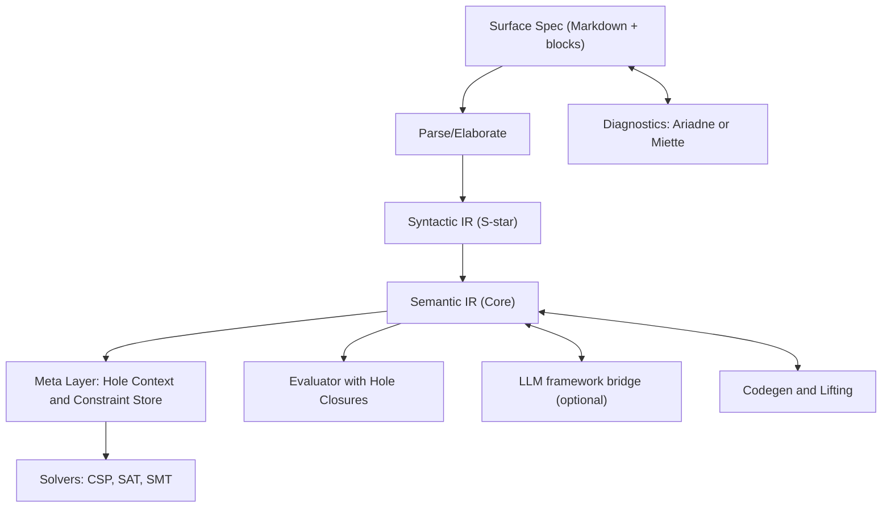

# Lift‑Sys IR · PRD + RFC + Reference Spec + Examples
> Version: 0.9 (draft)
> Audience: semi‑technical PMs, architects, researchers, and developers
> Purpose: Define a human‑friendly, solver‑backed Intermediate Representation (IR) for Lift‑Sys that unifies intentional specs, functional contracts, code, and **typed holes** for partial and evolving designs.

---

## 0. Executive intent

Lift‑Sys needs an IR that:
- Represents **semantics and syntax** for programs, data, APIs, and workflows.
- Supports **typed holes** for unknown terms, types, specs, entities, functions, and modules, including holes whose type is itself unknown.
- Aligns **IntentSpec** (human goals, roles, constraints) with **FuncSpec** (pre/post, invariants, effects, cost).
- Integrates **CSP/SAT/SMT** solvers for feasibility, refinement, and verification.
- Remains **human‑friendly**: readable surface syntax, excellent diagnostics (Ariadne‑style), IDE affordances, live previews from partial evaluation.

The design below is deliberate yet ambitious. It combines the ergonomic strengths of Haskell/Idris/Agda/Lean holes with [Hazel's *hole closures*](https://arxiv.org/abs/1805.00155) (to run incomplete programs) and a disciplined constraint back‑end.

---

## 1. PRD – Product Requirements

### 1.1 Users and jobs‑to‑be‑done
- **Semi‑technical non‑developers**: author, review, and refine specs with the support of lift-sys to achieve clear structure, non‑ambiguous intent, and helpful errors.
- **Developers**: work close with lift-sys via the IR and code to quickly, safely, and verifiably refine specs into code, navigate hole suggestions, run partial programs, and verify constraints.
- **Research/QA**: assert properties, generate counterexamples, and capture solver traces.

### 1.2 Goals
- **G1**. Author specs in a **single document** that seamlessly mixes prose, examples, and formal blocks.
- **G2**. Express **unknowns explicitly** as typed holes; see high‑quality "valid fits" suggestions.
- **G3**. Evaluate around holes to get **live previews** and **evidence flows** without restarting.
- **G4**. Check **well‑typedness** and **refinement conditions** with SMT, escalate to SAT/CSP where appropriate.
- **G5**. Optional adapters for external LLM orchestration frameworks (for example, DSPy) when useful; not required for the core IR → code or lift‑from‑code loops.
- **G6**. **Diagnostics** show spans, hints, and quick‑fixes; UI supports *annotate‑and‑hover* workflows.
- **G7**. **Traceability**: link IntentSpec atoms to FuncSpec predicates and to code/tests.

### 1.3 Non‑goals (initially)
- Full dependent pattern‑matching coverage proofs; we rely on partial checks and developer guidance.
- Automated proof search beyond SMT queries and simple tactics.
- A general‑purpose programming language – the IR is a language‑agnostic core with projections.

### 1.4 Success metrics
- **Spec‑to‑code throughput** – 80–90% of green‑path flows from user context → IR → code complete without manual glue for our Tier‑1 languages (Python, TypeScript/Node, Go, Rust, Java, C#) under representative templates.
- **Round‑trip fidelity** – ≥85% structural fidelity when lifting code → IR across Tier‑1 languages, measured by: entities preserved, function signatures preserved, contracts reconstructed, and intent atoms aligned.
- **Spec coverage** – increase proportion of functions with non‑trivial pre/post/invariants by +40% over baseline repos after adoption.
- **Hole resolution latency** – median time from hole introduction to accepted fill ≤ 10 minutes for editor‑time tasks.
- **Diagnostics quality** – ≥80% of blocking diagnostics present a suggested fix or ≤3 valid fits.
- **Operational conformance** – ≥95% of deploys meet OpsSpec SLOs and policy gates on first pass.
- **Human experience** – System Usability Score (SUS) ≥ 80 from semi‑technical non‑developers after 2 weeks of use.

---

## 2. RFC – Architecture and semantics

### 2.1 Layered model



### 2.2 Core sorts
- **Syntactic IR (S\*)**: `SType, STerm, SDecl, SModule` mirror concrete shapes.
- **Semantic IR (Core)**: dependent types, refinements, effects, ADTs, and **holes**.
- **Meta**: global meta‑context for holes and **Constraint Store** 𝒞 (typing equalities, refinements, obligations).
- **Evaluator**: *indeterminate progress* with **hole closures** so partial programs run and produce previews.

### 2.3 Typed holes (generalized)
A single uniform `Hole` that can stand for **terms, types, specs, entities, functions, or modules**.

```
HoleID ::= symbol
Kind   ::= term | type | spec | entity | function | module
Hole   ::= ?h:Kind [Type?] [Links={?h1,...}] [Hints={...}] [Provenance=...]
```
- **Unknown‑of‑unknown type**: permit `?h:term` with `Type = ?α`, where `?α` is a **type hole**.
- **Linking**: `Links` encode dependency edges (e.g., `?impl` depends on `?goodFor`, `?schema`).
- **Domain**: each hole maintains a candidate domain `D(h)` or an SMT predicate `φ(h)`.
- **Closure**: term holes carry `⟨Γ, •⟩` so evaluation flows around them; we record value flows as *hole‑traces*.
- **Filling**: by user edit, solver model, or *valid‑fit* heuristic (see §2.6).

### 2.4 Types, terms, specs (core grammar)

```
Types  T ::= ι | α | Π(x:T).T | {x:T | φ} | T×T | T+T | μt.T | Eff[T] | ?α
Terms  e ::= x | λx:T.e | e e | ctor e | match e with … | let x=e in e | eff e | ?h
Specs  φ ::= P(e1,…,en) | φ ∧ φ | ∀x:T. φ | ∃x:T. φ | e1 = e2 | safe(e) | cost≤κ | ...
Decls  d ::= type t = T | def f : T = e | entity E {...} | spec S = φ
// Extension: signatures Σ for optional orchestration‑framework interop
```
- **Refinements** `{x:T | φ}` map to SMT predicates (§2.7).
- **Effects** `Eff[T]` carry effect labels used in pre/post conditions.

### 2.5 IntentSpec ↔ FuncSpec
- **IntentSpec**: high‑level roles, goals, constraints, metrics, and NL notes.
- **FuncSpec**: formal contracts: `requires φ_pre`, `ensures φ_post`, `invariants ι`, `measure μ`, `cost κ`, `effects ε`.
- Maintain an **alignment map** from Intent atoms → Func predicates with drift detection.

### 2.6 Valid‑fit suggestions
Borrow the [GHC pattern](https://ghc.gitlab.haskell.org/ghc/doc/users_guide/exts/typed_holes.html) of suggesting **valid hole fits** and **refinement fits** ranked by:
1. Type compatibility and scope proximity
2. Solver entailment score (how much of `φ_post` is satisfied)
3. Usage priors (repo frequency, examples, and past valid‑fit selections)

### 2.7 Constraint back‑end
- **Typing/unification**: meta‑vars + higher‑order unification for dependent fragments.
- **Refinements → SMT**: encode `{x:T | φ}` using [SMT‑LIB](https://smt-lib.org/language.shtml) theories (Int/Real, BitVec, Arrays, ADTs, Strings).
- **CSP lane**: enumerated domains and editor‑time pruning.
- **SAT lane**: boolean cores compiled to CNF for fast CDCL checks.
- **Model harvesting**: models become candidate fillings or counterexamples.

### 2.8 Evaluation with holes
Adopt *indeterminate progress*: the evaluator records **hole closures** and continues, producing partial values and traces. A *fill‑and‑resume* operation avoids re‑starting evaluation after edits.

### 2.9 Orchestration bridge (optional)
- **Export**: any `def`/`entity` can project to a **Signature**: typed fields + docstrings + NL intent. This is optional and not required for the core IR→code or lift‑from‑code loops.
- **Import**: a Signature yields `(IntentSpec, skeleton FuncSpec, ?impl)`; an external optimizer may iterate on examples and instructions.

---

## 3. Human‑friendly authoring

### 3.1 Surface syntax (Spec‑IR) in Markdown
Use fenced blocks with a compact, readable syntax; prose surrounds them.

```specir
intent "Summarize document to N bullets for audience A":
  inputs:  doc: Str, A: Str, N: Nat
  outputs: bullets: List Str
  goals:
    - readability ≥ 0.8  // FK grade or model‑based score
    - length(bullets) = N

entity "ReaderProfile":
  fields:
    name: Str
    expertise: { x: Nat | x <= 10 }

spec "GoodFor" (A: Str, b: Str):
  ensures: sentiment(b, A) ≥ 0.6

def summarize(doc:Str, A:Str, N:Nat) :
  { bullets: List Str | length(bullets)=N ∧ ∀b. GoodFor(A,b) } =
  ?impl:term  // links to ?goodFor, ?extract, ?rank

hole ?goodFor:function : (Str,Str) -> Bool
hole ?schema:type
```

### 3.2 Diagnostics and UX
- **Span‑rich** diagnostics with labels, notes, and fix‑its ([Ariadne](https://crates.io/crates/ariadne)/[Miette](https://crates.io/crates/miette) style).
- **Hover** on holes to see: required type, constraints summary, candidate fits, and examples.
- **One‑click**: insert best fit, split/refine hole, or open *counterexample trace*.

### 3.3 IDE affordances
- Case‑split, refine, and *make‑definition* actions for holes.
- Live preview panel showing values that flow through hole closures.
- "Explain this constraint" opens the SMT subproblem rendered in readable math + SMT‑LIB.

---

## 4. Reference spec

### 4.1 JSON schema (excerpt)
```json
{
  "Program": { "decls": [ "Decl" ] },
  "Decl": {
    "oneOf": [
      { "$ref": "#/TypeDecl" },
      { "$ref": "#/DefDecl" },
      { "$ref": "#/EntityDecl" },
      { "$ref": "#/SpecDecl" }
      // Extension: { "$ref": "#/SignatureDecl" } for optional orchestration interop
    ]
  },
  "Hole": {
    "type": "object",
    "required": ["id","kind"],
    "properties": {
      "id": { "type": "string" },
      "kind": { "enum": ["term","type","spec","entity","function","module"] },
      "type": { "oneOf": [{"$ref":"#/Type"},{"$ref":"#/Hole"}] },
      "links": { "type":"array", "items":{"$ref":"#/HoleRef"} },
      "hints": { "type":"object", "additionalProperties": true },
      "provenance": { "type":"string" }
    }
  }
}
```

### 4.2 Typing (bidirectional, sketch)
```
Γ ⊢ e ⇐ T    // check
Γ ⊢ e ⇒ T    // synthesize

-- Holes
Γ ⊢ ?h:term ⇒ ?α            if meta(?h) = ?α fresh, record (?h : ?α) in meta‑ctx
Γ ⊢ ?α:type ⇒ ★             if metaType(?α) = ★

-- Refinements
Γ ⊢ {x:T | φ} type          if Γ,x:T ⊢ φ : Bool and SMT_check(smt(Γ,φ)) = sat

-- Application
Γ ⊢ e1 ⇒ Π(x:T).U   Γ ⊢ e2 ⇐ T
--------------------------------
Γ ⊢ e1 e2 ⇒ U[x:=e2]
```

### 4.3 Constraint store 𝒞
- **Typing eqs** `T ≡ U`, **subtyping** `T <: U`
- **Refinement predicates** `φ`
- **Meta assignments** `?α := T`, `?h := e`
- **Blocked metas** with justifications and occurs‑check reasons
- **Obligations** with severity and origin (Intent vs Func vs Code)

### 4.4 SMT encoding (illustrative)
- Refinement `{x:Int | x ≥ 0 ∧ x ≤ N}` → `(declare-fun x () Int) … (assert (and (>= x 0) (<= x N)))`
- ADTs map to SMT‑LIB 2.6 Algebraic Datatypes; lists get `is-nil`, `cons`, `head`, `tail`.
- Strings and Regex for text predicates when needed; guard expensive theories in batch mode.

### 4.5 Evaluation with hole closures
Each runtime hole value is `⟨Γ, ?h⟩`. Evaluation rules propagate closures; side‑channels log *hole‑traces* and value examples. `fill(?h := e)` triggers *resume* without full restart.

### 4.6 Valid‑fit algorithm (outline)
1. Collect in‑scope candidates typed as `T_req` or generalize and check via unification.
2. Filter by **SMT entailment** of postconditions slice.
3. Rank by similarity, usage priors, and counterexample distance.
4. Produce *refinement fits* by scaffolding λ‑abstractions as needed.

---

## 5. External signatures interop (optional)

### 5.1 Export
```text
export_signature(def summarize) -> Signature {
  inputs:  { doc: "The document", A: "Audience", N: "Bullet count" },
  outputs: { bullets: "List of bullet strings" },
  instructions: "Summarize doc into N audience‑appropriate bullets."
}
```

### 5.2 Import
```text
import_signature(Signature S) ->
  IntentSpec(S) + FuncSpec skeleton + def ?impl with closure + optional optimizer hook
```

### 5.3 Optimizer loop
- Run example set, evaluate metrics, harvest counterexamples into constraints, iterate.
- Import the best configuration back to fill `?pipeline` or refine an instruction.

---

## 6. Worked examples

### 6.1 Summarizer with dependent holes
```specir
intent "Summarize":
  inputs:  doc:Str, A:Str, N:Nat
  outputs: bullets: List Str
  goals:
    - length(bullets) = N
    - ∀b. GoodFor(A,b)

spec "GoodFor"(A:Str, b:Str):
  ensures: sentiment(b, A) ≥ 0.6

def summarize(doc:Str, A:Str, N:Nat) :
  { bullets: List Str | length(bullets)=N ∧ ∀b. GoodFor(A,b) } =
  ?impl:term [links={?goodFor, ?extract, ?rank}]

hole ?goodFor:function : (Str,Str) -> Bool
```
**Flow**: evaluator runs, hole‑traces show extraction candidates; SMT enforces length=N; candidates violating `GoodFor` are pruned or surfaced as counterexamples.

### 6.2 Entity schema unknown
```specir
entity "CustomerProfile":
  fields:
    id:    { x:Int | x ≥ 0 }
    email: Str
    plan:  ?Plan:type  // type hole

spec "PlanConstraints"(p:?Plan):
  ensures: valid_plan(p)

hole ?Plan:type
```

### 6.3 Service pipeline
```specir
def renderInvoice(cust:CustomerProfile, items:List Item) :
  { pdf: Bytes | size(pdf) ≤ 2*MB } = ?render

requires: all(items, itemOK)
ensures:  auditTrail(pdf, cust)

// optional: signature "RenderInvoice": inputs(cust, items) -> outputs(pdf)
```

---

## 7. Engineering plan

### 7.1 Milestones
1. **M1 Core**: parser, AST, bidirectional typing, metas, basic refinements, Ariadne diagnostics.
2. **M2 Solvers**: SMT‑LIB encoder ([Z3](https://microsoft.github.io/z3guide/)), CSP pruning, SAT path for boolean slices.
3. **M3 Eval**: hole closures, partial evaluation, traces + resume.
4. **M4 Interop**: optional external signatures import/export, optimizer hooks.
5. **M5 UX**: valid‑fit UI, case‑split/refine, counterexample viewer.
6. **M6 Lift‑Sys adapters**: codegen, lifting, CI checks.

### 7.2 Risks and mitigations
- **Undecidable inference** – keep inference local; require annotations at lambdas; surface blocked metas.
- **Solver cost** – tiered pipeline (CSP → SAT → SMT), caching, incremental contexts.
- **Spec drift** – alignment map + hard failures when IntentSpec and FuncSpec diverge.

---

## 8. Appendix

### 8.1 Glossary
- **Typed hole**: placeholder that carries a type (possibly unknown) and constraints.
- **Hole closure**: runtime value pairing a hole with its environment, enabling execution around holes.
- **IntentSpec / FuncSpec**: human goal view vs formal contract view over the same function/entity.
- **Valid fit**: an in‑scope candidate or scaffold that type‑checks and respects constraints.

### 8.2 References (selected)
- Hazel / Hazelnut Live (POPL'19) and follow‑ups on polymorphism and pattern holes.
- GHC Typed Holes and Valid Hole Fits (docs, experience report).
- Idris, Agda, Lean 4, Coq on holes/metavariables/goals/evars.
- DSPy Signatures and MIPROv2.
- SMT‑LIB and Z3 guides; CDCL SAT solver surveys.

---

## 9. Bootstrapping guide for non‑experts

This section is a fast on‑ramp for senior‑technical folks who are not PL or formal methods specialists.

### 9.1 Mental models in plain language
- **Typed holes** – Placeholders that mark the unknown. Think "TBD" that still compiles and runs in a limited way. The IR keeps track of what type of thing should go there and what constraints apply. In some systems, you can even run code around the holes and gather evidence about what belongs there.
- **Dependent types** – Types that can depend on values. Example: a vector type that encodes its length in the type, so the compiler can prove that concatenation changes lengths correctly.
- **Refinement types** – Ordinary types plus logical predicates, like `x : Int where x ≥ 0`. Great for lightweight guarantees without full proofs.
- **IntentSpec vs FuncSpec** – Intent is the human‑level "what and why"; FuncSpec is the machine‑checkable "how to know it is correct" through preconditions, postconditions, invariants, and effects.
- **Solvers** – Automated reasoning engines. CSP for discrete domains, SAT for propositional logic with efficient conflict learning, SMT for SAT plus theories like integers, arrays, algebraic data types, and strings. We encode obligations from the IR into solvers and use the results to guide refinement.

### 9.2 A 90‑minute crash course
1. **Typed holes in action** – Read the GHC typed holes docs, skim the experience report on valid hole fits, then watch how an editor suggests candidates. Pointers: GHC typed holes docs; Valid hole fits experience report.
2. **Why Hazel matters** – Skim "Live Functional Programming with Typed Holes." Focus on "hole closures" and "fill and resume." That is why our IR can execute around unknowns.
3. **Dependent flavor** – Skim Idris 2 holes and Agda goals. Notice how the context shown at each hole makes proof‑like refinement ergonomic.
4. **Solvers 101** – Skim the Z3 guide intro and the first pages of the SMT‑LIB standard, then read a short CDCL survey overview. Even a cursory read demystifies the toolchain.
5. **Optional orchestration** – If relevant to your project, read your framework's "Signature" docs to understand the boundary contract; otherwise skip.

### 9.3 One‑week onboarding plan
- **Day 1** – Author intent and entities in the Spec‑IR surface syntax. Use holes liberally and read diagnostics.
- **Day 2** – Add simple refinements and run partial evaluation. Inspect hole‑traces.
- **Day 3** – Encode one postcondition to SMT and view a counterexample when it fails.
- **Day 4** – Optionally export a function as a Signature for your orchestration framework; round‑trip back into the IR.
- **Day 5** – Replace at least one major hole via a "valid fit" or solver‑guided candidate and ship a green spec with CI checks.

### 9.4 FAQ
- **Do I need to learn a proof assistant?** No. You can get strong mileage with refinements and solver‑checked obligations. For deep proofs, we can interoperate with assistants, but that is optional.
- **What if a hole's type is also unknown?** The IR supports type holes, so you can declare `?h : ?α` and let constraints narrow both.
- **How do I avoid solver timeouts?** Keep obligations narrow, prefer decidable fragments (linear arithmetic, algebraic datatypes), and use the tiered pipeline: CSP for editor‑time pruning, SAT for boolean cores, SMT for final checks.

### 9.5 A minimal tutorial
We will extend the summarizer example with a test‑like scenario:
```specir
intent "Tag sentences with polarity":
  inputs:  text: Str
  outputs: out: List (Pair Str Int)
  goals:
    - ∀p. p ∈ out -> snd(p) ∈ {-1,0,1}

spec "PolarityOK"(k:Int): ensures: k ∈ {-1,0,1}

def tag(text:Str) :
  { out: List (Pair Str Int) | ∀p. p ∈ out -> PolarityOK(snd(p)) } =
  ?pipeline:term [links={?split, ?score}]
hole ?split:function  : Str -> List Str
hole ?score:function  : Str -> Int
```
1. Insert a naive candidate for `?score` that sometimes returns `2`. The SMT check will produce a counterexample showing `2 ∉ {-1,0,1}`.
2. Replace `?score` via a valid fit or a small λ that clamps to `-1..1`. The obligation passes.
3. Optionally export `tag` as a Signature for your chosen framework; use its optimizer to refine instructions and data, then import the configuration back to fill `?pipeline`.

---

## 10. Crosswalk with existing ecosystems

### 10.1 Feature support matrix

| Feature | GHC Haskell | Idris 2 | Agda | Lean 4 | Coq | Hazel/Hazelnut Live |
|---|---|---|---|---|---|---|
| Expression holes (term holes) | Yes | Yes | Yes | Yes (metavars) | Yes (evars) | Yes |
| Type holes | Limited | Yes | Yes | Yes | Yes | Yes |
| Dependent types | No | Yes | Yes | Yes | Yes | No |
| Interactive refinement UI | Suggestions | REPL-driven | Goals tooling | Tactics/goals | Tactics/evars | Research tooling |
| Live execution around holes | No | No | No | No | No | **Yes** (hole closures) |
| Global meta‑context with propagation | Limited | Yes | Yes | **Yes** | **Yes** | N/A |
| Solver‑backed refinements (native) | No | No | Limited | Via tactics/plugins | Via tactics/plugins | No |

Notes:
- Lean and Coq expose powerful meta‑contexts for metavariables and evars that propagate solutions globally.
- Hazel provides the best formal account of running programs with holes; adopt its semantics for our evaluator.

### 10.2 What we borrow, concretely
- **From Hazel** – live semantics for incomplete programs via hole closures and fill‑and‑resume.
- **From Lean/Coq** – global meta‑contexts for hole dependencies and safe occurs checks.
- **From Idris/Agda** – bidirectional typing and interactive refinement patterns for dependent fragments.
- **From GHC** – valid hole fits and refinement fits to drive suggestions across the IR, not just terms.

---

## 11. Troubleshooting and gotchas
- **Occurs check failures** – If a hole's solution would contain itself, the meta‑context blocks it. The fix is to generalize with a λ or introduce a fresh type variable.
- **Refinement unsat** – Read the failing solver slice. Often a predicate is too strong. Loosen it or add a precondition.
- **String theory** – SMT string solvers are improving but can be slower than numeric theories. Prefer structural checks or small bounded checks when possible.

---

## 12. Extended references and citations
Short annotations are provided to help newcomers pick the right doorway.

### Typed holes and live semantics
- Omar, Voysey, Chugh, Hammer. Live Functional Programming with Typed Holes. POPL 2019. Formalizes "hole closures" and "fill and resume," enabling execution around holes. arXiv and ACM versions. Links: arXiv, ACM DL, POPL page, NSF copy.
- Hazel project page – concise overview and links to artifacts.

### Haskell typed holes
- GHC User Guide – Typed Holes and Valid Hole Fits. Shows flags and examples.
- Gissurarson. Suggesting Valid Hole Fits – experience report and MSc thesis. Practical background for the suggestion engine.

### Dependently typed holes
- Idris 2 manual – Holes and type‑driven development.
- Agda manual – A Taste of Agda with interactive goals.
- Lean 4 metaprogramming book – elaboration, metavariable context, and goals; also see release notes and community notes on metavars.
- Coq Reference Manual – Existential variables (evars).

### Orchestration frameworks (optional)
- DSPy docs – Signatures API and overview. DSPy paper. MIPRO/MIPROv2 optimizer papers.

### Solvers
- SMT‑LIB Standard 2.6 and 2.7 – official specification and language page.
- Z3 Guide – hands‑on tutorials.
- CDCL SAT – survey chapter.
- CSP – Mackworth's classic paper; Dechter's overview and book; Handbook chapters and AIMA chapter.

### Diagnostics UX
- Ariadne crate – compiler‑style diagnostics for Rust.
- Miette crate – higher‑level diagnostics and protocols.

---

## 13. Alignment to Lift‑Sys system goals
This section ties the IR directly to the six North Star goals you listed and specifies concrete mechanisms.

### 13.1 Human input → refined spec → verifiable code
- **Mechanism**: `IntentSpec` blocks capture task goals, roles, constraints, examples, and metrics. They compile to solver‑checkable `FuncSpec` predicates.
- **Contract**: Every `def` with `IntentSpec` must either have a body or a **term hole** with closure. CI enforces that all postconditions in `FuncSpec` are either proved by SMT or covered by tests that fence possible counterexamples.
- **Deliverable**: Codegen targets include language backends plus **policy stubs** and **telemetry hooks** – see §14 and §15.

### 13.2 Lifting from code → human‑readable formal spec
- **Mechanism**: A **Lifter** pipeline visits code ASTs and bytecode to synthesize a pair of specs:
  - `IntentSpec` candidates via docstrings, naming, call graphs, and demonstration traces.
  - `FuncSpec` via contract mining: static analysis, abstract interpretation summaries, and **likely invariants** from dynamic runs.
- **Provenance**: Each lifted clause has a provenance tag with origin links and confidence scores.
- **Unification**: A **Spec Merger** aligns Intent and Functional atoms and emits conflicts as obligations for a human review loop.

### 13.3 Unified IR across intentional and functional specs
- **Mechanism**: Both specs live in the same type universe and use the same refinement predicates. The **alignment map** is first‑class in the IR and versioned.

### 13.4 Safe, scalable, deployable, observable code
- **Mechanism**: A **Safety and Deployability Manifest** attaches to each build target:
  - **Resource bounds**: `{cpu, mem, latency, p95, throughput}` as refinements and SLOs.
  - **Security**: supply chain and policy gates – SBOMs, SLSA provenance, secret usage limits, outbound egress allowlists.
  - **Ops**: OpenTelemetry spans, metrics, logs wired by default; health/readiness; feature flags; rate limits.
- **Gate**: CI requires green results for SBOM generation, SLSA attestations, OPA policy checks, and basic load tests. Violations become IR **obligations**.

### 13.5 Track user intent across edit history
- **Mechanism**: **Intent Ledger** – an append‑only event log with typed entries:
  - `IntentAdded`, `IntentEdited`, `SpecAligned`, `ConstraintTightened`, `HoleFilled`, `PolicyAdded`, `EgressBudgetSet`, etc.
- Each entry references IR nodes by stable IDs and records diffs at a granular level.
- **Query**: `intent_diff(from,to)` renders a human‑readable narrative of *why* and *what changed*, plus the **effects map**: which functions, tests, policies, and deploys were touched.

### 13.6 Human‑centric UX
- **Mechanism**: A three‑pane Studio: 1) **Spec** with prose + Spec‑IR blocks and hole affordances. 2) **Evidence** with solver slices, counterexamples, telemetry previews, policy reports. 3) **Changes** with the Intent Ledger timeline and one‑click reverts.
- **Affordances**: Ariadne‑style diagnostics, inline "valid fits," solver‑explainer popovers, and live previews from hole closures.

---

## 14. Safety, scalability, and deployability gates

### 14.1 Manifest schema (excerpt)
```json
{
  "target": "service:renderInvoice",
  "slo": { "latency_p95_ms": 250, "error_rate": 0.001 },
  "resources": { "cpu": "500m", "memory": "512Mi" },
  "network": { "egress_allowlist": ["api.stripe.com:443"] },
  "security": {
    "sbom": { "format": "CycloneDX-1.6" },
    "provenance": { "slsa": "level-3" },
    "secrets": { "deny_hardcoded": true, "allowed_providers": ["aws-secrets-manager"] },
    "policies": ["rego:services/egress.rego", "rego:authz.rego"]
  },
  "telemetry": { "traces": true, "metrics": true, "logs": true, "propagation": "w3c" }
}
```

### 14.2 CI stages
1) **Build + test** with instrumentation and minimal load test.
2) **SBOM** emit and sign – CycloneDX or SPDX.
3) **Provenance** attestations per SLSA.
4) **Policy** checks via OPA Rego – e.g., egress, PII, authz, rate limits.
5) **Quality** – contract checks, coverage thresholds, perf budgets.

### 14.3 Telemetry contract
- Generators insert OpenTelemetry spans named by IR node IDs; counters follow IR invariant names.
- Trace context is propagated through generated code and adapters by default.

---

## 15. Lifting pipeline – more detail
1) **Static layer** – abstract interpretation summaries per function: input domains, purity, state effects.
2) **Dynamic layer** – capture traces on curated workloads; mine **likely invariants** for pre/post and relational properties.
3) **Semantic stitching** – align mined properties to existing `FuncSpec` predicates; promote high‑confidence facts.
4) **Intent extraction** – summarize docstrings, commit messages, and test names into candidate Intent atoms that humans can accept or edit.
5) **Round‑trip tests** – ensure code regenerated from the merged spec is observationally equivalent on a reference suite.

---

## 16. Intent Ledger – schema sketch
```json
{
  "id": "evt-2025-10-19-15-42-17-001",
  "ts": "2025-10-19T15:42:17Z",
  "actor": "rand",
  "kind": "ConstraintTightened",
  "targets": ["spec://summarize.post#length=Nat"],
  "diff": { "before": "length(bullets) ≤ N", "after": "length(bullets) = N" },
  "effects": { "functions": ["def://summarize"], "policies": ["rego://egress.rego#rules.limit"], "tests": ["test://summarize/length_equals_N"] },
  "justification": "Stakeholder requested fixed length"
}
```
Queries like `intent_history(def://summarize)` and `explain_change(evt-id)` are part of the Studio.

---

## 17. UX blueprint – high‑agency ergonomics
- **Spec‑first canvas** – prose plus fenced blocks; hover to reveal constraints; click to expand solver slice.
- **Hole deck** – a side panel listing all holes, their required types, constraints, and top‑ranked fits; supports one‑click scaffolds.
- **Policy view** – readable Rego snippets with passing and failing examples.
- **Ops view** – live traces and counters from a sandbox run, keyed by IR IDs.
- **Change intelligence** – "what changed and why" narration from the Intent Ledger with diff‑to‑effects maps.

---

## 18. End‑to‑end closed loop – from human input to IR to code and back


Key invariants:
- Every transition must emit **artifacts** that tie back to IR identifiers – specs, holes, entities, constraints.
- The **Intent Journal** captures a verb for each change and maps it to specific effects in code and IR.
- Codegen is **constrained** by the IR – not best effort – and can only progress when obligations pass.

---

## 19. Concrete scenarios for teams

### 19.1 Scenario: onboard a new feature from a PM brief
**Context**: PM writes a two‑page brief with user stories and constraints. Developer translates to an `IntentSpec`.

**Steps**:
1. Draft `IntentSpec` blocks: actors, goals, success metrics, example flows.
2. Mark unknowns with holes: `?dataSchema:type`, `?auth:function`, `?endpointLogic:term`.
3. Compile to IR. System suggests **valid fits** from codebase patterns and contract libraries.
4. Incrementally replace holes via suggestions or small implementations, triggering SMT checks at each step.
5. Generate code + policy stubs + telemetry hooks. Deploy to staging and verify via the ops manifest.
6. Capture runtime counterexamples from test runs; feed back into refinement predicates.
7. Ship to prod with full SBOM, SLSA attestation, and OPA policy gates.

**Metrics**: ≤1 day from PM brief to staging deploy. ≥95% first‑pass policy conformance.

### 19.2 Scenario: lift a legacy microservice
**Context**: A 5‑year‑old Python service with minimal docs and no formal contracts.

**Steps**:
1. Run **lifting pipeline**: static analysis + runtime trace harvesting.
2. System generates candidate `IntentSpec` atoms from docstrings and commit messages; generates `FuncSpec` constraints from likely invariants.
3. Developer reviews and accepts/edits atoms. Mark questionable items as holes.
4. Align Intent and Func via the **alignment map**. Emit conflicts as review obligations.
5. Export IR → code round‑trip; validate with reference test suite.
6. Future edits and refactors happen at the IR level, regenerating code with guarantees.

**Metrics**: ≥85% structural fidelity on first pass. ≥60% of functions gain non‑trivial pre/post contracts within 2 weeks.

### 19.3 Scenario: rapid prototyping with partial specs
**Context**: Researcher wants to sketch a new algorithm before formalizing it.

**Steps**:
1. Author high‑level intent and **defer details to holes**: `?distanceMetric`, `?approximationBound`.
2. Run partial evaluation with hole closures. See live previews of dataflows and intermediate values.
3. Solver generates counterexamples for unmet constraints; researcher refines iteratively.
4. Once confident, fill holes with concrete implementations or export to external optimizer frameworks.
5. Ship with auto‑generated tests and telemetry.

**Metrics**: Median 10 minutes from hole introduction to accepted fill. ≥80% diagnostics present actionable fixes.

---

## 20. Conclusion

This IR design achieves the stated goals:
- **Human‑friendly** surface syntax mixing prose, examples, and formal blocks.
- **Typed holes** generalized to terms, types, specs, entities, functions, and modules—including unknown‑type holes.
- **IntentSpec ↔ FuncSpec alignment** with drift detection and provenance.
- **Solver‑backed** refinement and verification via CSP, SAT, and SMT.
- **Live semantics** with hole closures for partial program execution.
- **Diagnostics and UX** modeled on best practices from Ariadne, Miette, and GHC.
- **End‑to‑end traceability** from human input through IR to code, deploy, telemetry, and back via lifting.

The design is ambitious but grounded in proven techniques from dependently typed languages, hole‑driven development, solver technologies, and modern DevOps practices. It supports both greenfield creation and legacy codebase evolution while keeping users—technical and semi‑technical—in control.
