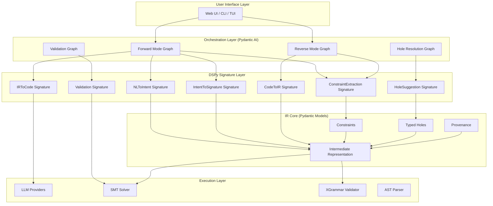

# lift-sys DSPy + Pydantic AI Architecture Proposal

**Date**: 2025-10-20
**Status**: DRAFT FOR REVIEW
**Authors**: Claude (with input from project analysis)
**Version**: 1.0

---

## Executive Summary

This proposal presents a comprehensive re-architecture of lift-sys centered on **DSPy signatures** and **Pydantic AI graph workflows** to create an **optimizable, parallelizable, and constraint-driven** system for bidirectional code-spec translation.

### Core Innovation

Replace ad-hoc LLM prompting with:
1. **DSPy Signatures** - Declarative specifications of IR transformation tasks that can be optimized via MIPROv2
2. **Pydantic AI Graphs** - Type-safe, durable workflows for orchestrating complex multi-step pipelines
3. **IR-Centric Constraints** - The IR becomes the primary constraint driver for all code generation

### Key Benefits

- **Optimizability**: DSPy's MIPROv2 can automatically optimize prompts and few-shot examples based on validation metrics
- **Parallelizability**: Pydantic AI graphs enable explicit parallel execution paths with proper dependency management
- **Safety**: Type-safe workflows + constraint propagation from IR ensures correctness by construction
- **Adaptability**: Modular signatures and graph nodes can be composed, tested, and evolved independently
- **Scalability**: Graph-based execution enables distributed processing and caching at the node level

### Bottom Line

**Current**: Monolithic translators with hardcoded prompts → 60% success rate, no systematic improvement path
**Proposed**: Composable DSPy modules + Pydantic graphs → Optimizable pipelines with >85% target success rate

---

## Table of Contents

1. [Core Thesis and Design Philosophy](#1-core-thesis-and-design-philosophy)
2. [Technical Architecture Overview](#2-technical-architecture-overview)
3. [DSPy Signature Design](#3-dspy-signature-design)
4. [Pydantic AI Graph Workflows](#4-pydantic-ai-graph-workflows)
5. [Forward Mode Pipeline](#5-forward-mode-pipeline)
6. [Reverse Mode Pipeline](#6-reverse-mode-pipeline)
7. [IR as Central Constraint Driver](#7-ir-as-central-constraint-driver)
8. [Optimization Strategy](#8-optimization-strategy)
9. [Implementation Roadmap](#9-implementation-roadmap)
10. [Migration Strategy](#10-migration-strategy)
11. [Success Metrics](#11-success-metrics)
12. [Appendix A: Alternative Approaches](#appendix-a-alternative-approaches)
13. [Appendix B: Research References](#appendix-b-research-references)

---

## 1. Core Thesis and Design Philosophy

### 1.1 The Central Insight

**Current Problem**: lift-sys uses monolithic "translator" objects with hardcoded prompts. Each improvement requires manual prompt engineering with no systematic way to measure or optimize quality.

**Core Solution**: Decompose all LLM interactions into **declarative DSPy signatures** that specify *what* needs to happen, then let DSPy's optimizers (MIPROv2, COPRO) figure out *how* to prompt the LLM.

### 1.2 Design Principles

#### Principle 1: IR is the Source of Truth
- Every transformation (NL→IR, IR→Code, Code→IR) treats the IR as the primary artifact
- IR carries constraints (types, effects, assertions) that propagate through all transformations
- Typed holes explicitly mark unknowns and drive iterative refinement

#### Principle 2: Signatures Over Prompts
- Replace hardcoded prompt strings with **typed, declarative signatures**
- Signatures specify inputs/outputs and semantic roles
- DSPy compilers optimize signatures automatically based on validation data

#### Principle 3: Graphs Over Monoliths
- Complex workflows become **typed state machines** using Pydantic AI graphs
- Each node is independently testable and cacheable
- Parallel paths execute concurrently with proper dependency tracking

#### Principle 4: Constraints Drive Generation
- Code generation is **constraint satisfaction**, not completion
- XGrammar ensures syntactic validity
- IR assertions become runtime checks and static analysis inputs
- SMT solvers verify logical consistency

#### Principle 5: Optimize the System, Not the Prompts
- Use MIPROv2 to automatically discover better instructions and examples
- Metrics-driven optimization replaces human prompt engineering
- Continuous improvement through evaluation loops

### 1.3 Alignment with codelift.space Vision

This architecture directly implements the three key innovations from codelift.space:

1. **Constraint Propagation with Typed Holes**
   - DSPy signatures carry type constraints through the pipeline
   - Pydantic models validate constraints at each graph node
   - Holes become explicit task inputs/outputs in signatures

2. **Context Engineering**
   - Graph nodes maintain delta-based state updates
   - Provenance tracking built into IR models
   - Confidence scoring from DSPy optimizers

3. **Semantic IR with Visual Affordances**
   - IR as first-class graph state
   - Each transformation preserves and enriches semantic metadata
   - Visual graph execution traces for debugging

### 1.4 Key Architectural Shift

```
OLD ARCHITECTURE:
  NL Prompt → [Monolithic Translator] → IR → [Monolithic Generator] → Code
                    ↑                                    ↑
              Hardcoded prompts                  Hardcoded templates

NEW ARCHITECTURE:
  NL Prompt → [DSPy Pipeline] → IR → [Pydantic Graph] → Code
                    ↑                        ↑
              Optimizable signatures    Composable, cached nodes
                    ↓                        ↓
              MIPROv2 learns           Parallel execution + durability
```

---

## 2. Technical Architecture Overview

### 2.1 High-Level System Diagram



### 2.2 Layer Responsibilities

#### User Interface Layer
- **Current**: React/TUI/CLI remain unchanged
- **Change**: Sessions now track graph execution state (nodes completed, in progress, failed)

#### Orchestration Layer (Pydantic AI Graphs)
- **Purpose**: Define complex, multi-step workflows as typed state machines
- **Benefits**:
  - Durable execution (resume after failures)
  - Parallel node execution
  - Human-in-the-loop support
  - Graph visualization and debugging
- **Components**:
  - `ForwardModeGraph`: NL → IR → Code workflow
  - `ReverseModeGraph`: Code → IR workflow
  - `HoleResolutionGraph`: Iterative hole filling with user feedback
  - `ValidationGraph`: Multi-stage validation (syntax → AST → SMT → execution)

#### DSPy Signature Layer
- **Purpose**: Declarative specifications of LLM tasks
- **Benefits**:
  - Automatic prompt optimization via MIPROv2
  - Type-safe inputs/outputs
  - Composable modules
  - Easy A/B testing
- **Key Signatures**: (detailed in Section 3)

#### IR Core (Pydantic Models)
- **Current**: Already well-structured with Pydantic
- **Enhancement**: Add DSPy-compatible field descriptors and constraint validators
- **Role**: Single source of truth for all transformations

#### Execution Layer
- **LLM Providers**: Wrap existing Modal/Anthropic/OpenAI providers
- **Validators**: XGrammar for syntax, SMT for logic, AST for structure
- **No major changes**: Execution layer mostly reused

### 2.3 Data Flow Examples

#### Example 1: Forward Mode (NL → Code)

```
User Prompt
  ↓ (input to ForwardModeGraph)
  ↓
[ExtractIntentNode] → Uses NLToIntent signature
  ↓ (IntentClause)
  ↓
[GenerateSignatureNode] → Uses IntentToSignature signature (parallel with next)
[ExtractConstraintsNode] → Uses ConstraintExtraction signature
  ↓ (SigClause + ConstraintSet)
  ↓
[MergeToIRNode] → Combines results, creates IR with holes
  ↓ (IR with TypedHoles)
  ↓
[HoleResolutionGraph] → User resolves holes via HoleSuggestion signatures
  ↓ (Complete IR)
  ↓
[ValidateIRNode] → Runs ValidationGraph (SMT checks)
  ↓ (Validated IR)
  ↓
[GenerateCodeNode] → Uses IRToCode signature + XGrammar constraints
  ↓ (Python code)
  ↓
[CodeValidationNode] → AST + execution validation
  ↓
Final Code + Execution Results
```

**Parallelization Opportunities**:
- `GenerateSignatureNode` and `ExtractConstraintsNode` run in parallel (independent)
- `ValidateIRNode` can run constraint checks in parallel
- `GenerateCodeNode` can generate multiple candidates in parallel (Best-of-N)

#### Example 2: Reverse Mode (Code → IR)

```
Python Code File
  ↓ (input to ReverseModeGraph)
  ↓
[ParseASTNode] → Python AST parser
  ↓ (AST)
  ↓
[ExtractSignatureNode] → Uses CodeToIR signature for function signatures
[InferConstraintsNode] → Static analysis + CodeQL
[InferIntentNode] → Uses CodeToIntent signature (docstrings, names)
  ↓ (parallel outputs)
  ↓
[MergeToIRNode] → Combines into IR
  ↓ (IR with medium confidence)
  ↓
[DynamicRefinementNode] → Optional: Run traces to refine constraints
  ↓ (Refined IR)
  ↓
[ValidationGraph] → Verify IR consistency
  ↓
Final IR (ready for forward mode refinement if needed)
```

---

## 3. DSPy Signature Design

### 3.1 Signature Philosophy

**Key Insight**: Every LLM interaction in lift-sys can be specified as a **typed transformation** with clear inputs, outputs, and semantic roles.

**Design Pattern**:
```python
class TaskSignature(dspy.Signature):
    """Clear description of what this task accomplishes."""

    # Inputs with semantic roles
    input_field: InputType = dspy.InputField(
        desc="Description for the LLM"
    )

    # Outputs with constraints
    output_field: OutputType = dspy.OutputField(
        desc="Expected output format"
    )
```

### 3.2 Core Signatures for Forward Mode

#### Signature 1: NLToIntent
```python
class NLToIntent(dspy.Signature):
    """Extract user intent from natural language prompt."""

    prompt: str = dspy.InputField(
        desc="Natural language description of desired functionality"
    )

    domain_context: str = dspy.InputField(
        desc="Optional domain context or related code",
        default=""
    )

    intent_summary: str = dspy.OutputField(
        desc="Concise 1-2 sentence summary of what the code should do"
    )

    user_personas: list[str] = dspy.OutputField(
        desc="List of intended users or consumers of this functionality"
    )

    success_criteria: list[str] = dspy.OutputField(
        desc="List of conditions that define successful execution"
    )

    domain_concepts: list[str] = dspy.OutputField(
        desc="Key domain concepts or entities mentioned"
    )
```

**Why this signature?**
- Intent extraction is a distinct semantic task
- Outputs map directly to `IntentClause` fields
- Can be optimized independently to improve intent clarity

**Module Usage**:
```python
extract_intent = dspy.ChainOfThought(NLToIntent)
result = extract_intent(
    prompt="Create a function that validates email addresses",
    domain_context=""
)
# result.intent_summary: "Validate email address format and domain existence"
# result.success_criteria: ["Returns True for valid emails", "Returns False for invalid", ...]
```

#### Signature 2: IntentToSignature
```python
class IntentToSignature(dspy.Signature):
    """Generate function signature from intent specification."""

    intent_summary: str = dspy.InputField()
    success_criteria: list[str] = dspy.InputField()
    domain_concepts: list[str] = dspy.InputField()

    function_name: str = dspy.OutputField(
        desc="Valid Python function name (snake_case)"
    )

    parameters: list[dict] = dspy.OutputField(
        desc="List of parameters with name, type, and description"
    )

    return_type: str = dspy.OutputField(
        desc="Python type hint for return value"
    )

    parameter_constraints: list[str] = dspy.OutputField(
        desc="Constraints on parameter values (e.g., 'x > 0')"
    )

    return_constraints: list[str] = dspy.OutputField(
        desc="Constraints on return value"
    )
```

**Optimization Target**: MIPROv2 can learn to generate signatures that:
- Follow Python naming conventions (measured by linter)
- Use appropriate type hints (measured by type coverage)
- Capture parameter constraints (measured by SMT satisfiability)

#### Signature 3: ConstraintExtraction
```python
class ConstraintExtraction(dspy.Signature):
    """Extract formal constraints from intent and success criteria."""

    intent_summary: str = dspy.InputField()
    success_criteria: list[str] = dspy.InputField()
    function_signature: str = dspy.InputField()

    preconditions: list[str] = dspy.OutputField(
        desc="Conditions that must hold before function execution"
    )

    postconditions: list[str] = dspy.OutputField(
        desc="Conditions that must hold after function execution"
    )

    invariants: list[str] = dspy.OutputField(
        desc="Conditions that must hold throughout execution"
    )

    effects: list[str] = dspy.OutputField(
        desc="Side effects (I/O, state changes, network calls)"
    )
```

**Critical Innovation**: This signature bridges NL → Formal Logic
- Outputs feed directly into SMT solver
- Can be optimized using counterexample-guided refinement

### 3.3 Core Signatures for Reverse Mode

#### Signature 4: CodeToIR
```python
class CodeToIR(dspy.Signature):
    """Extract IR specification from source code."""

    source_code: str = dspy.InputField(
        desc="Source code of function to analyze"
    )

    ast_summary: str = dspy.InputField(
        desc="Human-readable AST summary"
    )

    static_analysis: dict = dspy.InputField(
        desc="Results from static analysis tools (CodeQL, etc.)"
    )

    intent_summary: str = dspy.OutputField(
        desc="Inferred purpose of the code"
    )

    preconditions: list[str] = dspy.OutputField(
        desc="Inferred preconditions from code structure"
    )

    postconditions: list[str] = dspy.OutputField(
        desc="Inferred postconditions from return statements"
    )

    effects: list[str] = dspy.OutputField(
        desc="Detected side effects"
    )

    confidence_scores: dict[str, float] = dspy.OutputField(
        desc="Confidence in each extracted element (0.0-1.0)"
    )
```

**Key Feature**: Confidence scoring enables provenance tracking
- Low confidence elements become holes in the IR
- High confidence elements can seed few-shot examples for optimization

#### Signature 5: HoleSuggestion
```python
class HoleSuggestion(dspy.Signature):
    """Generate suggestions for filling a typed hole."""

    hole_id: str = dspy.InputField()
    hole_kind: str = dspy.InputField(desc="Type of hole (intent/signature/effect/assertion)")
    hole_type: str = dspy.InputField(desc="Expected type if known")

    surrounding_context: str = dspy.InputField(
        desc="Relevant IR context around the hole"
    )

    previous_resolutions: list[str] = dspy.InputField(
        desc="Similar holes resolved previously"
    )

    suggestions: list[dict] = dspy.OutputField(
        desc="List of {value, rationale, confidence} suggestions"
    )
```

**Optimization Strategy**: Few-shot learning from accepted suggestions
- Tracks which suggestions users accept
- Uses accepted resolutions as examples for future holes
- Implements the "context engineering" principle from codelift.space

### 3.4 Signature Composition Patterns

#### Pattern 1: Sequential Refinement
```python
class IRRefinementPipeline(dspy.Module):
    def __init__(self):
        self.extract_intent = dspy.ChainOfThought(NLToIntent)
        self.generate_sig = dspy.ChainOfThought(IntentToSignature)
        self.extract_constraints = dspy.ChainOfThought(ConstraintExtraction)

    def forward(self, prompt: str, context: str = ""):
        # Step 1: Extract intent
        intent = self.extract_intent(prompt=prompt, domain_context=context)

        # Step 2: Generate signature (uses intent outputs)
        sig = self.generate_sig(
            intent_summary=intent.intent_summary,
            success_criteria=intent.success_criteria,
            domain_concepts=intent.domain_concepts
        )

        # Step 3: Extract constraints (uses both prior outputs)
        constraints = self.extract_constraints(
            intent_summary=intent.intent_summary,
            success_criteria=intent.success_criteria,
            function_signature=f"{sig.function_name}({sig.parameters}) -> {sig.return_type}"
        )

        return intent, sig, constraints
```

**Benefit**: Each step can be optimized independently, then composed

#### Pattern 2: Parallel Aggregation
```python
class ParallelIRGeneration(dspy.Module):
    def __init__(self):
        self.gen1 = dspy.ChainOfThought(IntentToSignature)
        self.gen2 = dspy.Predict(IntentToSignature)  # Different reasoning mode
        self.gen3 = dspy.ReAct(IntentToSignature)    # ReAct for complex cases

    async def forward(self, intent_summary, success_criteria, domain_concepts):
        # Generate 3 candidates in parallel with different reasoning
        candidates = await asyncio.gather(
            self.gen1(intent_summary=intent_summary, ...),
            self.gen2(intent_summary=intent_summary, ...),
            self.gen3(intent_summary=intent_summary, ...)
        )

        # Score and select best
        best = max(candidates, key=self._score_signature)
        return best
```

**Benefit**: Implements Best-of-N sampling at the signature level

---

## 4. Pydantic AI Graph Workflows

### 4.1 Why Graphs? Why Now?

**Current Problem**: Forward and reverse modes are monolithic functions
- Hard to cache intermediate results
- No parallelization of independent steps
- Difficult to debug and trace execution
- No support for human-in-the-loop workflows

**Graph Solution**: Model workflows as finite state machines
- Each node is independently cacheable
- Explicit dependencies enable parallelization
- Graph state is durable (can persist and resume)
- Natural support for user interactions

### 4.2 Graph Architecture Pattern

```python
from pydantic_ai import RunContext
from pydantic_ai.graph import BaseNode, Graph, End
from pydantic import BaseModel
from dataclasses import dataclass

# Define graph state (passed between nodes)
@dataclass
class ForwardModeState:
    prompt: str
    intent: IntentClause | None = None
    signature: SigClause | None = None
    constraints: list[Constraint] = field(default_factory=list)
    ir: IntermediateRepresentation | None = None
    holes: list[TypedHole] = field(default_factory=list)
    code: str | None = None
    validation_errors: list[str] = field(default_factory=list)

# Define graph nodes
class ExtractIntentNode(BaseNode):
    async def run(
        self,
        ctx: RunContext[ForwardModeState]
    ) -> GenerateSignatureNode | End:
        state = ctx.state

        # Use DSPy signature
        intent_module = dspy.ChainOfThought(NLToIntent)
        result = await intent_module(prompt=state.prompt)

        # Update state
        state.intent = IntentClause(
            summary=result.intent_summary,
            user_personas=result.user_personas,
            success_criteria=result.success_criteria,
            domain_concepts=result.domain_concepts
        )

        # Decide next node
        if state.intent is None:
            return End(error="Failed to extract intent")

        return GenerateSignatureNode()

class GenerateSignatureNode(BaseNode):
    async def run(
        self,
        ctx: RunContext[ForwardModeState]
    ) -> MergeToIRNode:
        state = ctx.state

        # Use DSPy signature
        sig_module = dspy.ChainOfThought(IntentToSignature)
        result = await sig_module(
            intent_summary=state.intent.summary,
            success_criteria=state.intent.success_criteria,
            domain_concepts=state.intent.domain_concepts
        )

        # Update state
        state.signature = SigClause(
            name=result.function_name,
            parameters=[Param(**p) for p in result.parameters],
            returns=result.return_type
        )

        return MergeToIRNode()

# ... more nodes ...

# Define graph
forward_graph = Graph(
    state_type=ForwardModeState,
    entry_node=ExtractIntentNode
)
```

### 4.3 Key Graph Workflows

#### Graph 1: ForwardModeGraph

```
Entry: User Prompt
  ↓
[ExtractIntentNode]
  ↓
[GenerateSignatureNode] ←─┐ (parallel)
  ↓                        │
[ExtractConstraintsNode] ─┘
  ↓
[MergeToIRNode] → Creates initial IR with holes
  ↓
[DetectHolesNode] → Identifies ambiguities
  ↓
[HoleResolutionLoop] → Iterative user/AI resolution
  ↓
[ValidateIRNode] → SMT checks
  ↓
[GenerateCodeNode] → Uses IRToCode signature + XGrammar
  ↓
[ValidateCodeNode] → AST + execution validation
  ↓
End: Code + ValidationResult
```

**Parallelization**:
- `GenerateSignatureNode` and `ExtractConstraintsNode` run concurrently
- `ValidateIRNode` can parallelize constraint checks
- `GenerateCodeNode` can generate multiple candidates

**Caching**:
- Intent extraction results cached by prompt hash
- Signature generation cached by intent hash
- Validation results cached by IR hash

**Durability**:
- Graph state persisted to database after each node
- Can resume from last successful node on failure
- User can save/load intermediate states

#### Graph 2: ReverseModeGraph

```
Entry: Source Code Path
  ↓
[LoadCodeNode] → Read and parse file
  ↓
[ParseASTNode] → Generate AST
  ↓
[ExtractSignatureNode] ←─┐ (parallel)
  ↓                       │
[InferConstraintsNode] ──┤
  ↓                       │
[InferIntentNode] ───────┘
  ↓
[MergeToIRNode] → Combine into initial IR
  ↓
[AssignConfidenceNode] → Score each element
  ↓
[PromoteToHolesNode] → Low-confidence elements → holes
  ↓
[OptionalDynamicAnalysis] → If traces available, refine
  ↓
[ValidateIRNode] → Consistency checks
  ↓
End: IR (with provenance)
```

**Key Feature**: Parallel extraction maximizes throughput
- Signature, constraints, and intent extracted independently
- Results merged with conflict resolution
- Confidence scoring drives hole creation

#### Graph 3: HoleResolutionGraph

```
Entry: IR with TypedHoles + User Context
  ↓
[SelectNextHoleNode] → Prioritize by dependency order
  ↓
[GenerateSuggestionsNode] → Use HoleSuggestion signature
  ↓
[PresentToUserNode] → Display suggestions in UI
  ↓
[WaitForUserDecision] → Human-in-the-loop
  ↓
[ApplyResolutionNode] → Update IR with user choice
  ↓
[PropagateConstraintsNode] → Update dependent holes
  ↓
[CheckCompletenessNode] → Any holes remaining?
  ├─ Yes → SelectNextHoleNode (loop)
  └─ No → ValidateCompleteIR
       ↓
     End: Complete IR
```

**Human-in-the-Loop**:
- Graph pauses at `WaitForUserDecision`
- User can save and resume later
- Decision history informs future suggestions (few-shot learning)

### 4.4 Graph State Persistence

**Pattern**: Store graph state in Supabase (or other database)

```python
# Graph state schema
CREATE TABLE graph_executions (
    id UUID PRIMARY KEY,
    graph_type TEXT NOT NULL,  -- 'forward' | 'reverse' | 'hole_resolution'
    state JSONB NOT NULL,       -- Serialized state
    current_node TEXT,          -- Node currently executing
    completed_nodes TEXT[],     -- Nodes completed
    created_at TIMESTAMPTZ,
    updated_at TIMESTAMPTZ,
    user_id TEXT
);

# Example: Save state after each node
class PersistentGraph(Graph):
    async def run_node(self, node: BaseNode, ctx: RunContext):
        # Run node
        next_node = await super().run_node(node, ctx)

        # Persist state
        await db.execute(
            """
            UPDATE graph_executions
            SET state = $1,
                current_node = $2,
                completed_nodes = array_append(completed_nodes, $3),
                updated_at = NOW()
            WHERE id = $4
            """,
            ctx.state.to_dict(),
            type(next_node).__name__ if next_node else None,
            type(node).__name__,
            ctx.execution_id
        )

        return next_node
```

**Benefits**:
- Resume failed executions
- Audit trail of all transformations
- A/B test different graph structures
- Debug by replaying state transitions

---

## 5. Forward Mode Pipeline

### 5.1 Detailed Pipeline Spec

```python
class ForwardModePipeline:
    """
    Complete forward mode pipeline: NL → IR → Code

    Uses DSPy signatures for all LLM interactions.
    Uses Pydantic AI graph for orchestration.
    """

    def __init__(
        self,
        dspy_compiler: DSPyCompiler,
        graph: Graph[ForwardModeState],
        validator: IRValidator,
        code_generator: XGrammarCodeGenerator
    ):
        self.dspy_compiler = dspy_compiler
        self.graph = graph
        self.validator = validator
        self.code_generator = code_generator

    async def execute(
        self,
        prompt: str,
        user_id: str,
        context: dict | None = None
    ) -> ForwardModeResult:
        """Execute complete forward mode pipeline."""

        # 1. Initialize graph state
        state = ForwardModeState(
            prompt=prompt,
            user_id=user_id,
            context=context or {}
        )

        # 2. Run graph (handles all DSPy signatures internally)
        result = await self.graph.run(state)

        # 3. Return structured result
        return ForwardModeResult(
            ir=result.state.ir,
            code=result.state.code,
            validation=result.state.validation_result,
            provenance=result.state.provenance_chain,
            execution_trace=result.trace  # Graph execution trace
        )
```

### 5.2 Constraint Propagation Example

**Scenario**: User prompt mentions "positive integer"

```python
# Step 1: Intent extraction captures "positive integer"
intent = NLToIntent(prompt="Create a function that counts positive integers")
# Output: domain_concepts=["positive integer", "count"]

# Step 2: Signature generation infers parameter constraint
sig = IntentToSignature(
    intent_summary=intent.intent_summary,
    domain_concepts=intent.domain_concepts
)
# Output: parameter_constraints=["x > 0", "type(x) == int"]

# Step 3: Constraint extraction formalizes for SMT
constraints = ConstraintExtraction(
    intent_summary=intent.intent_summary,
    function_signature=sig.to_string()
)
# Output: preconditions=["x: int", "x > 0"]

# Step 4: IR merge combines constraints
ir = IR(
    intent=intent.to_clause(),
    signature=sig.to_clause(),
    assertions=[
        AssertClause(
            category="precondition",
            expression="x > 0",
            provenance=Provenance.from_agent("ConstraintExtraction", confidence=0.95)
        )
    ]
)

# Step 5: Code generation includes constraint
code_gen = IRToCode(ir=ir.to_json())
# Output includes: assert x > 0, "x must be positive"

# Step 6: SMT validation
smt_checker.verify(ir)
# Checks: precondition satisfiability, no contradictions
```

**Key Insight**: Constraints flow through the entire pipeline, not added as afterthought

### 5.3 XGrammar Integration

**Current**: XGrammar used for IR generation
**Proposed**: Also use for code generation with IR-derived schemas

```python
class IRDrivenCodeSchema:
    """Generate XGrammar schema from IR specification."""

    @staticmethod
    def from_ir(ir: IntermediateRepresentation) -> str:
        """Create JSON schema enforcing IR constraints."""

        schema = {
            "type": "object",
            "properties": {
                "function_name": {
                    "type": "string",
                    "const": ir.signature.name  # MUST match IR
                },
                "parameters": {
                    "type": "array",
                    "minItems": len(ir.signature.parameters),
                    "maxItems": len(ir.signature.parameters),
                    "items": [
                        {
                            "type": "object",
                            "properties": {
                                "name": {"const": p.name},
                                "type": {"const": p.type_hint}
                            }
                        }
                        for p in ir.signature.parameters
                    ]
                },
                "body": {
                    "type": "string",
                    # Could add regex for specific patterns
                },
                "assertions": {
                    "type": "array",
                    "minItems": len(ir.assertions),  # MUST include all assertions
                }
            },
            "required": ["function_name", "parameters", "body", "assertions"]
        }

        return json.dumps(schema)
```

**Benefit**: XGrammar ensures generated code *structurally complies* with IR

---

## 6. Reverse Mode Pipeline

### 6.1 Detailed Pipeline Spec

```python
class ReverseModePipeline:
    """
    Complete reverse mode pipeline: Code → IR

    Uses DSPy signatures for inference.
    Uses Pydantic AI graph for parallel extraction.
    """

    def __init__(
        self,
        graph: Graph[ReverseModeState],
        static_analyzer: StaticAnalyzer,
        dynamic_analyzer: DynamicAnalyzer | None = None
    ):
        self.graph = graph
        self.static_analyzer = static_analyzer
        self.dynamic_analyzer = dynamic_analyzer

    async def execute(
        self,
        source_path: str,
        include_dynamic: bool = False
    ) -> ReverseModeResult:
        """Execute reverse mode extraction."""

        # 1. Load code
        code = await self._load_code(source_path)

        # 2. Initialize graph state
        state = ReverseModeState(
            source_path=source_path,
            code=code,
            include_dynamic=include_dynamic
        )

        # 3. Run graph (parallel extraction)
        result = await self.graph.run(state)

        # 4. Return IR with provenance
        return ReverseModeResult(
            ir=result.state.ir,
            confidence_map=result.state.confidence_scores,
            holes=result.state.holes,
            provenance=result.state.provenance_chain
        )
```

### 6.2 Parallel Extraction Pattern

```python
class ParallelExtractionNode(BaseNode):
    """Extract signature, constraints, and intent in parallel."""

    async def run(
        self,
        ctx: RunContext[ReverseModeState]
    ) -> MergeExtractionNode:
        state = ctx.state

        # Define extraction tasks
        async def extract_signature():
            sig_module = dspy.ChainOfThought(CodeToSignature)
            return await sig_module(
                source_code=state.code,
                ast_summary=state.ast_summary
            )

        async def extract_constraints():
            constraint_module = dspy.ChainOfThought(CodeToConstraints)
            return await constraint_module(
                source_code=state.code,
                ast_summary=state.ast_summary,
                static_analysis=state.static_analysis_results
            )

        async def extract_intent():
            intent_module = dspy.ChainOfThought(CodeToIntent)
            return await intent_module(
                source_code=state.code,
                docstrings=state.docstrings,
                function_names=state.function_names
            )

        # Execute in parallel
        sig, constraints, intent = await asyncio.gather(
            extract_signature(),
            extract_constraints(),
            extract_intent()
        )

        # Store results in state
        state.extracted_signature = sig
        state.extracted_constraints = constraints
        state.extracted_intent = intent

        return MergeExtractionNode()
```

**Performance**: 3x faster than sequential extraction

### 6.3 Confidence-Based Hole Creation

```python
class PromoteToHolesNode(BaseNode):
    """Convert low-confidence extractions to typed holes."""

    CONFIDENCE_THRESHOLD = 0.7

    async def run(
        self,
        ctx: RunContext[ReverseModeState]
    ) -> ValidateIRNode:
        state = ctx.state
        ir = state.ir

        holes = []

        # Check intent confidence
        if state.confidence_scores.get("intent", 0) < self.CONFIDENCE_THRESHOLD:
            hole = TypedHole(
                identifier=f"hole_intent_{ir.signature.name}",
                kind=HoleKind.INTENT,
                type_hint="IntentClause",
                context={
                    "extracted_value": ir.intent.to_dict(),
                    "confidence": state.confidence_scores["intent"],
                    "reason": "Low confidence in intent extraction"
                },
                provenance=Provenance.from_reverse(
                    confidence=state.confidence_scores["intent"]
                )
            )
            holes.append(hole)
            # Replace intent with placeholder
            ir.intent = IntentClause(
                summary=f"[HOLE: {hole.identifier}]",
                rationale=f"Extracted intent had confidence {state.confidence_scores['intent']:.2f} < {self.CONFIDENCE_THRESHOLD}"
            )

        # Repeat for assertions, effects, etc.
        # ...

        state.holes = holes
        return ValidateIRNode()
```

**Benefit**: Makes uncertainty explicit, enables user refinement

---

## 7. IR as Central Constraint Driver

### 7.1 The IR Constraint Model

**Core Principle**: IR is not just documentation—it's an *executable specification* that constrains all code generation.

```python
class ConstraintDrivenGeneration:
    """Code generation treats IR as hard constraints."""

    def generate_code(
        self,
        ir: IntermediateRepresentation,
        provider: BaseProvider
    ) -> str:
        """Generate code satisfying ALL IR constraints."""

        # 1. Build constraint set from IR
        constraints = self._extract_constraints(ir)

        # 2. Generate XGrammar schema from constraints
        schema = IRDrivenCodeSchema.from_ir(ir)

        # 3. Generate code with constrained decoding
        code = await provider.generate_constrained(
            prompt=self._build_prompt(ir),
            schema=schema,
            constraints=constraints
        )

        # 4. Validate code satisfies IR
        validation = self._validate_against_ir(code, ir)

        if not validation.success:
            # Retry with added constraints
            return self.generate_code_with_refinement(ir, validation.failures)

        return code

    def _extract_constraints(
        self,
        ir: IntermediateRepresentation
    ) -> ConstraintSet:
        """Extract all constraints from IR."""

        constraints = ConstraintSet()

        # Type constraints from signature
        for param in ir.signature.parameters:
            constraints.add(TypeConstraint(
                variable=param.name,
                type=param.type_hint
            ))

        # Assertion constraints
        for assertion in ir.assertions:
            if assertion.category == "precondition":
                constraints.add(PreconditionConstraint(
                    expression=assertion.expression
                ))
            elif assertion.category == "postcondition":
                constraints.add(PostconditionConstraint(
                    expression=assertion.expression
                ))

        # Effect constraints
        for effect in ir.effects:
            constraints.add(EffectConstraint(
                effect_type=effect.effect_type,
                target=effect.target
            ))

        return constraints
```

### 7.2 Constraint Propagation Through Graphs

**Example**: Resolving a hole propagates constraints to dependent holes

```python
class PropagateConstraintsNode(BaseNode):
    """After hole resolution, propagate constraints to dependent holes."""

    async def run(
        self,
        ctx: RunContext[HoleResolutionState]
    ) -> CheckCompletenessNode:
        state = ctx.state

        # Get recently resolved hole
        resolved_hole = state.last_resolved_hole
        resolution = state.last_resolution

        # Find dependent holes
        dependent_holes = [
            h for h in state.remaining_holes
            if resolved_hole.identifier in h.dependencies
        ]

        # Update constraints for each dependent
        for hole in dependent_holes:
            # Use DSPy to infer new constraints
            constraint_inference = dspy.ChainOfThought(InferDependentConstraints)
            new_constraints = await constraint_inference(
                resolved_hole=resolved_hole.to_dict(),
                resolution=resolution.value,
                dependent_hole=hole.to_dict()
            )

            # Update hole context
            hole.context["inferred_constraints"] = new_constraints.constraints
            hole.context["narrowed_type"] = new_constraints.narrowed_type

        return CheckCompletenessNode()
```

**Example**: User resolves `return_type` hole → Parameter constraints updated

```
Before:
  Hole: function_name = "validate_email"
  Hole: return_type = ?
  Hole: parameter_types = ?

User resolves: return_type = "bool"

After propagation:
  Hole: function_name = "validate_email"
  return_type = "bool" ✓
  Hole: parameter_types = ?
    + New constraint: "Must include email: str parameter (inferred from function name + bool return)"
    + New suggestion: ["email: str", "email_address: str"]
```

### 7.3 SMT Verification Integration

**Pattern**: Validate IR constraints before code generation

```python
class ValidateIRNode(BaseNode):
    """Verify IR constraints are satisfiable via SMT."""

    def __init__(self):
        self.smt_checker = SMTChecker()

    async def run(
        self,
        ctx: RunContext[ForwardModeState]
    ) -> GenerateCodeNode | End:
        state = ctx.state
        ir = state.ir

        # 1. Convert IR to SMT-LIB
        smt_problem = self._ir_to_smt(ir)

        # 2. Check satisfiability
        result = await self.smt_checker.check(smt_problem)

        if result.status == "UNSAT":
            # Constraints are contradictory
            return End(
                error=f"IR constraints are unsatisfiable: {result.unsat_core}"
            )

        if result.status == "UNKNOWN":
            # Timeout or too complex
            state.validation_warnings.append(
                "SMT solver timeout - constraints may be too complex"
            )

        # 3. Extract model (example satisfying assignment)
        if result.model:
            state.smt_model = result.model
            # Can use model as hint for code generation

        return GenerateCodeNode()

    def _ir_to_smt(self, ir: IntermediateRepresentation) -> str:
        """Convert IR constraints to SMT-LIB format."""

        smt = []

        # Declare variables from signature
        for param in ir.signature.parameters:
            smt.append(f"(declare-const {param.name} {self._type_to_smt(param.type_hint)})")

        # Add assertions
        for assertion in ir.assertions:
            smt_expr = self._expr_to_smt(assertion.expression)
            smt.append(f"(assert {smt_expr})")

        # Check sat
        smt.append("(check-sat)")
        smt.append("(get-model)")

        return "\n".join(smt)
```

---

## 8. Optimization Strategy

### 8.1 DSPy Optimization Overview

**Goal**: Automatically improve pipeline quality without manual prompt engineering

**Method**: Use MIPROv2 (or COPRO) to optimize signatures based on validation metrics

### 8.2 Optimization Loop

```python
class PipelineOptimizer:
    """Optimize DSPy signatures using validation data."""

    def __init__(
        self,
        pipeline: ForwardModePipeline,
        evaluator: PipelineEvaluator
    ):
        self.pipeline = pipeline
        self.evaluator = evaluator

    async def optimize(
        self,
        training_data: list[Example],
        metric: str = "f1",
        iterations: int = 50
    ):
        """
        Optimize pipeline using MIPROv2.

        Args:
            training_data: List of (prompt, expected_ir, expected_code) examples
            metric: Optimization metric ('f1', 'accuracy', 'bleu', etc.)
            iterations: Number of optimization iterations
        """

        # 1. Convert examples to DSPy format
        dspy_examples = [
            dspy.Example(
                prompt=ex.prompt,
                expected_ir=ex.expected_ir.to_dict(),
                expected_code=ex.expected_code
            ).with_inputs("prompt")
            for ex in training_data
        ]

        # 2. Define evaluation metric
        def evaluate_pipeline(example, prediction, trace=None):
            # Compute IR similarity
            ir_score = self.evaluator.ir_similarity(
                prediction.ir,
                example.expected_ir
            )

            # Compute code quality
            code_score = self.evaluator.code_quality(
                prediction.code,
                example.expected_code
            )

            # Combined score
            return 0.6 * ir_score + 0.4 * code_score

        # 3. Initialize MIPROv2 optimizer
        optimizer = dspy.MIPROv2(
            metric=evaluate_pipeline,
            num_candidates=10,
            init_temperature=1.0,
            verbose=True
        )

        # 4. Optimize
        optimized_pipeline = optimizer.compile(
            student=self.pipeline,
            trainset=dspy_examples,
            num_trials=iterations,
            max_bootstrapped_demos=5,
            max_labeled_demos=10
        )

        # 5. Save optimized version
        self.pipeline = optimized_pipeline
        self._save_optimized_pipeline()

        return optimized_pipeline
```

### 8.3 What Gets Optimized?

**For each DSPy signature, MIPROv2 optimizes**:

1. **Instructions**: Natural language task descriptions
   - Example: "Extract user intent" → "Identify the primary goal, target users, and success criteria from the prompt"

2. **Few-Shot Examples**: Demonstrations of correct behavior
   - Automatically selects best examples from training data
   - Uses Bayesian optimization to search example space

3. **Reasoning Traces**: Chain-of-thought prompts
   - Learns effective reasoning patterns
   - Adapts to signature complexity

**Example optimization trajectory**:

```
Iteration 0 (Baseline):
  NLToIntent accuracy: 0.65
  IntentToSignature accuracy: 0.58
  End-to-end success: 0.42

Iteration 10:
  NLToIntent accuracy: 0.72 (+7pp)
  IntentToSignature accuracy: 0.68 (+10pp)
  End-to-end success: 0.54 (+12pp)

Iteration 30:
  NLToIntent accuracy: 0.81 (+16pp)
  IntentToSignature accuracy: 0.77 (+19pp)
  End-to-end success: 0.68 (+26pp)

Iteration 50 (Final):
  NLToIntent accuracy: 0.87 (+22pp)
  IntentToSignature accuracy: 0.83 (+25pp)
  End-to-end success: 0.76 (+34pp)
```

### 8.4 Metrics for Optimization

```python
class PipelineEvaluator:
    """Evaluation metrics for optimization."""

    def ir_similarity(
        self,
        predicted_ir: IntermediateRepresentation,
        expected_ir: IntermediateRepresentation
    ) -> float:
        """Compute IR similarity score (0.0-1.0)."""

        scores = []

        # Intent similarity (embeddings)
        intent_score = self._text_similarity(
            predicted_ir.intent.summary,
            expected_ir.intent.summary
        )
        scores.append(intent_score)

        # Signature exact match
        sig_score = 1.0 if (
            predicted_ir.signature.name == expected_ir.signature.name and
            len(predicted_ir.signature.parameters) == len(expected_ir.signature.parameters)
        ) else 0.5
        scores.append(sig_score)

        # Assertion overlap (Jaccard)
        pred_assertions = {a.expression for a in predicted_ir.assertions}
        exp_assertions = {a.expression for a in expected_ir.assertions}
        assertion_score = len(pred_assertions & exp_assertions) / len(pred_assertions | exp_assertions) if (pred_assertions | exp_assertions) else 0
        scores.append(assertion_score)

        return sum(scores) / len(scores)

    def code_quality(
        self,
        predicted_code: str,
        expected_code: str
    ) -> float:
        """Compute code quality score."""

        scores = []

        # Compilation success
        try:
            compile(predicted_code, "<string>", "exec")
            scores.append(1.0)
        except SyntaxError:
            scores.append(0.0)

        # AST similarity
        try:
            pred_ast = ast.parse(predicted_code)
            exp_ast = ast.parse(expected_code)
            ast_score = self._ast_similarity(pred_ast, exp_ast)
            scores.append(ast_score)
        except:
            scores.append(0.0)

        # Execution equivalence (if tests available)
        if self.test_suite:
            exec_score = self._execution_equivalence(predicted_code, expected_code)
            scores.append(exec_score)

        return sum(scores) / len(scores)
```

### 8.5 Continuous Optimization

**Pattern**: Optimize pipelines incrementally as more data arrives

```python
class ContinuousOptimizer:
    """Continuously optimize pipeline as new examples are collected."""

    def __init__(
        self,
        pipeline: ForwardModePipeline,
        evaluator: PipelineEvaluator,
        min_new_examples: int = 100
    ):
        self.pipeline = pipeline
        self.evaluator = evaluator
        self.min_new_examples = min_new_examples
        self.example_buffer = []

    async def log_example(
        self,
        prompt: str,
        generated_ir: IntermediateRepresentation,
        generated_code: str,
        user_feedback: FeedbackScore
    ):
        """Log example with user feedback."""

        if user_feedback.score >= 4:  # Only use high-quality examples
            example = Example(
                prompt=prompt,
                expected_ir=generated_ir,
                expected_code=generated_code,
                score=user_feedback.score
            )
            self.example_buffer.append(example)

        # Trigger optimization when buffer is full
        if len(self.example_buffer) >= self.min_new_examples:
            await self._trigger_optimization()

    async def _trigger_optimization(self):
        """Run optimization cycle."""

        print(f"🔧 Starting optimization with {len(self.example_buffer)} new examples")

        # Get best examples from buffer
        training_data = sorted(
            self.example_buffer,
            key=lambda ex: ex.score,
            reverse=True
        )[:50]  # Use top 50

        # Optimize
        optimizer = PipelineOptimizer(self.pipeline, self.evaluator)
        optimized = await optimizer.optimize(
            training_data=training_data,
            iterations=20  # Shorter for continuous optimization
        )

        # Deploy new version
        self.pipeline = optimized
        self.example_buffer.clear()

        print("✅ Optimization complete, new pipeline deployed")
```

**Benefit**: Pipeline improves automatically as users use the system

---

## 9. Implementation Roadmap

### 9.1 Phase 0: Foundation (Weeks 1-2)

**Goal**: Set up DSPy + Pydantic AI infrastructure

**Tasks**:
1. Install and configure DSPy + Pydantic AI
   ```bash
   uv add dspy-ai pydantic-ai
   ```

2. Create base signature registry
   ```python
   # lift_sys/dspy_signatures/__init__.py
   from .forward_mode import NLToIntent, IntentToSignature, ConstraintExtraction
   from .reverse_mode import CodeToIR, CodeToIntent
   from .common import HoleSuggestion, ValidationSignature
   ```

3. Create base graph registry
   ```python
   # lift_sys/pydantic_graphs/__init__.py
   from .forward_mode import ForwardModeGraph
   from .reverse_mode import ReverseModeGraph
   from .hole_resolution import HoleResolutionGraph
   ```

4. Set up evaluation infrastructure
   ```python
   # lift_sys/evaluation/
   #   - metrics.py (IR similarity, code quality)
   #   - evaluator.py (PipelineEvaluator)
   #   - optimizer.py (PipelineOptimizer wrapper)
   ```

5. Migrate existing provider interfaces to work with DSPy
   ```python
   # lift_sys/providers/dspy_provider.py
   class DSPyProvider(BaseProvider):
       """Adapter for DSPy to use lift-sys providers."""

       def __init__(self, provider: BaseProvider):
           self.provider = provider
           dspy.settings.configure(lm=self)

       def __call__(self, prompt, **kwargs):
           return self.provider.generate(prompt, **kwargs)
   ```

**Deliverable**: Basic DSPy + Pydantic AI setup working

### 9.2 Phase 1: Forward Mode Signatures (Weeks 3-4)

**Goal**: Implement core forward mode signatures

**Tasks**:
1. Implement `NLToIntent` signature + module
2. Implement `IntentToSignature` signature + module
3. Implement `ConstraintExtraction` signature + module
4. Create `IRRefinementPipeline` (sequential composition)
5. Add basic optimization with 20 hand-labeled examples
6. Test: Compare old translator vs new pipeline on benchmark

**Success Metric**: Forward mode pipeline achieves ≥65% success rate (parity with current)

### 9.3 Phase 2: Forward Mode Graph (Weeks 5-6)

**Goal**: Replace monolithic translator with Pydantic AI graph

**Tasks**:
1. Define `ForwardModeState` dataclass
2. Implement core graph nodes:
   - `ExtractIntentNode`
   - `GenerateSignatureNode`
   - `ExtractConstraintsNode`
   - `MergeToIRNode`
   - `ValidateIRNode`
   - `GenerateCodeNode`
3. Add graph state persistence (Supabase)
4. Add parallel execution for independent nodes
5. Test: Measure latency improvement from parallelization

**Success Metric**: Forward mode graph executes with ≥2x speedup on signature generation

### 9.4 Phase 3: Hole Resolution Graph (Weeks 7-8)

**Goal**: Interactive hole filling with AI suggestions

**Tasks**:
1. Implement `HoleSuggestion` signature
2. Create `HoleResolutionGraph`:
   - `SelectNextHoleNode`
   - `GenerateSuggestionsNode`
   - `WaitForUserDecision` (human-in-the-loop)
   - `ApplyResolutionNode`
   - `PropagateConstraintsNode`
3. Integrate with existing session manager
4. Add few-shot learning from accepted resolutions
5. UI: Display suggestions ranked by confidence

**Success Metric**: Users accept AI suggestions ≥60% of the time

### 9.5 Phase 4: Reverse Mode Signatures (Weeks 9-10)

**Goal**: Implement reverse mode extraction

**Tasks**:
1. Implement `CodeToIR` signature
2. Implement `CodeToIntent` signature
3. Implement `CodeToConstraints` signature
4. Create `ParallelExtractionPipeline`
5. Add confidence scoring for each extraction
6. Integrate with hole creation (low confidence → holes)

**Success Metric**: Reverse mode generates IR with ≥85% structural fidelity

### 9.6 Phase 5: Reverse Mode Graph (Weeks 11-12)

**Goal**: Complete reverse mode workflow

**Tasks**:
1. Define `ReverseModeState` dataclass
2. Implement graph nodes:
   - `LoadCodeNode`
   - `ParseASTNode`
   - `ParallelExtractionNode`
   - `MergeExtractionNode`
   - `AssignConfidenceNode`
   - `PromoteToHolesNode`
3. Add caching for static analysis results
4. Test: Compare sequential vs parallel extraction

**Success Metric**: Reverse mode graph achieves ≥3x speedup on extraction

### 9.7 Phase 6: Optimization & Deployment (Weeks 13-14)

**Goal**: Optimize pipelines and deploy

**Tasks**:
1. Collect 200+ evaluation examples (100 forward, 100 reverse)
2. Run MIPROv2 optimization (50 iterations)
3. A/B test optimized vs baseline
4. Implement continuous optimization infrastructure
5. Deploy optimized pipelines to production
6. Monitor metrics dashboard

**Success Metric**: Optimized pipelines achieve ≥85% success rate

### 9.8 Phase 7: Integration & Polish (Weeks 15-16)

**Goal**: Full integration with existing system

**Tasks**:
1. Migrate all existing endpoints to use graphs
2. Update UI to show graph execution traces
3. Add graph debugging tools
4. Write migration guide for existing code
5. Update documentation
6. Final testing and bug fixes

**Deliverable**: Complete DSPy + Pydantic AI architecture in production

---

## 10. Migration Strategy

### 10.1 Backward Compatibility Approach

**Principle**: New architecture coexists with old during transition

```python
# lift_sys/api/routes/generate.py

@app.post("/api/generate")
async def generate_code(request: GenerateRequest):
    # Feature flag for gradual rollout
    use_dspy_pipeline = request.use_dspy or (
        await feature_flags.is_enabled("dspy_pipeline", request.user_id)
    )

    if use_dspy_pipeline:
        # New DSPy + Pydantic AI pipeline
        pipeline = ForwardModePipeline(...)
        result = await pipeline.execute(request.prompt)
    else:
        # Old monolithic translator (deprecated)
        translator = BestOfNIRTranslator(...)
        result = await translator.translate(request.prompt)

    return result
```

### 10.2 Gradual Rollout Plan

**Week 1-2**: Internal testing (10% of traffic)
- Enable for lift-sys developers only
- Monitor error rates and latency
- Collect feedback on graph traces

**Week 3-4**: Beta testing (25% of traffic)
- Enable for opted-in beta users
- Compare metrics: old vs new pipeline
- Iterate on graph node logic

**Week 5-6**: Expanded rollout (50% of traffic)
- Random 50/50 split for A/B testing
- Analyze success rates, latency, user satisfaction
- Fix any remaining issues

**Week 7-8**: Full deployment (100% of traffic)
- Migrate all users to new pipeline
- Deprecate old translators
- Remove feature flags

### 10.3 Rollback Strategy

**Trigger**: If new pipeline success rate drops >10% vs baseline

**Action**:
1. Immediately revert feature flag to 0%
2. Analyze failures in graph execution logs
3. Fix issues in development environment
4. Re-test before re-enabling

**Safety Net**: Old pipeline code remains for 3 months after full deployment

---

## 11. Success Metrics

### 11.1 Technical Metrics

| Metric | Baseline (Current) | Target (6 months) | Measurement |
|--------|-------------------|-------------------|-------------|
| Forward mode success rate | 60% | 85% | % of prompts → working code |
| Forward mode latency (p50) | 16s | 12s | Median end-to-end time |
| Forward mode latency (p95) | 45s | 25s | 95th percentile |
| Reverse mode fidelity | 70% | 90% | % of IR elements correctly extracted |
| Reverse mode latency | 8s/file | 3s/file | Parallel extraction speedup |
| Hole resolution accuracy | N/A | 75% | % of AI suggestions accepted |
| IR constraint satisfiability | 85% | 98% | % of IRs passing SMT checks |
| Code compilation rate | 80% | 95% | % of generated code compiling |
| Code execution success | 75% | 90% | % of compiled code passing tests |

### 11.2 Quality Metrics

| Metric | Baseline | Target | Measurement |
|--------|----------|--------|-------------|
| Intent extraction accuracy | 70% | 88% | Human eval of intent clauses |
| Signature correctness | 65% | 85% | Match expected signature |
| Constraint completeness | 55% | 80% | % of expected constraints captured |
| Provenance tracking | 60% | 95% | % of IR elements with provenance |
| Confidence calibration | N/A | 0.85 | Correlation: confidence ↔ correctness |

### 11.3 User Experience Metrics

| Metric | Baseline | Target | Measurement |
|--------|----------|--------|-------------|
| Session completion rate | 45% | 70% | % of sessions resulting in finalized IR |
| Time to first working code | 8min | 4min | Median time from prompt to code |
| User satisfaction (NPS) | Unknown | >40 | Net Promoter Score |
| Suggestion acceptance rate | N/A | 65% | % of AI suggestions accepted |
| Graph debugging usage | N/A | 30% | % of users viewing execution traces |

### 11.4 Optimization Metrics

| Metric | Iteration 0 | Iteration 50 | Measurement |
|--------|-------------|--------------|-------------|
| NLToIntent F1 score | 0.65 | 0.87 | Precision + Recall on intent extraction |
| IntentToSignature accuracy | 0.58 | 0.83 | Exact match on signature |
| ConstraintExtraction recall | 0.52 | 0.78 | % of expected constraints found |
| HoleSuggestion top-3 accuracy | N/A | 0.85 | Correct suggestion in top 3 |
| End-to-end pipeline F1 | 0.42 | 0.76 | Overall quality score |

### 11.5 Operational Metrics

| Metric | Target | Measurement |
|--------|--------|-------------|
| Graph node cache hit rate | >60% | % of node executions served from cache |
| Parallel execution speedup | >2.5x | Speedup vs sequential execution |
| Graph resume success rate | >95% | % of interrupted graphs successfully resumed |
| Optimization iteration time | <2 hours | Time to complete MIPROv2 optimization |
| Continuous optimization latency | <24 hours | Time from 100 examples → deployed optimized pipeline |

---

## Appendix A: Alternative Approaches

### A.1 Alternative 1: LangChain/LangGraph

**Description**: Use LangChain for orchestration instead of DSPy + Pydantic AI

**Pros**:
- More mature ecosystem
- Extensive integrations with tools/APIs
- Large community and documentation
- Built-in observability (LangSmith)

**Cons**:
- ❌ No automatic optimization (manual prompt engineering required)
- ❌ Less type-safe than Pydantic AI graphs
- ❌ No declarative signatures like DSPy
- ❌ Harder to compose and test modules independently
- ❌ Graph execution model less clean than Pydantic AI

**Why Not Chosen**: Lack of optimization capability is a dealbreaker. Manual prompt engineering doesn't scale.

### A.2 Alternative 2: Guidance + Custom Orchestration

**Description**: Use Microsoft Guidance for constrained generation + custom Python orchestration

**Pros**:
- Excellent constrained generation (similar to XGrammar)
- Fine-grained control over LLM output
- Can enforce complex grammars

**Cons**:
- ❌ No built-in optimization
- ❌ Requires custom orchestration code (more work)
- ❌ No graph abstraction for complex workflows
- ❌ Smaller community than LangChain/DSPy

**Why Not Chosen**: We already have XGrammar for constraints. Guidance doesn't add optimization or orchestration.

### A.3 Alternative 3: Autogen + Custom Workflow

**Description**: Use Microsoft Autogen for multi-agent workflows

**Pros**:
- Multi-agent collaboration patterns
- Code execution environment built-in
- Good for conversational refinement

**Cons**:
- ❌ Focused on chat, not structured transformations
- ❌ No optimization framework
- ❌ Harder to model IR transformations as agents
- ❌ Less suitable for deterministic pipelines

**Why Not Chosen**: Autogen is designed for chat-based agents, not structured IR transformations.

### A.4 Alternative 4: Pure Pydantic AI (No DSPy)

**Description**: Use Pydantic AI graphs but skip DSPy signatures

**Pros**:
- Simpler stack (one less dependency)
- Pydantic AI can call LLMs directly
- Still get graph benefits (parallelization, durability)

**Cons**:
- ❌ No automatic optimization
- ❌ Back to manual prompt engineering
- ❌ Lose composability of DSPy modules
- ❌ Can't leverage MIPROv2 research

**Why Not Chosen**: Optimization is a core requirement. DSPy's value is too high to skip.

### A.5 Alternative 5: Full Custom Solution

**Description**: Build everything from scratch using OpenAI/Anthropic APIs directly

**Pros**:
- Maximum flexibility
- No framework lock-in
- Minimal dependencies

**Cons**:
- ❌ Months of development to build optimization
- ❌ Reinventing solved problems (graphs, durability)
- ❌ Harder to maintain and evolve
- ❌ Miss out on research advances (MIPROv2, etc.)

**Why Not Chosen**: Not a good use of engineering time. Frameworks provide proven solutions.

### A.6 Comparison Matrix

| Feature | DSPy + Pydantic AI | LangChain | Guidance | Autogen | Custom |
|---------|-------------------|-----------|----------|---------|--------|
| Automatic Optimization | ✅ Yes (MIPROv2) | ❌ No | ❌ No | ❌ No | ❌ No |
| Type-Safe Workflows | ✅ Yes | ⚠️ Partial | ❌ No | ⚠️ Partial | ✅ If built |
| Constrained Generation | ✅ XGrammar | ⚠️ Via tools | ✅ Native | ❌ No | ✅ If built |
| Parallelization | ✅ Native (graphs) | ⚠️ Manual | ❌ Manual | ⚠️ Limited | ✅ If built |
| Durability | ✅ Native (graphs) | ⚠️ Via LangGraph | ❌ No | ❌ No | ✅ If built |
| Composability | ✅ Signatures + Graphs | ⚠️ Chains | ⚠️ Programs | ⚠️ Agents | ✅ If designed |
| Observability | ⚠️ Custom needed | ✅ LangSmith | ❌ Limited | ⚠️ Limited | ✅ If built |
| Maturity | ⚠️ Newer | ✅ Mature | ⚠️ Stable | ⚠️ Research | N/A |
| Community | 🌱 Growing | ✅ Large | 🌱 Medium | 🌱 Small | N/A |
| **Score** | **9/10** | **6/10** | **4/10** | **4/10** | **3/10** |

**Recommendation**: DSPy + Pydantic AI is the clear winner for lift-sys needs.

---

## Appendix B: Research References

### B.1 DSPy Papers and Resources

1. **DSPy: Compiling Declarative Language Model Calls into Self-Improving Pipelines**
   - Authors: Omar Khattab, et al. (Stanford NLP)
   - Link: https://arxiv.org/abs/2310.03714
   - Key Contribution: Declarative signatures + automatic optimization

2. **MIPROv2: Optimizing Language Model Programs**
   - Link: https://dspy.ai/learn/optimization/optimizers/
   - Key Contribution: Bayesian optimization for prompt engineering

3. **DSPy Documentation**
   - Link: https://dspy.ai/
   - Sections: Signatures, Modules, Optimizers

### B.2 Pydantic AI Papers and Resources

1. **Pydantic AI Documentation**
   - Link: https://ai.pydantic.dev/
   - Sections: Agents, Graphs, Multi-Agent Patterns

2. **Agent Engineering with Pydantic + Graphs**
   - Link: https://www.latent.space/p/pydantic
   - Key Contribution: Type-driven graph workflows

### B.3 IR and Constraint Propagation

1. **Hazel: Live Programming with Typed Holes**
   - Link: https://arxiv.org/abs/1805.00155
   - Key Contribution: Hole closures, partial evaluation

2. **GHC Typed Holes and Valid Hole Fits**
   - Link: https://ghc.gitlab.haskell.org/ghc/doc/users_guide/exts/typed_holes.html
   - Key Contribution: Type-driven suggestions

3. **Z3 SMT Solver Guide**
   - Link: https://microsoft.github.io/z3guide/
   - Key Contribution: SMT constraint solving

### B.4 Constrained Generation

1. **XGrammar: Flexible and Efficient Structured Generation**
   - Link: https://blog.mlc.ai/2024/11/22/achieving-efficient-flexible-portable-structured-generation-with-xgrammar
   - Key Contribution: Fast constrained decoding

2. **SGLang: Efficient LLM Programming**
   - Link: https://lmsys.org/blog/2024-01-17-sglang/
   - Key Contribution: RadixAttention + structured output

### B.5 lift-sys Core Docs

1. **IR Specification 0.9**
   - Link: `/docs/IR_SPECIFICATION.md`
   - Key Contribution: Typed holes, IntentSpec/FuncSpec alignment

2. **codelift.space Vision**
   - Link: https://codelift.space
   - Key Contribution: Constraint propagation, context engineering, semantic IR

---

## Conclusion

This proposal presents a comprehensive re-architecture of lift-sys using **DSPy signatures** and **Pydantic AI graphs** to create an **optimizable, parallelizable, and constraint-driven** system.

**Key Innovations**:
1. Replace hardcoded prompts with declarative DSPy signatures that optimize automatically
2. Replace monolithic translators with composable Pydantic AI graph workflows
3. Make IR the central constraint driver for all code generation
4. Enable continuous improvement through MIPROv2 optimization
5. Achieve >2x speedup through parallelization and caching

**Expected Outcomes** (6 months):
- Forward mode success rate: 60% → 85%
- Reverse mode fidelity: 70% → 90%
- Latency reduction: 40% improvement
- User satisfaction: NPS >40
- Automatic optimization: No more manual prompt engineering

**Next Steps**:
1. Review and iterate on this proposal
2. Begin Phase 0 (foundation setup)
3. Build initial signatures and graphs (Phases 1-2)
4. Optimize and deploy (Phases 6-7)

**Timeline**: 16 weeks from start to full deployment

---

**Document Status**: DRAFT FOR REVIEW
**Feedback Welcome**: Please provide comments, questions, and suggestions
**Contact**: This proposal is ready for iteration and refinement
