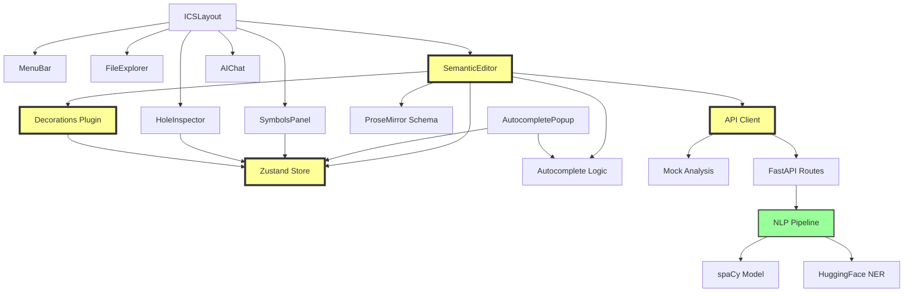
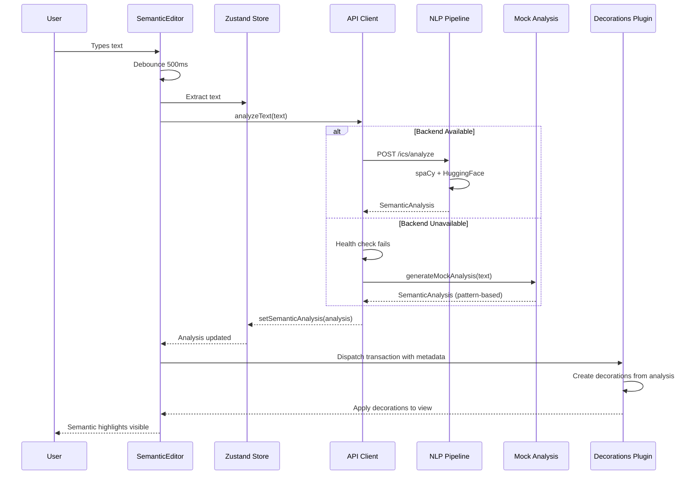

# ICS Master Specification

**Version**: 1.0
**Date**: 2025-10-25
**Status**: Phase 2 - Full Specification
**Project**: lift-sys ICS (Integrated Context Studio)

---

## Document Purpose

This master specification provides the complete architectural blueprint for implementing the ICS (Integrated Context Studio) feature for lift-sys. It serves as the single source of truth for:

1. **System Architecture**: Component decomposition and boundaries
2. **Dependencies**: How components interact and depend on each other
3. **Integration Points**: Typed holes where components connect
4. **Constraints**: Type, behavioral, and performance constraints
5. **Test Strategy**: Comprehensive testing approach

**Relationship to Other Specs**:
- **Refined Spec v1** (`ics-spec-v1.md`): Phase 1 analysis with OODA loops, state machines, MVP scope
- **Sub-Specifications**: Detailed specs for each major component (this doc references them)
- **Typed Holes**: Integration points catalog (`typed-holes.md`)
- **Constraints**: System-wide constraints catalog (`constraints.md`)
- **Test Plan**: Comprehensive test strategy (`test-plan.md`)

---

## Table of Contents

1. [System Architecture](#1-system-architecture)
2. [Component Decomposition](#2-component-decomposition)
3. [Sub-Specification Index](#3-sub-specification-index)
4. [Dependency Graph](#4-dependency-graph)
5. [Integration Points](#5-integration-points)
6. [Constraints Overview](#6-constraints-overview)
7. [Test Strategy Overview](#7-test-strategy-overview)
8. [Implementation Phases](#8-implementation-phases)
9. [Success Metrics](#9-success-metrics)

---

## 1. System Architecture

### 1.1 High-Level Architecture

```
┌─────────────────────────────────────────────────────────────────┐
│                         User                                     │
└────────────────────────┬────────────────────────────────────────┘
                         │ HTTP/WebSocket
                         ↓
┌─────────────────────────────────────────────────────────────────┐
│                    Frontend (React SPA)                          │
│  ┌──────────────┐  ┌──────────────┐  ┌─────────────────┐       │
│  │ UI Layer     │  │ State Layer  │  │ Editor Layer    │       │
│  │ (Components) │←→│ (Zustand)    │←→│ (ProseMirror)   │       │
│  └──────────────┘  └──────────────┘  └─────────────────┘       │
│         ↓                   ↓                  ↓                 │
│  ┌──────────────────────────────────────────────────────┐       │
│  │           API Client + Mock Fallback                 │       │
│  └──────────────────────────────────────────────────────┘       │
└────────────────────────┬────────────────────────────────────────┘
                         │ REST API (graceful degradation)
                         ↓
┌─────────────────────────────────────────────────────────────────┐
│                  Backend (FastAPI) [OPTIONAL]                    │
│  ┌──────────────┐  ┌──────────────┐  ┌─────────────────┐       │
│  │ API Routes   │→ │ NLP Pipeline │→ │ spaCy + HF NER  │       │
│  │ (/ics/*)     │  │              │  │                 │       │
│  └──────────────┘  └──────────────┘  └─────────────────┘       │
└─────────────────────────────────────────────────────────────────┘
```

### 1.2 System Context

**ICS Position in lift-sys**:
```
lift-sys Platform
├── Configuration View
├── Repository View
├── Prompt Workbench
├── ICS ← THIS SPEC
├── IR Review
├── Planner
└── IDE
```

**ICS Role**: Specification authoring with real-time semantic analysis, feeding into lift-sys's natural language → IR → code pipeline.

### 1.3 Key Architectural Decisions

| Decision | Rationale | Trade-offs |
|----------|-----------|------------|
| **ProseMirror for editing** | Extensible, mature, decorations system | Learning curve, complexity |
| **Zustand for state** | Lightweight, minimal boilerplate, devtools | Less opinionated than Redux |
| **Backend optional** | Graceful degradation, works offline | Mock has lower accuracy |
| **shadcn/ui components** | Accessible, customizable, Tailwind-based | Less opinionated than full framework |
| **FastAPI backend** | Fast, async, Python (matches lift-sys) | Requires separate deployment |
| **spaCy + HuggingFace** | Production-ready NLP, good accuracy | Model size, startup time |

---

## 2. Component Decomposition

### 2.1 Frontend Components (6 major)

| Component | Responsibility | Sub-Spec |
|-----------|----------------|----------|
| **ICSLayout** | 4-panel resizable layout, menu bar | `ics-frontend-spec.md` §2.1 |
| **SemanticEditor** | ProseMirror editor, decorations, analysis trigger | `ics-editor-spec.md` §1 |
| **SymbolsPanel** | List view of semantic elements (entities, holes, constraints) | `ics-frontend-spec.md` §2.3 |
| **HoleInspector** | Detailed hole view (deps, constraints, AI suggestions) | `ics-frontend-spec.md` §2.4 |
| **AutocompletePopup** | File (#) and symbol (@) autocomplete | `ics-editor-spec.md` §3 |
| **AIChat** | AI assistant (deferred to Phase 2) | `ics-frontend-spec.md` §2.5 |

### 2.2 Frontend Libraries (6 major)

| Library | Responsibility | Sub-Spec |
|---------|----------------|----------|
| **store.ts** | Zustand state management, persistence | `ics-state-spec.md` §1 |
| **schema.ts** | ProseMirror document schema | `ics-editor-spec.md` §2.1 |
| **decorations.ts** | Semantic highlighting decorations plugin | `ics-editor-spec.md` §2.2 |
| **autocomplete.ts** | Autocomplete logic, file/symbol search | `ics-editor-spec.md` §3 |
| **api.ts** | Backend API client, health checks, graceful degradation | `ics-backend-spec.md` §3 |
| **mockSemanticAnalysis.ts** | Pattern-based fallback analysis | `ics-backend-spec.md` §4 |

### 2.3 Backend Components (3 major)

| Component | Responsibility | Sub-Spec |
|-----------|----------------|----------|
| **API Routes** | FastAPI endpoints (/ics/analyze, /ics/health) | `ics-backend-spec.md` §1 |
| **NLP Pipeline** | Semantic analysis orchestration | `ics-backend-spec.md` §2.1 |
| **Models** | spaCy (en_core_web_sm), HuggingFace (dslim/bert-large-NER) | `ics-backend-spec.md` §2.2 |

### 2.4 Data Types (Core)

| Type | Definition | Sub-Spec |
|------|------------|----------|
| **SemanticAnalysis** | Complete analysis result (entities, modals, etc.) | `ics-state-spec.md` §2.1 |
| **Entity** | Named entity (PERSON, ORG, TECHNICAL, etc.) | `ics-state-spec.md` §2.2 |
| **ModalOperator** | Requirement strength (must, should, may, cannot) | `ics-state-spec.md` §2.3 |
| **TypedHole** | Incomplete specification marker (???) | `ics-state-spec.md` §2.4 |
| **Constraint** | Temporal, type, value, return constraints | `ics-state-spec.md` §2.5 |
| **Ambiguity** | Underspecified requirement | `ics-state-spec.md` §2.6 |

---

## 3. Sub-Specification Index

### 3.1 Frontend Specification
**File**: `specs/ics-frontend-spec.md`

**Covers**:
- ICSLayout (4-panel resizable layout)
- MenuBar (icon navigation)
- FileExplorer (project file tree)
- SymbolsPanel (entities, holes, constraints tabs)
- HoleInspector (dependency viewer, constraint propagation)
- AIChat (AI assistant - Phase 2)
- Visual design (colors, typography, spacing)
- Accessibility (WCAG 2.1 AA, keyboard navigation)

**Dependencies**:
- Depends on: `ics-editor-spec.md` (SemanticEditor integration)
- Depends on: `ics-state-spec.md` (Zustand store)
- Depends on: `ics-backend-spec.md` (API client)

---

### 3.2 Editor Specification
**File**: `specs/ics-editor-spec.md`

**Covers**:
- SemanticEditor (ProseMirror integration)
- ProseMirror schema (document structure)
- Decorations plugin (semantic highlighting)
- AutocompletePopup (# and @ triggers)
- Real-time analysis flow (debounce, API call, render)
- Keyboard shortcuts
- Hover tooltips

**Dependencies**:
- Depends on: `ics-state-spec.md` (SemanticAnalysis type)
- Depends on: `ics-backend-spec.md` (API client)

---

### 3.3 State Management Specification
**File**: `specs/ics-state-spec.md`

**Covers**:
- Zustand store structure
- State shape (document, analysis, holes, constraints, UI)
- Actions (setSemanticAnalysis, resolveHole, etc.)
- Persistence (localStorage via persist middleware)
- State machines (per component, from Phase 1)
- TypeScript type definitions

**Dependencies**:
- None (core dependency for other specs)

---

### 3.4 Backend Specification
**File**: `specs/ics-backend-spec.md`

**Covers**:
- FastAPI routes (/ics/analyze, /ics/health)
- NLP pipeline (spaCy + HuggingFace)
- Entity extraction
- Modal operator detection
- Typed hole detection
- Ambiguity detection
- Constraint detection
- Mock analysis (frontend fallback)
- API contract (request/response schemas)
- Error handling

**Dependencies**:
- Depends on: `ics-state-spec.md` (SemanticAnalysis type)

---

## 4. Dependency Graph

### 4.1 Component Dependencies (Mermaid)



### 4.2 Data Flow Dependencies



### 4.3 Critical Path

**Definition**: Minimum set of components required for core functionality (semantic editing).

**Components**:
1. **SemanticEditor** ← User types here
2. **Zustand Store** ← State management
3. **API Client** ← Backend or mock
4. **Decorations Plugin** ← Visual feedback
5. **NLP Pipeline** ← Semantic analysis (or mock)

**Flow**:
```
User Types → Editor → Store → API Client → Backend/Mock → Store → Decorations → Editor → User Sees
```

**Performance Budget** (from Phase 1):
- Typing → Debounce: 500ms
- API call: < 1s (backend) or < 200ms (mock)
- Store update → Decorations: < 100ms
- **Total**: < 2s (OODA requirement)

---

## 5. Integration Points

### 5.1 Typed Holes Overview

**Definition**: Integration points where components connect but implementation details are abstracted.

**Total Typed Holes**: 12 (detailed in `specs/typed-holes.md`)

**Critical Holes**:

| Hole ID | Name | Type | Connects | Status |
|---------|------|------|----------|--------|
| **H1** | EditorStateSync | Interface | SemanticEditor ↔ Store | Phase 1 |
| **H2** | DecorationApplication | Function | Decorations ↔ Editor View | Phase 1 |
| **H3** | AnalysisAPI | Interface | API Client ↔ Backend | Phase 1 |
| **H4** | MockFallback | Function | API Client ↔ Mock | Phase 1 |
| **H5** | AutocompleteIntegration | Plugin | Editor ↔ Autocomplete | Phase 1 |
| **H6** | HoleDependencyGraph | Algorithm | HoleInspector ↔ Store | Phase 2 |
| **H7** | ConstraintPropagation | Algorithm | Store ↔ HoleInspector | Phase 2 |
| **H8** | AIAssistant | Interface | AIChat ↔ Backend | Phase 2 |
| **H9** | FileTreeLoader | Interface | FileExplorer ↔ Backend | Phase 1 |
| **H10** | SymbolExtractor | Function | Autocomplete ↔ Backend | Phase 1 |
| **H11** | TooltipPositioning | Algorithm | SemanticTooltip ↔ Editor | Phase 1 |
| **H12** | LayoutPersistence | Interface | ICSLayout ↔ LocalStorage | Phase 1 |

**Reference**: See `specs/typed-holes.md` for complete details.

### 5.2 Integration Requirements

**H1: EditorStateSync**
```typescript
interface EditorStateSync {
  // When editor state changes, update Zustand store
  onEditorChange(view: EditorView): void;

  // When store changes, trigger editor recalculation
  onStoreChange(analysis: SemanticAnalysis): void;
}
```

**H2: DecorationApplication**
```typescript
function applyDecorations(
  doc: ProseMirrorNode,
  analysis: SemanticAnalysis
): DecorationSet {
  // Create decorations from semantic analysis
  // Return decoration set for ProseMirror view
}
```

**H3: AnalysisAPI**
```typescript
interface AnalysisAPI {
  analyze(text: string, options?: AnalyzeOptions): Promise<SemanticAnalysis>;
  health(): Promise<{ status: 'healthy' | 'unhealthy' }>;
}
```

---

## 6. Constraints Overview

### 6.1 Constraint Categories

**Total Constraints**: 34 (detailed in `specs/constraints.md`)

**Categories**:
1. **Type Constraints** (10): TypeScript strict mode, Pydantic validation
2. **Performance Constraints** (8): OODA loop timings, API latency
3. **Behavioral Constraints** (12): State transitions, error handling
4. **UI/UX Constraints** (4): WCAG 2.1 AA, keyboard navigation

### 6.2 Critical Constraints

| ID | Constraint | Category | Impact |
|----|------------|----------|--------|
| **C1** | OODA cycles < 2s | Performance | User experience |
| **C2** | TypeScript strict mode | Type | Code quality |
| **C3** | Graceful degradation (backend optional) | Behavioral | Reliability |
| **C4** | All states handled (empty, error, loading) | Behavioral | User experience |
| **C5** | WCAG 2.1 AA compliance | UI/UX | Accessibility |
| **C6** | No console errors | Behavioral | Production quality |
| **C7** | 22/22 tests pass | Testing | Correctness |
| **C8** | Decorations apply on analysis update | Behavioral | Core feature |

**Reference**: See `specs/constraints.md` for complete catalog.

### 6.3 Constraint Satisfaction Strategy

**Phase 1** (MVP):
- Focus on C1-C8 (critical constraints)
- Automated validation via tests
- Manual validation via code review

**Phase 2+**:
- Add constraint solver for hole resolution
- Add performance monitoring (Core Web Vitals)
- Add accessibility testing (axe-core)

---

## 7. Test Strategy Overview

### 7.1 Test Pyramid

```
         ┌──────────────┐
         │  E2E Tests   │  ← 22 Playwright tests (user workflows)
         │  (Playwright)│
         └──────────────┘
              ▲
       ┌──────────────────┐
       │ Integration Tests│  ← API contract, component integration
       │  (Vitest + MSW)  │
       └──────────────────┘
              ▲
    ┌─────────────────────────┐
    │     Unit Tests          │  ← Functions, hooks, utilities
    │  (Vitest + React Testing│
    │      Library)           │
    └─────────────────────────┘
```

### 7.2 Test Coverage Targets

| Layer | Coverage Target | Current | Gap |
|-------|----------------|---------|-----|
| **Unit** | 80% | ? | TBD |
| **Integration** | 70% | ? | TBD |
| **E2E** | Key workflows | 55% (12/22 pass) | 10 tests |

### 7.3 Test Categories

**Unit Tests** (target: 50 tests):
- Editor utilities (text extraction, position mapping)
- Mock analysis (pattern matching)
- State management (actions, reducers)
- Decoration creation (entity, modal, hole)
- Autocomplete logic (filtering, insertion)

**Integration Tests** (target: 20 tests):
- API client + mock fallback
- Store + decorations plugin
- Editor + autocomplete
- Backend NLP pipeline

**E2E Tests** (current: 22 tests):
- ✅ 12 passing (auth, navigation, basic editor, autocomplete)
- ❌ 10 failing (semantic analysis decorations)

**Reference**: See `specs/test-plan.md` for complete strategy.

---

## 8. Implementation Phases

### 8.1 Phase Timeline

```
Phase 1: Core Editor & Analysis (2 weeks) ← WE ARE HERE
  ├─ Week 1: Fix decorations, backend tests
  └─ Week 2: Complete TODOs, 22/22 tests pass

Phase 2: Constraint Propagation & AI (2 weeks)
  ├─ Week 3: Hole dependency graph, propagation
  └─ Week 4: AI chat assistant

Phase 3: Advanced Features (4 weeks)
  ├─ Week 5-6: Dependency graph visualization
  └─ Week 7-8: Contradiction detection, semantic search

Phase 4: Collaboration & Git (6 weeks)
  ├─ Week 9-11: Real-time collaborative editing (CRDT)
  └─ Week 12-14: Git integration, diff view

Phase 5: Enterprise Features (8 weeks)
  ├─ Week 15-18: Team workflows, review system
  └─ Week 19-22: Templates, analytics
```

### 8.2 Phase 1 Deliverables (Current)

**Must Complete**:
- ✅ Fix decoration application (H2)
- ✅ Backend tests pass (H3)
- ✅ Mock fallback works (H4)
- ✅ Autocomplete integrated (H5)
- ✅ File tree loads (H9)
- ✅ Symbol extraction works (H10)
- ✅ Tooltips position correctly (H11)
- ✅ Layout persists (H12)
- ✅ All 22 E2E tests pass
- ✅ All state machines implemented

**Success Criteria**: Phase 1 exit criteria from `ics-spec-v1.md` §8

---

## 9. Success Metrics

### 9.1 Technical Metrics

| Metric | Target | Measurement |
|--------|--------|-------------|
| **Test Pass Rate** | 100% (22/22) | Playwright test results |
| **OODA Cycle Time** | < 2s | Manual timing |
| **Type Safety** | 0 `any` types | TypeScript compiler |
| **Accessibility** | WCAG 2.1 AA | axe-core (Phase 2) |
| **Performance** | LCP < 2.5s, FID < 100ms, CLS < 0.1 | Lighthouse (Phase 2) |
| **Error Rate** | 0 console errors | Browser console |

### 9.2 User Experience Metrics

| Metric | Target | Measurement |
|--------|--------|-------------|
| **Typing Lag** | < 16ms | Chrome DevTools Performance |
| **Analysis Latency** | < 1s (backend), < 200ms (mock) | API timing |
| **Highlight Accuracy** | > 85% (backend), > 60% (mock) | Manual review (Phase 2) |
| **Empty States** | 100% coverage | Manual checklist |
| **Error Recovery** | < 5s | Manual timing |

### 9.3 Code Quality Metrics

| Metric | Target | Measurement |
|--------|--------|-------------|
| **Cyclomatic Complexity** | < 10 per function | ESLint (complexity rule) |
| **File Size** | < 300 lines | Manual review |
| **Code Duplication** | < 3% | jscpd (Phase 2) |
| **Documentation** | 100% public APIs | TSDoc coverage |

---

## 10. References

### 10.1 Related Documents

- **Phase 1 Refined Spec**: `specs/ics-spec-v1.md`
- **Original Interface Spec**: `docs/ICS_INTERFACE_SPECIFICATION.md`
- **Sub-Specifications**: `specs/ics-*-spec.md`
- **Typed Holes Catalog**: `specs/typed-holes.md`
- **Constraints Catalog**: `specs/constraints.md`
- **Test Plan**: `specs/test-plan.md`

### 10.2 External References

- **ProseMirror Guide**: https://prosemirror.net/docs/guide/
- **Zustand Documentation**: https://github.com/pmndrs/zustand
- **shadcn/ui Components**: https://ui.shadcn.com/
- **spaCy NLP**: https://spacy.io/usage/linguistic-features
- **HuggingFace Transformers**: https://huggingface.co/dslim/bert-large-NER
- **WCAG 2.1**: https://www.w3.org/WAI/WCAG21/quickref/

---

**Next Steps**:
1. Create all sub-specifications
2. Catalog typed holes in detail
3. Document all constraints
4. Create comprehensive test plan
5. Proceed to Phase 3 (Execution Plan)

**Document Status**: Master Spec Complete, Ready for Sub-Spec Creation
