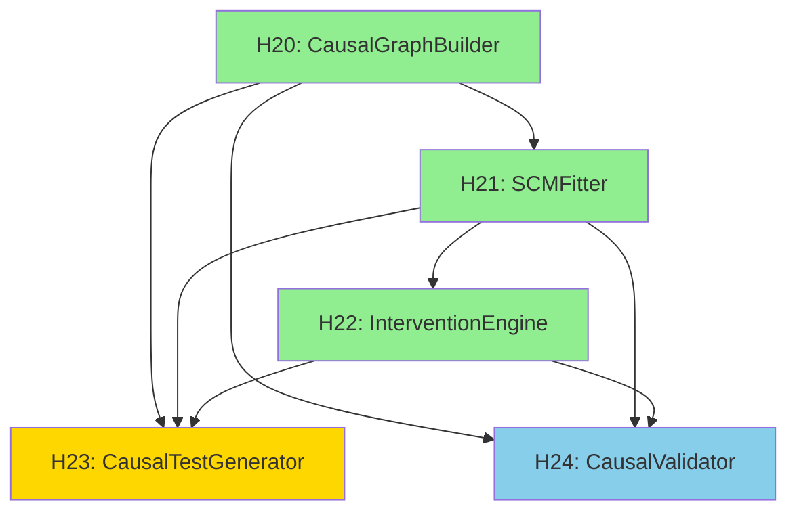

# DoWhy Integration - Typed Holes Specification

**Date**: 2025-10-25
**Status**: Complete
**Phase**: Phase 2 - Typed Holes Definition
**Parent**: DOWHY_INTEGRATION_SPEC.md

---

## Document Purpose

This document defines **5 typed holes** for DoWhy integration with lift-sys, following the Design by Typed Holes methodology.

**Typed Holes**: Well-defined integration points with explicit type signatures, constraints, and dependencies.

---

## Hole Inventory

| Hole ID | Name | Phase | Status | Priority | Dependencies |
|---------|------|-------|--------|----------|--------------|
| H20 | CausalGraphBuilder | 1 | OPEN | P0 | reverse_mode, NetworkX |
| H21 | SCMFitter | 1 | OPEN | P0 | H20, DoWhy |
| H22 | InterventionEngine | 1 | OPEN | P0 | H21 |
| H23 | CausalTestGenerator | 2 | OPEN | P1 | H20, H21, H22 |
| H24 | CausalValidator | 3 | OPEN | P2 | H20, H21, H22 |

---

## H20: CausalGraphBuilder

### Type Signature

```python
from typing import Optional
import ast
import networkx as nx

class CausalGraphBuilder:
    """Converts code structure to causal DAG."""

    def build(
        self,
        ast_tree: ast.Module,
        call_graph: nx.DiGraph,
        control_flow: Optional[nx.DiGraph] = None
    ) -> nx.DiGraph:
        """Build causal graph from code structure.

        Type: (AST, DiGraph, Optional[DiGraph]) → DiGraph

        Args:
            ast_tree: Python AST from reverse mode
            call_graph: Function call graph
            control_flow: Optional control flow graph

        Returns:
            Causal DAG with typed nodes and edges

        Constraints:
            - Output MUST be acyclic (DAG)
            - Output MUST have ≥1 root node (no incoming edges)
            - Output MUST have ≥1 leaf node (no outgoing edges)
            - Edge count ≤ O(N log N) where N = node count
            - Must complete in <1s for 100-node input

        Raises:
            ValueError: If input graph is invalid
            GraphBuildError: If construction fails
            CyclicGraphError: If result would be cyclic
        """
```

### Constraints

**Input Constraints**:
- `ast_tree` MUST be valid Python AST
- `call_graph` MUST be NetworkX DiGraph
- `call_graph` nodes MUST correspond to AST nodes

**Output Constraints**:
- Result MUST be DAG (no cycles)
- Result MUST have node attributes: `{'type': 'function'|'variable'|'return'|'effect'}`
- Result MUST have edge attributes: `{'type': 'data_flow'|'control_flow'|'call'}`
- Result MUST be connected (one component)

**Performance Constraints**:
- Time complexity: O(N log N) where N = node count
- Space complexity: O(N + E) where E = edge count
- Must complete in <1s for 100 nodes

**Quality Constraints**:
- Edge precision (vs manual review): ≥90%
- Edge recall (vs manual review): ≥85%

### Dependencies

**Blocks**:
- None (first hole in sequence)

**Blocked By**:
- H21 (SCMFitter)
- H22 (InterventionEngine)
- H23 (CausalTestGenerator)
- H24 (CausalValidator)

**Requires**:
- `lift_sys.reverse_mode.lifter.Lifter` (AST extraction)
- `networkx>=3.0`
- Python standard library (`ast`, `inspect`)

### Test Strategy

**Unit Tests**:
1. Simple linear flow (A → B → C)
2. Branching (if/else)
3. Loops (while/for)
4. Function calls
5. Edge pruning (logging excluded)
6. Cyclic detection (should raise error)

**Property Tests**:
1. Output is always DAG
2. Edge count ≤ N² (quadratic bound)
3. All nodes reachable from roots

**Integration Tests**:
1. Real codebase (10 files)
2. Validate against manual review

---

## H21: SCMFitter

### Type Signature

```python
from dowhy import gcm
import pandas as pd
from typing import Optional

class SCMFitter:
    """Fits causal mechanisms to graph."""

    def fit(
        self,
        causal_graph: nx.DiGraph,
        traces: Optional[pd.DataFrame] = None,
        static_only: bool = False
    ) -> gcm.StructuralCausalModel:
        """Fit structural causal model.

        Type: (DiGraph, Optional[DataFrame], bool) → StructuralCausalModel

        Args:
            causal_graph: Causal DAG from H20
            traces: Execution traces (columns = node names)
            static_only: Use static approximation if True

        Returns:
            Fitted StructuralCausalModel

        Constraints:
            - If traces provided, R² MUST be ≥0.7
            - If static_only=True, MUST work without traces
            - Must complete in <10s for 1000 traces
            - Must validate with cross-validation

        Raises:
            FittingError: If fitting fails
            ValidationError: If R² < threshold
            DataError: If traces don't match graph nodes
        """
```

### Constraints

**Input Constraints**:
- `causal_graph` MUST be valid DAG (from H20)
- If `traces` provided: `traces.columns` ⊇ `causal_graph.nodes()`
- `traces` rows MUST be ≥100 for reliable fitting

**Output Constraints**:
- Result MUST be fitted `StructuralCausalModel`
- Cross-validation R² MUST be ≥0.7 (when traces available)
- All nodes MUST have assigned mechanisms

**Modes**:
1. **Static Mode** (`static_only=True`, `traces=None`):
   - Use code analysis for mechanism inference
   - Example: `def double(x): return x*2` → linear mechanism, coef=2

2. **Dynamic Mode** (`traces` provided):
   - Fit mechanisms from data
   - Use `gcm.auto.assign_causal_mechanisms()`
   - Cross-validate on 20% hold-out set

**Performance Constraints**:
- <10s for 1000 traces, 100 nodes
- <1s for static mode (no traces)

### Dependencies

**Blocks**:
- H20 (needs causal graph)

**Blocked By**:
- H22 (InterventionEngine needs fitted SCM)
- H23 (Test generation needs fitted SCM)

**Requires**:
- DoWhy `gcm` module (Python 3.11)
- `pandas>=2.0`
- `scikit-learn>=1.3` (for cross-validation)

### Test Strategy

**Unit Tests**:
1. Static mode (no traces)
2. Dynamic mode (synthetic traces)
3. Cross-validation
4. Missing data handling
5. R² threshold enforcement

**Property Tests**:
1. R² ∈ [0, 1]
2. All nodes have mechanisms
3. Fitted model is reproducible (same seed → same result)

---

## H22: InterventionEngine

### Type Signature

```python
from typing import Any
from dataclasses import dataclass

@dataclass
class ImpactEstimate:
    """Result of causal intervention."""
    affected_nodes: dict[str, float]  # node → effect size
    confidence_intervals: dict[str, tuple[float, float]]
    sample_size: int
    intervention: dict[str, Any]

class InterventionEngine:
    """Processes causal queries."""

    def estimate_impact(
        self,
        scm: gcm.StructuralCausalModel,
        intervention: dict[str, Any],
        num_samples: int = 1000
    ) -> ImpactEstimate:
        """Estimate impact of intervention.

        Type: (SCM, dict, int) → ImpactEstimate

        Args:
            scm: Fitted SCM from H21
            intervention: Node → value mapping
            num_samples: Samples for estimation

        Returns:
            Impact estimate with effect sizes and CIs

        Constraints:
            - Must complete in <100ms
            - Confidence intervals MUST be 95% (bootstrap)
            - Effect sizes MUST be standardized (Cohen's d)
            - All downstream nodes MUST be included

        Raises:
            InterventionError: If intervention invalid
            NodeNotFoundError: If intervened node doesn't exist
        """
```

### Constraints

**Input Constraints**:
- `scm` MUST be fitted (from H21)
- `intervention` keys MUST be nodes in `scm.graph`
- `num_samples` ≥100 (for reliable estimates)

**Output Constraints**:
- `affected_nodes` MUST include all downstream nodes
- `confidence_intervals` MUST be 95% (2.5th, 97.5th percentile)
- Effect sizes MUST be standardized: `(μ_intervention - μ_baseline) / σ_baseline`

**Performance Constraints**:
- <100ms for simple queries (single intervention, <10 downstream nodes)
- <1s for complex queries (multiple interventions, >50 downstream nodes)

**Statistical Constraints**:
- Bootstrap iterations: 100 (for CI estimation)
- CI coverage: 95% nominal

### Dependencies

**Blocks**:
- H21 (needs fitted SCM)

**Blocked By**:
- H23 (test generation uses interventions)
- H24 (validation uses interventions)

**Requires**:
- DoWhy `gcm.interventional_samples()`
- `numpy` (for bootstrap)

### Test Strategy

**Unit Tests**:
1. Single intervention
2. Multiple simultaneous interventions
3. Confidence interval computation
4. Effect size standardization
5. Performance (<100ms)

**Statistical Tests**:
1. CI coverage (95% nominal)
2. Effect size accuracy (vs ground truth)

---

## H23: CausalTestGenerator

### Type Signature

```python
from dataclasses import dataclass

@dataclass
class CausalPath:
    """Causal path through code."""
    nodes: list[str]
    importance: float  # 0-1
    priority: str  # HIGH|MEDIUM|LOW

@dataclass
class TestCase:
    """Generated test."""
    name: str
    code: str  # pytest function
    path: CausalPath
    inputs: dict[str, Any]
    expected_output: Any

class CausalTestGenerator:
    """Generates tests for causal paths."""

    def generate_from_paths(
        self,
        paths: list[CausalPath],
        scm: gcm.StructuralCausalModel,
        max_tests: Optional[int] = None
    ) -> list[TestCase]:
        """Generate test cases.

        Type: (list[CausalPath], SCM, Optional[int]) → list[TestCase]

        Args:
            paths: Causal paths from path extractor
            scm: Fitted SCM
            max_tests: Optional limit on test count

        Returns:
            List of generated pytest test cases

        Constraints:
            - Generated code MUST be syntactically valid (100%)
            - Generated tests MUST pass on original code (≥95%)
            - Must complete in <1s per test
            - Test names MUST be descriptive

        Raises:
            GenerationError: If test generation fails
        """
```

### Constraints

**Input Constraints**:
- `paths` MUST be non-empty
- `scm` MUST be fitted
- Each path MUST exist in `scm.graph`

**Output Constraints**:
- All generated tests MUST be syntactically valid Python
- All generated tests MUST use pytest format
- All generated tests MUST have descriptive names
- ≥95% of generated tests MUST pass on original code

**Performance Constraints**:
- <1s per test generation
- <5min for 1000-file codebase

### Dependencies

**Blocks**:
- H20, H21, H22 (needs full causal infrastructure)

**Blocked By**:
- None (last in sequence for P2)

**Requires**:
- H20 (causal graph)
- H21 (fitted SCM)
- H22 (for predictions)
- `ast` (for code generation)

### Test Strategy

**Unit Tests**:
1. Code syntax validation (ast.parse)
2. pytest format compliance
3. Test naming convention
4. Input generation
5. Output prediction

**Integration Tests**:
1. Generated tests run successfully
2. Generated tests pass on original code
3. Generated tests detect introduced bugs

---

## H24: CausalValidator

### Type Signature

```python
@dataclass
class ValidationResult:
    """Result of causal validation."""
    valid: bool
    violations: list[str]  # Descriptions of violations
    intervened_node: Optional[str]
    effect_difference: Optional[float]

class CausalValidator:
    """Validates transformations preserve causality."""

    def validate_transformation(
        self,
        scm_before: gcm.StructuralCausalModel,
        scm_after: gcm.StructuralCausalModel,
        test_interventions: Optional[list[dict]] = None
    ) -> ValidationResult:
        """Validate transformation preserves behavior.

        Type: (SCM, SCM, Optional[list[dict]]) → ValidationResult

        Args:
            scm_before: SCM before transformation
            scm_after: SCM after transformation
            test_interventions: Optional list of interventions to test

        Returns:
            Validation result

        Constraints:
            - Must test ≥10 interventions (if not provided)
            - Equivalence threshold: effect difference <0.1
            - Must complete in <5s

        Raises:
            ValidationError: If validation process fails
        """
```

### Constraints

**Input Constraints**:
- `scm_before` and `scm_after` MUST be fitted
- Graphs SHOULD have similar structure (warn if very different)

**Output Constraints**:
- `valid=True` IFF all test interventions produce equivalent distributions
- Equivalence defined as: `|effect_before - effect_after| < threshold`
- Threshold configurable, default 0.1

**Performance Constraints**:
- <5s for validation (10 test interventions)

### Dependencies

**Blocks**:
- H20, H21, H22

**Blocked By**:
- None (P3 feature)

**Requires**:
- H22 (InterventionEngine)
- Statistical equivalence tests (e.g., Kolmogorov-Smirnov)

### Test Strategy

**Unit Tests**:
1. Equivalent transformations (should pass)
2. Behavior-changing transformations (should fail)
3. Edge cases (empty graphs, single-node graphs)

---

## Dependency Graph



**Legend**:
- Green: Phase 1 (P1 - Reverse Mode)
- Gold: Phase 2 (P2 - Test Generation)
- Blue: Phase 3 (P3 - Constraint Validation)

---

## Resolution Order

**Phase 1** (Priority 1 - Reverse Mode):
1. H20: CausalGraphBuilder (Week 1)
2. H21: SCMFitter (Week 2)
3. H22: InterventionEngine (Week 3)

**Phase 2** (Priority 2 - Test Generation):
4. H23: CausalTestGenerator (Weeks 5-7)

**Phase 3** (Priority 3 - Constraint Validation):
5. H24: CausalValidator (Weeks 8-10)

---

## Constraint Propagation

### Event 1: H20 Resolution

**When H20 is resolved with async design**:
- **Propagates to H21**: SCM fitting MUST accept NetworkX DiGraph format
- **Propagates to H23**: Test generator MUST handle node naming from H20
- **Propagates to H24**: Validator MUST compare graphs with same node IDs

### Event 2: H21 Resolution

**When H21 chooses linear mechanisms by default**:
- **Propagates to H22**: Intervention engine can optimize for linear case
- **Propagates to H23**: Test generator can predict outputs analytically
- **Propagates to H24**: Validation can use faster linear equivalence tests

### Event 3: H22 Resolution

**When H22 implements bootstrap CIs**:
- **Propagates to H23**: Test generator inherits CI-based importance
- **Propagates to H24**: Validator uses same CI methodology

---

## Acceptance Criteria

**For each hole to be considered RESOLVED**:
- [ ] Implementation exists at specified path
- [ ] Type signature matches specification
- [ ] All constraints satisfied
- [ ] Tests pass (unit + integration)
- [ ] Documentation complete (docstrings + examples)
- [ ] Code review approved
- [ ] Performance benchmarks met

**For overall DoWhy integration to be COMPLETE**:
- [ ] All 5 holes resolved
- [ ] Integration tests pass
- [ ] Real codebase validation (3+ repos)
- [ ] User acceptance testing (5+ users)
- [ ] Documentation published
- [ ] Performance goals met

---

**Typed Holes Specification Status**: COMPLETE
**Next**: Create execution plan with atomic steps
