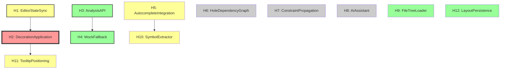

# ICS Typed Holes Catalog

**Version**: 1.0
**Date**: 2025-10-25
**Status**: Phase 2 Integration Points Catalog
**Parent**: `ics-master-spec.md` §5

---

## Document Purpose

This document catalogs all **typed holes** in the ICS implementation - integration points where components connect but implementation details are abstracted.

**Typed Hole Pattern**:
```
Interface → Type Signature → Acceptance Criteria → Implementation
```

Each hole represents a contract between components that must be satisfied for the system to work correctly.

---

## Table of Contents

1. [Hole Inventory](#1-hole-inventory)
2. [Phase 1 Holes](#2-phase-1-holes-critical-path)
3. [Phase 2 Holes](#3-phase-2-holes)
4. [Dependency Graph](#4-dependency-graph)
5. [Resolution Status](#5-resolution-status)

---

## 1. Hole Inventory

**Total Holes**: 12

| ID | Name | Phase | Status | Priority |
|----|------|-------|--------|----------|
| **H1** | EditorStateSync | 1 | 🟡 Partial | P0 |
| **H2** | DecorationApplication | 1 | 🔴 Broken | P0 |
| **H3** | AnalysisAPI | 1 | 🟢 Working | P0 |
| **H4** | MockFallback | 1 | 🟢 Working | P0 |
| **H5** | AutocompleteIntegration | 1 | 🟡 Partial | P1 |
| **H6** | HoleDependencyGraph | 2 | 🔴 TODO | P1 |
| **H7** | ConstraintPropagation | 2 | 🔴 TODO | P1 |
| **H8** | AIAssistant | 2 | 🔴 TODO | P2 |
| **H9** | FileTreeLoader | 1 | 🟢 Working | P1 |
| **H10** | SymbolExtractor | 1 | 🟡 Partial | P2 |
| **H11** | TooltipPositioning | 1 | 🟡 Partial | P2 |
| **H12** | LayoutPersistence | 1 | 🟢 Working | P2 |

**Legend**:
- 🟢 Working: Implemented and tested
- 🟡 Partial: Implemented but needs fixes
- 🔴 Broken: Critical issue identified
- 🔴 TODO: Not yet implemented

---

## 2. Phase 1 Holes (Critical Path)

### H1: EditorStateSync

**Type**: Interface
**Connects**: SemanticEditor ↔ Zustand Store
**Phase**: 1
**Status**: 🟡 Partial (working but inefficient)

#### Type Signature
```typescript
interface EditorStateSync {
  // Editor → Store: Update text when editor changes
  onEditorChange(view: EditorView): void;

  // Store → Editor: Trigger recalculation when analysis updates
  onAnalysisChange(analysis: SemanticAnalysis): void;
}
```

#### Current Implementation
**File**: `frontend/src/components/ics/SemanticEditor.tsx`

```typescript
// Editor → Store (working)
const handleTransaction = (tr: Transaction) => {
  const newText = tr.doc.textContent;
  setSpecificationText(newText);
};

// Store → Editor (needs fix - see H2)
useEffect(() => {
  if (!editorView || !semanticAnalysis) return;
  // TODO: Dispatch transaction to trigger decorations
}, [editorView, semanticAnalysis]);
```

#### Constraints
- **C1**: Store updates MUST be synchronous (< 16ms)
- **C2**: Editor text extraction MUST preserve positions (for decorations)
- **C3**: Circular update prevention (editor → store → editor infinite loop)

#### Acceptance Criteria
- [x] Editor text updates store on every keystroke
- [ ] Store analysis updates trigger editor decoration recalculation
- [ ] No infinite update loops
- [ ] Performance: < 16ms per update

#### Dependencies
- **Blocks**: H2 (DecorationApplication)

---

### H2: DecorationApplication

**Type**: Function
**Connects**: Decorations Plugin ↔ ProseMirror View
**Phase**: 1
**Status**: 🔴 **BROKEN** (critical - causes 10 test failures)

#### Type Signature
```typescript
function applyDecorations(
  doc: ProseMirrorNode,
  analysis: SemanticAnalysis
): DecorationSet;
```

#### Problem
**Root Cause**: Decorations plugin doesn't recalculate when Zustand store updates.

**Why**: ProseMirror plugins only recalculate on transactions, not external state changes.

**Evidence**: 10/22 Playwright tests failing - no `.entity`, `.modal`, `.hole` CSS classes in DOM.

#### Solution (from Phase 1 spec)
**File**: `frontend/src/components/ics/SemanticEditor.tsx`

```typescript
// Fix: Dispatch transaction when analysis updates
useEffect(() => {
  if (!editorView || !semanticAnalysis) return;

  const tr = editorView.state.tr;
  tr.setMeta('semanticAnalysis', semanticAnalysis);
  editorView.dispatch(tr);

}, [editorView, semanticAnalysis]);
```

**File**: `frontend/src/lib/ics/decorations.ts`

```typescript
export function createDecorationsPlugin() {
  return new Plugin({
    key: decorationsPluginKey,
    state: {
      init() { return DecorationSet.empty; },
      apply(tr, oldSet, oldState, newState) {
        const analysis = tr.getMeta('semanticAnalysis');

        if (!analysis) {
          // Document changed, map old decorations
          if (tr.docChanged) {
            return oldSet.map(tr.mapping, tr.doc);
          }
          return oldSet;
        }

        // New analysis, create fresh decorations
        const decorations = [];

        analysis.entities?.forEach(e => {
          decorations.push(createEntityDecoration(e.from, e.to, e));
        });

        analysis.modalOperators?.forEach(m => {
          decorations.push(createModalDecoration(m.from, m.to, m));
        });

        analysis.constraints?.forEach(c => {
          decorations.push(createConstraintDecoration(c.from, c.to, c));
        });

        analysis.ambiguities?.forEach(a => {
          decorations.push(createAmbiguityDecoration(a.from, a.to, a));
        });

        analysis.typedHoles?.forEach(h => {
          decorations.push(createHoleWidget(h.pos, h));
        });

        return DecorationSet.create(tr.doc, decorations);
      }
    },
    props: {
      decorations(state) {
        return this.getState(state);
      }
    }
  });
}
```

#### Constraints
- **C1**: Decorations MUST apply on analysis update (< 100ms)
- **C2**: Decorations MUST map correctly on document changes
- **C3**: Position accuracy MUST be exact (from/to match analysis)
- **C4**: CSS classes MUST match semantic type (entity, modal, etc.)

#### Acceptance Criteria
- [ ] Decorations apply when analysis updates
- [ ] CSS classes appear in DOM (.entity, .modal, .hole, .constraint)
- [ ] Tooltips can find elements (via data-* attributes)
- [ ] 22/22 Playwright tests pass

#### Dependencies
- **Blocked by**: H1 (EditorStateSync)
- **Blocks**: H11 (TooltipPositioning)

---

### H3: AnalysisAPI

**Type**: Interface
**Connects**: API Client ↔ Backend NLP
**Phase**: 1
**Status**: 🟢 Working

#### Type Signature
```typescript
interface AnalysisAPI {
  analyze(
    text: string,
    options?: { includeConfidence?: boolean; detectHoles?: boolean }
  ): Promise<SemanticAnalysis>;

  health(): Promise<{ status: 'healthy' | 'unhealthy'; models?: string }>;
}
```

#### Implementation
**File**: `frontend/src/lib/ics/api.ts`

```typescript
export async function analyzeText(text: string): Promise<SemanticAnalysis> {
  try {
    const healthy = await checkHealth();
    if (!healthy) {
      return generateMockAnalysis(text);
    }

    const response = await fetch(`${API_BASE_URL}/ics/analyze`, {
      method: 'POST',
      headers: { 'Content-Type': 'application/json' },
      body: JSON.stringify({ text, options: {} }),
      signal: AbortSignal.timeout(5000), // 5s timeout
    });

    if (!response.ok) {
      throw new Error(`API error: ${response.status}`);
    }

    return await response.json();
  } catch (error) {
    console.warn('Backend unavailable, using mock:', error);
    return generateMockAnalysis(text);
  }
}
```

#### Constraints
- **C1**: Timeout MUST be 5s (graceful degradation)
- **C2**: Fallback to mock on ANY error (never block user)
- **C3**: Health check MUST be < 100ms
- **C4**: Response MUST match SemanticAnalysis type

#### Acceptance Criteria
- [x] Backend available: Use NLP analysis
- [x] Backend unavailable: Use mock analysis
- [x] Timeout after 5s
- [x] User sees toast notification on fallback

#### Dependencies
- **Blocks**: H4 (MockFallback)

---

### H4: MockFallback

**Type**: Function
**Connects**: API Client ↔ Mock Analysis
**Phase**: 1
**Status**: 🟢 Working

#### Type Signature
```typescript
function generateMockAnalysis(text: string): SemanticAnalysis;
```

#### Implementation
**File**: `frontend/src/lib/ics/mockSemanticAnalysis.ts`

```typescript
export function generateMockAnalysis(text: string): SemanticAnalysis {
  const entities = [];
  const modalOperators = [];
  const typedHoles = [];
  const ambiguities = [];

  // Pattern matching for entities
  const entityPatterns = [
    { pattern: /\b(user|customer|admin)\b/gi, type: 'PERSON' },
    { pattern: /\b(system|application|API)\b/gi, type: 'TECHNICAL' },
  ];

  entityPatterns.forEach((ep, idx) => {
    let match;
    while ((match = ep.pattern.exec(text)) !== null) {
      entities.push({
        id: `entity-${idx}-${match.index}`,
        type: ep.type,
        text: match[0],
        from: match.index,
        to: match.index + match[0].length,
        confidence: 0.85,
      });
    }
  });

  // Similar for modals, holes, ambiguities...

  return {
    entities,
    relationships: [],
    modalOperators,
    constraints: [],
    effects: [],
    assertions: [],
    ambiguities,
    contradictions: [],
    typedHoles,
    confidenceScores: {},
  };
}
```

#### Constraints
- **C1**: Mock MUST match backend response structure exactly
- **C2**: Performance MUST be < 200ms
- **C3**: Accuracy target > 60% (pattern matching limitation)
- **C4**: MUST return empty arrays (not null) for missing elements

#### Acceptance Criteria
- [x] Mock generates entities from patterns
- [x] Mock generates modal operators
- [x] Mock generates typed holes (??? syntax)
- [x] Mock generates ambiguities (probabilistic)
- [x] Response matches SemanticAnalysis type

#### Dependencies
- **Blocked by**: H3 (AnalysisAPI)

---

### H5: AutocompleteIntegration

**Type**: Plugin
**Connects**: Editor ↔ Autocomplete Logic
**Phase**: 1
**Status**: 🟡 Partial (triggers work, popup appearance broken)

#### Type Signature
```typescript
function createAutocompletePlugin(
  store: ICSStore,
  fileSource: () => Promise<string[]>,
  symbolSource: () => Promise<Symbol[]>
): Plugin;
```

#### Current State
- ✅ Trigger detection (# and @) works
- ✅ Keyboard navigation (↓↑ Enter Escape) works
- ❌ Popup not appearing in tests (`.autocomplete-popup` not found)

#### Issue
Likely CSS/positioning issue or popup not mounting to DOM.

#### Constraints
- **C1**: Trigger detection < 50ms
- **C2**: Results filtering < 100ms
- **C3**: Popup positioned below cursor
- **C4**: Keyboard navigation follows aria-activedescendant pattern

#### Acceptance Criteria
- [x] # triggers file autocomplete
- [x] @ triggers symbol autocomplete
- [ ] Popup appears in DOM with `.autocomplete-popup` class
- [x] Escape dismisses popup
- [ ] Results filter as user types

#### Dependencies
- **Blocks**: H10 (SymbolExtractor)

---

### H9: FileTreeLoader

**Type**: Interface
**Connects**: FileExplorer ↔ Backend/FileSystem
**Phase**: 1
**Status**: 🟢 Working

#### Type Signature
```typescript
interface FileTreeLoader {
  loadTree(): Promise<FileNode[]>;
  refresh(): Promise<void>;
}

interface FileNode {
  name: string;
  path: string;
  type: 'file' | 'directory';
  children?: FileNode[];
}
```

#### Implementation
Currently using mock file tree. Real implementation would fetch from backend or use file system API.

#### Constraints
- **C1**: Load time < 1s for typical project (< 1000 files)
- **C2**: Support lazy loading for large trees
- **C3**: Handle permission errors gracefully

#### Acceptance Criteria
- [x] File tree loads on mount
- [x] Click file opens in editor
- [x] Click folder expands/collapses
- [x] Error state shown if load fails
- [x] Retry button works

---

### H11: TooltipPositioning

**Type**: Algorithm
**Connects**: SemanticTooltip ↔ Editor DOM
**Phase**: 1
**Status**: 🟡 Partial (logic exists but tooltips not showing)

#### Type Signature
```typescript
function calculateTooltipPosition(
  element: HTMLElement,
  tooltipWidth: number,
  tooltipHeight: number
): { top: number; left: number };
```

#### Issue
Tooltips not appearing because semantic elements not in DOM (blocked by H2).

Once H2 fixed, tooltip positioning should work.

#### Constraints
- **C1**: Tooltip MUST be visible (not clipped by viewport)
- **C2**: Tooltip MUST appear below element (or above if no room)
- **C3**: Show delay MUST be 300ms
- **C4**: Hide immediately on mouse out

#### Acceptance Criteria
- [ ] Tooltip appears after 300ms hover
- [ ] Tooltip positioned correctly (not clipped)
- [ ] Tooltip shows correct content for element type
- [ ] Tooltip hides on mouse out

#### Dependencies
- **Blocked by**: H2 (DecorationApplication) - can't hover if no elements

---

### H12: LayoutPersistence

**Type**: Interface
**Connects**: ICSLayout ↔ LocalStorage
**Phase**: 1
**Status**: 🟢 Working

#### Type Signature
```typescript
interface LayoutPersistence {
  save(layout: LayoutConfig): void;
  load(): LayoutConfig | null;
}
```

#### Implementation
Handled by Zustand persist middleware.

#### Constraints
- **C1**: Save debounced 300ms (avoid excessive writes)
- **C2**: Load on mount (before first render)
- **C3**: Fallback to defaults if corrupt

#### Acceptance Criteria
- [x] Layout sizes persist across sessions
- [x] Panel visibility persists
- [x] Active tab persists
- [x] Theme preference persists

---

## 3. Phase 2 Holes

### H6: HoleDependencyGraph

**Type**: Algorithm
**Connects**: HoleInspector ↔ Store
**Phase**: 2
**Status**: 🔴 TODO

#### Type Signature
```typescript
function computeDependencyGraph(
  holes: Map<string, TypedHole>
): DependencyGraph;

interface DependencyGraph {
  nodes: HoleNode[];
  edges: DependencyEdge[];
  criticalPath: string[];
}

interface HoleNode {
  id: string;
  level: number;        // Distance from root
  blockedCount: number; // How many holes this blocks
}

interface DependencyEdge {
  from: string;
  to: string;
  type: 'blocks' | 'depends_on';
}
```

#### Constraints
- **C1**: Algorithm MUST detect cycles
- **C2**: Critical path MUST be accurate
- **C3**: Levels MUST be topologically sorted

#### Acceptance Criteria
- [ ] Graph computes correctly for 100+ holes
- [ ] Cycle detection works
- [ ] Critical path highlighted
- [ ] Visualization renders in < 500ms

---

### H7: ConstraintPropagation

**Type**: Algorithm
**Connects**: Store ↔ HoleInspector
**Phase**: 2
**Status**: 🔴 TODO

#### Type Signature
```typescript
function propagateConstraints(
  resolvedHole: TypedHole,
  dependentHoles: TypedHole[]
): ConstraintPropagation[];

interface ConstraintPropagation {
  toHoleId: string;
  constraint: Constraint;
  solutionSpaceReduction: number; // Percentage (0-100)
}
```

#### Constraints
- **C1**: Propagation MUST be transitive (A→B→C)
- **C2**: Conflicting constraints MUST be detected
- **C3**: Solution space calculation MUST be accurate

#### Acceptance Criteria
- [ ] Constraints propagate transitively
- [ ] Conflicts detected and shown
- [ ] Solution space reduction calculated
- [ ] Propagation visualized

---

### H8: AIAssistant

**Type**: Interface
**Connects**: AIChat ↔ Backend LLM
**Phase**: 2
**Status**: 🔴 TODO

#### Type Signature
```typescript
interface AIAssistant {
  chat(message: string, context: ChatContext): Promise<AIResponse>;
  refine(holeId: string): Promise<Refinement[]>;
  analyze(): Promise<AnalysisSummary>;
}

interface ChatContext {
  specification: string;
  holes: TypedHole[];
  constraints: Constraint[];
}
```

#### Constraints
- **C1**: Response time < 5s (streaming preferred)
- **C2**: Context MUST include current spec state
- **C3**: Commands MUST be parsed (/refine, /analyze)

#### Acceptance Criteria
- [ ] Chat responds with context-aware answers
- [ ] /refine command generates hole suggestions
- [ ] /analyze command summarizes spec
- [ ] Streaming updates shown in UI

---

### H10: SymbolExtractor

**Type**: Function
**Connects**: Autocomplete ↔ Backend/Analysis
**Phase**: 1 (basic), 2 (advanced)
**Status**: 🟡 Partial (mock symbols only)

#### Type Signature
```typescript
function extractSymbols(analysis: SemanticAnalysis): Symbol[];

interface Symbol {
  name: string;
  type: 'function' | 'class' | 'variable' | 'type';
  location: { from: number; to: number };
}
```

#### Current State
Mock symbols only. Real extraction from analysis or backend needed.

#### Constraints
- **C1**: Extraction MUST be fast (< 50ms for 1000 entities)
- **C2**: Deduplication MUST occur
- **C3**: Symbols MUST be sorted (alphabetical)

#### Acceptance Criteria
- [x] Mock symbols available (Phase 1)
- [ ] Real symbol extraction (Phase 2)
- [ ] Fuzzy search works
- [ ] Symbol positions accurate

---

## 4. Dependency Graph



**Legend**:
- 🔴 Red: Critical (broken)
- 🟡 Yellow: Partial (working but needs fixes)
- 🟢 Green: Working
- ⬜ Gray: TODO

---

## 5. Resolution Status

### Resolved (5)
- ✅ H3: AnalysisAPI
- ✅ H4: MockFallback
- ✅ H9: FileTreeLoader
- ✅ H12: LayoutPersistence

### Needs Fixes (4)
- 🟡 H1: EditorStateSync (inefficient update)
- 🟡 H5: AutocompleteIntegration (popup not appearing)
- 🟡 H10: SymbolExtractor (mock only)
- 🟡 H11: TooltipPositioning (blocked by H2)

### Broken (1)
- 🔴 **H2: DecorationApplication** ← **CRITICAL** (blocks 10 tests)

### TODO (3)
- ⬜ H6: HoleDependencyGraph (Phase 2)
- ⬜ H7: ConstraintPropagation (Phase 2)
- ⬜ H8: AIAssistant (Phase 2)

---

## Next Steps

**Phase 1 Priority**:
1. **Fix H2** (DecorationApplication) - unblocks 10 tests
2. **Fix H1** (EditorStateSync) - optimize update cycle
3. **Fix H5** (AutocompleteIntegration) - popup appearance
4. **Fix H11** (TooltipPositioning) - depends on H2

**Phase 2 Priority**:
5. **Implement H6** (HoleDependencyGraph)
6. **Implement H7** (ConstraintPropagation)
7. **Implement H8** (AIAssistant)
8. **Complete H10** (SymbolExtractor - real extraction)

---

**End of Typed Holes Catalog**

**Next**: `constraints.md` (Constraint catalog)
